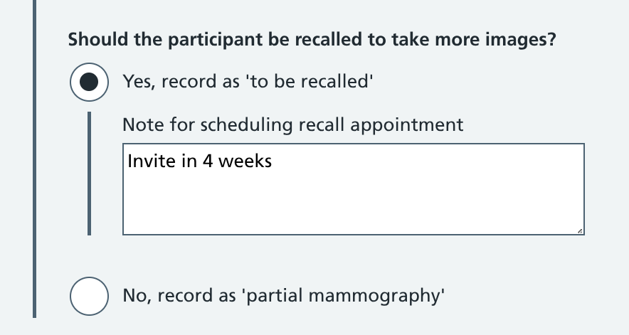
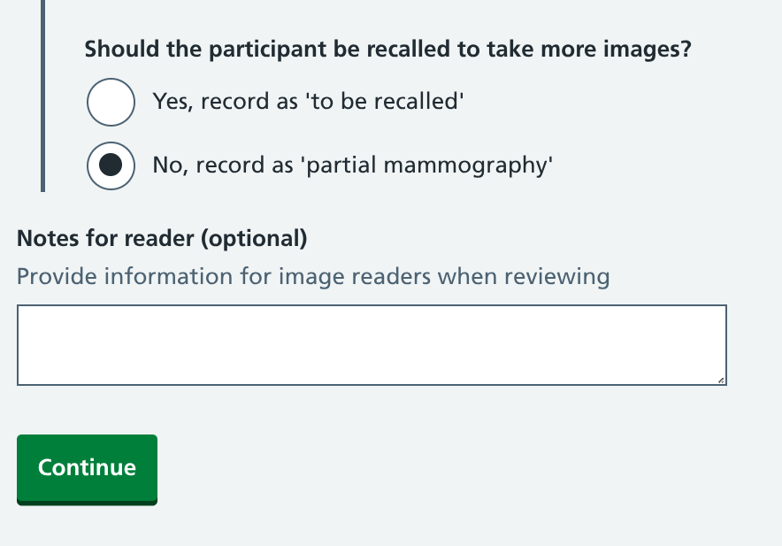

We've been looking into what happens when a mammographer does not get to take all the images they wanted to during a breast screening appointment.

Sometimes this is known as a 'partial mammography', but in some circumstances it is not. 

This has to do with how much off the breast has been scanned rather than (as we wrongly assumed) the completeness of the appointment.

## To partial, or not to partial

If an appointment stops before any images have been taken, the 'Attended not screened' status can be applied (read our [Exit, pause and resume an appointment](/manage-breast-screening/2025/12/exit-pause-resume-appointment/) design history).

But as soon as one mammogram has been taken, a whole host of scenarios open up that our service needs to cater for.

The National Breast Screening System (NBSS) gives users a checkbox and a reason dropdown when they need to record partial mammography.

[Guidance on partial or incomplete screening mammography](https://www.gov.uk/government/publications/breast-screening-guidance-on-partial-or-incomplete-screening-mammography/breast-screening-guidance-on-partial-or-incomplete-screening-mammography) explains when this should and should not be used.

A partial mammography **should** be recorded when the participant:

* withdrew their consent (after at least one mammogram is taken)
* couldn't cooperate (usually due to learning or language difficulties)
* could not be positioned correctly (due to being in a wheelchair, or for other mobility issues)
* had an implanted medical device that affected the ability to scan breast tissue

A partial mammography **should not** be recorded when:

* there has been a technical failure with X-ray equipment that prematurely ended the appointment
* there's a limited amount of tissue to be scanned (for example, if the participant has had a unilateral mastectomy)
* all breast tissue could not be scanned due to breast implants

### Partially mixed messages

In everyday language, 'partial' often refers to a process you've started and intend to finish. You partially boil potatoes, partially pay off your mortgage, or have partially mowed your lawn.

However the partial mammography definition in the guidance relates to the amount of breast tissue scanned, rather than the completeness of the appointment.

> If the examining mammographer believes that at least half of the breast can be demonstrated on one or more views of the routine examination, these views should provide sufficient useful information to be reported as a screening mammogram.

Partial mammography applies when the 'examination' is incomplete, but the 'event' has concluded.

This definition is repeated in the [Ionising Radiation (Medical Exposures) Regulations 2017 (IR(ME)R)](https://www.gov.uk/government/publications/ionising-radiation-medical-exposure-regulations-2017-guidance/guidance-to-the-ionising-radiation-medical-exposure-regulations-2017). There it provides a justification for getting enough information to assess a participant while minimising their radiation dose.

### The point of confusion

Our research uncovered a significant flaw in the current process. NBSS does not provide mammographers with a standard way to indicate when more breast tissue needs to be scanned and the participant needs to be invited back to finish their examination.

Breast screening offices (BSOs) use a variety of inefficient (and potentially clinically unsafe) workarounds to record this. Mammographers may:

* communicate with image readers through the 'Film Comment' text field suggesting they should report the case as a 'Technical recall' to trigger a follow-up appointment invite
* use the 'Partial mammography' checkbox and add a 'Film Comment', which means the case needs to be reopened if another appointment is scheduled

## Basing our service on real situations

When discussing the current workflow with users, it became clear that the partial mammography guidance had been developed around the limitations of the system, rather than being based on best practice.

After talking through the various scenarios they come across during appointments we established that mammographers want a service that allows them to:

1. record when and why they have not taken all the images they wanted to
2. recommend that a participant should be invited back to have more images taken
3. communicate relevant information about the mammograms to image readers

Achieving point 2 will allow us to negate the need for workarounds, and pass the responsibility of requesting appointments to take more images to mammographers rather than radiologists. As the ones who were there when the images were taken, they are in the best possible position to give a professional opinion on whether this is necessary.

### Removing the technical recalls conflict

By creating a separate way to recommend follow-up appointments, we can keep the 'Technical recall' function to its original purpose. It should be for image readers to request new appointments when the mammograms they are reviewing are not of sufficient quality. This could be because they are blurry, have artefacts (such as hair, dust or clothing) obscuring the view, or do not show enough breast tissue for an accurate assessment to be made.

Technical recalls are something all breast screening offices are keen to avoid. They cause hassle, anxiety and extra radiation for participants, and undue pressure on busy screening teams. Local targets are in place that aim to keep technical recalls to a minimum.

In an effort to keep these numbers down, mammographers often write "best possible images" (or "BPI") on the participant sheet to communicate to the reader that a recall may not result in any clearer views. Despite every effort, they sometimes struggle to adequately position participants due to their physical or mental health. It can be disheartening to see them return for a 'technical recall' a few days later if a reader has not seen or agreed with their previous appointment note.

The decision ultimately lies with the reader, however mammographers are keen on a better way to record their recommendation that a recall would be unproductive.

## Straightforward options, separate outcomes

One of our subject matter experts neatly summarised our goal when designing this part of the service:

> We want partial to be an outcome of what they're recording, not the decision itself.

To help meet their needs, we've given users various things to select within an 'Additional details' section on the [image details step of the mammogram workflow](/manage-breast-screening/2025/12/recording-images-taken/).

We have avoided using the term 'partial' at this stage. It comes with a lot of baggage and learned behaviour from the current system. The language used better reflects the information the mammographer needs to record.

### Imperfect, but best possible images

This formalises the BPI annotation often written on screening forms.

The 'Notes for reader' can be used to add extra context where necessary. Image readers will still have the option to request a technical recall, but clearly presenting the opinion of the mammographer will help them to weigh up the pros and cons of doing so.

### Not all mammograms taken

Selecting this option reveals several fields to collect more details.

The first mirrors the options currently within NBSS covering the reasons why not all images were taken. Multiple reasons can be selected (to account for more complex scenarios), but there is just a single text box for a more detailed explanation when necessary.

The second question is where we remove the workaround, and empower mammographers to indicate whether or not the participant should be recalled. 

If they select yes, details can be added on timescales, such as allowing for any temporary injuries to be resolved.

If they select no, a 'partial mammography' is recorded. We're retaining the current language here to reflect the scenarios outlined in breast screening guidance, but as a result of choices made rather than as a primary option.

As a fundamental change in how the screening process works, this is something we will need to put to national policy and clinical assurance teams. The initial support from the subject matter experts we work closely with suggests this is a long overdue improvement so we are hopeful these discussions will be positive.

After continuing, the detail provided is included within the [appointment summary screen](/manage-breast-screening/2025/12/checking-information-collected-during-an-appointment/).

## What happens next?

As long as one image has been taken during the mammogram, the case will still be sent to image readers for review. Even when recalls are requested, images should still be reviewed within a 14 day window just in case a follow-up appointment does not take place.

Radiologists will see the images, along with a summary of any issues encountered during the appointment. 

*Note: We are in the early stages of developing the image reading side of our service and these screenshots are early drafts.*

. Or, they could choose to request a technical recall for one or more images.")

## Initial user reactions

We've been met with positive reactions when showing this solution to both mammographers and image readers. Comments include:

> It's really useful to differentiate between whether it's a partial mammogram, full stop, or whether it's just pending and we can retry another day.

> I think it is really good as a mammographer to be able to have that ability to put forward your clinical opinion after spending the time performing the mammogram. You'll probably have the most knowledge as to whether that can be redone.

One area we need to look into is whether any of the options we've created could be overused.

For example, if mammographers are able to initiate follow-up appointments themselves, it's feasible for them to select this option and avoid having to deal with tricky participants. All mammographers are assessed on how many technical recalls are flagged on the images they have taken, so we would need to add in performance data on how frequently they request recalls themselves.

Another consideration is the messages that are sent to participants as a result of the selections made within the service. The additional structured information we're collecting can be tailored based on whether they are being recalled for more images, or for repeat images (due to a technical recall), or if their result is based on a partial mammography.

And finally, we need to determine how these options relate to statuses within the service. Things get complicated when we are deciding how to handle appointments based on certain selections, particularly regarding keeping 'episodes' open when there is a potential follow-up appointment to be arranged.
