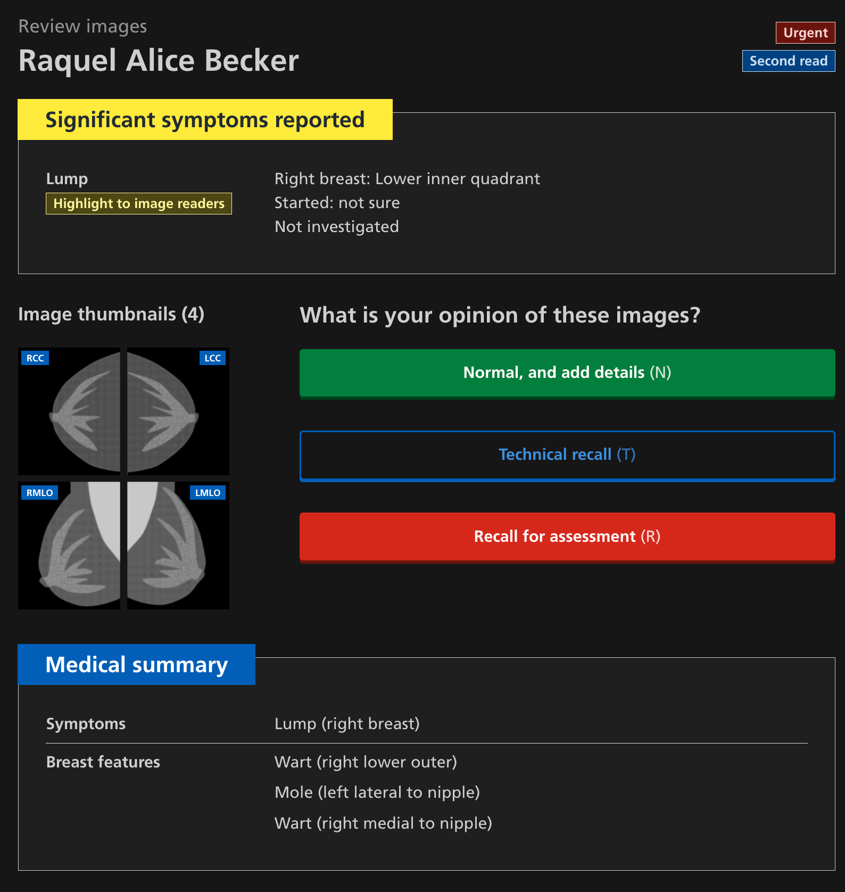
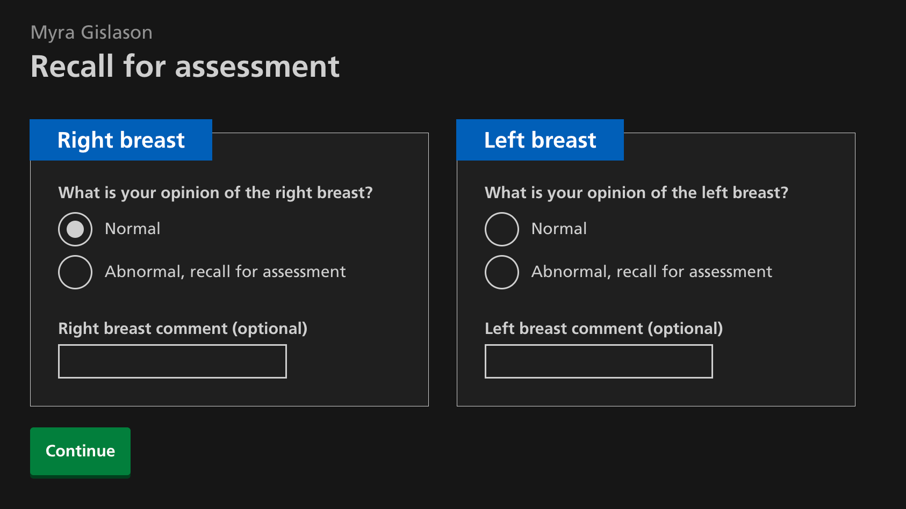

We’ve been looking at how we can improve our service for image readers, taking into account their typical ergonomic setup and lighting conditions. 

## The ergonomic setup used by image readers

Image readers look with great care for problems that can show up on mammograms, working in a room with the lights turned off. The darkened environment helps to increase the visibility of small details on the images on their screen. 

At a typical image reader’s desk, the mammograms for each participant are shown in a viewer on one screen, and a tool for recording notes and opinions is shown on a separate screen. Our design history on [understanding image reading](https://design-history.prevention-services.nhs.uk/manage-breast-screening/2025/04/understanding-image-reading/) shows this setup and gives more context about image reading.

## Dark, light and eye strain 
While the mammogram viewer (PACS) is on a dark background, the recording tool (NBSS) uses a light background. 

To adjust to different lighting conditions, the muscles in the iris adjust the pupil size to control the amount of light entering the eye. When image readers need to look back and forth between screens, this means the eyes need to work harder to adjust to differences in brightness, which can lead to eye strain and fatigue. 

## Dark mode by default, with light mode optional

Given the typical working environment for image readers, we’re proposing to enable dark mode by default. By having consistent lighting conditions with no need to adjust during the reading session, this will help to reduce eye strain and fatigue. 

That said, not all image readers may prefer dark mode. We’ll provide a way for those who prefer to use light mode to set their preference. Some image readers may prefer to use light mode, but dim their screen’s brightness. 

## Prototyping dark mode colours
Dark mode was [previously explored in early image reading concepts](https://design-history.prevention-services.nhs.uk/manage-breast-screening/2025/04/existing-image-reading-design-concepts/#image-reading-initial-1). 

### Medium contrast
Industry best practice recommends [medium contrast dark mode](https://uxmovement.com/content/why-you-should-never-use-pure-black-for-text-or-backgrounds). A pure black background prevents all light emitting from the screen, which makes the eyes work harder since they need to absorb more light. For people with astigmatism, this can lead to a blurring effect called halation. 

Following best practice, we've chosen a medium contrast palette: using off-white on a dark grey background. This avoids the blurring or halation effect, while meeting the minimum colour contrast for accessibility. 

### Lighter objects on darker objects 

[Google Material design](https://m2.material.io/design/color/dark-theme.html) recommends that objects on the background (such as a card or container) are lighter than the background, which is something we've followed. 

### Tags and meaningful colour 

[Tags](https://service-manual.nhs.uk/design-system/components/tag) are a way to show a category of something, for example, whether something is urgent or is a second read (meaning a first reader has already given their opinion on it). We debated whether to keep the colours the same as they are in light mode, as the colour has meaning.

We're experimenting with a compromise where the text colour and background colour of a tag is switched. This helps to dim the tag while (hopefully) keeping the meaning of the tag. This is something we'll keep an eye on in user research.

## Examples

## Next steps

We'll continue tweaking and testing our palette with real users. 

We'll also need to think about a designing a better toggle to turn dark mode on and off. 