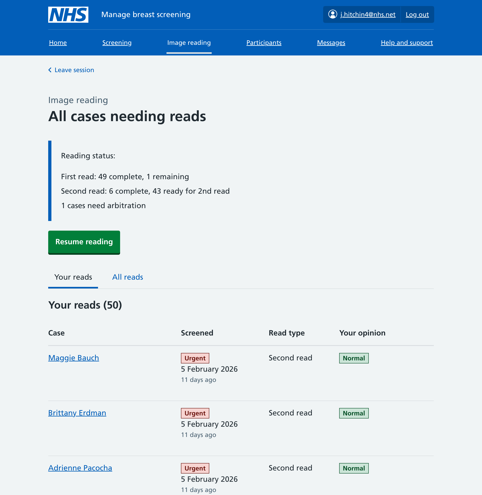
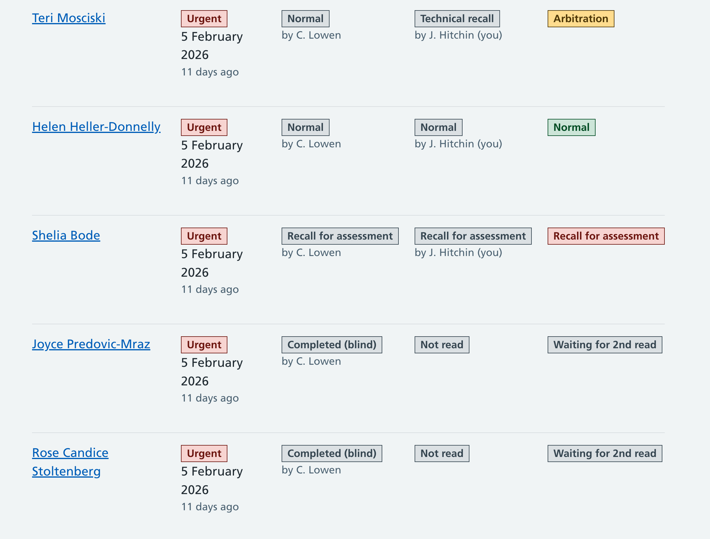
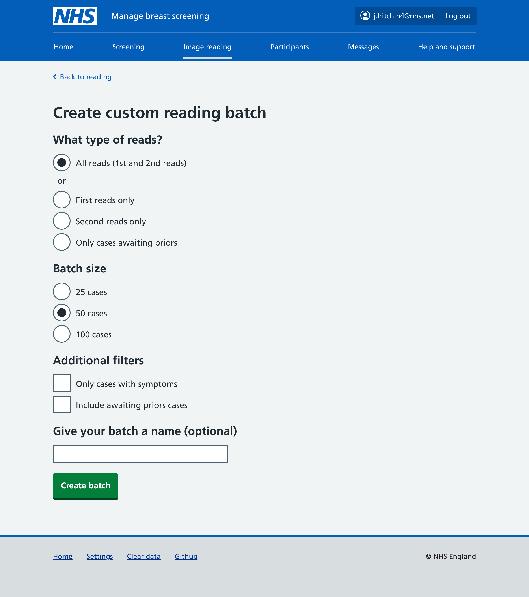
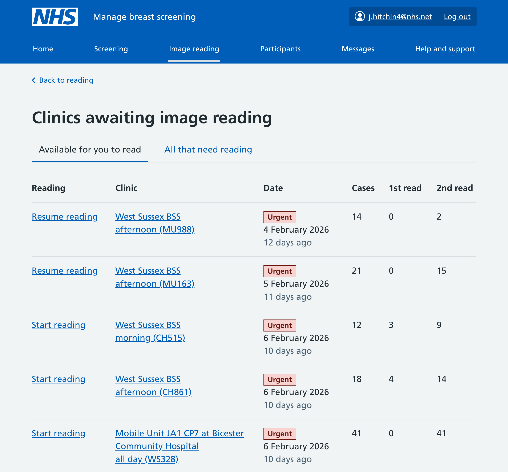
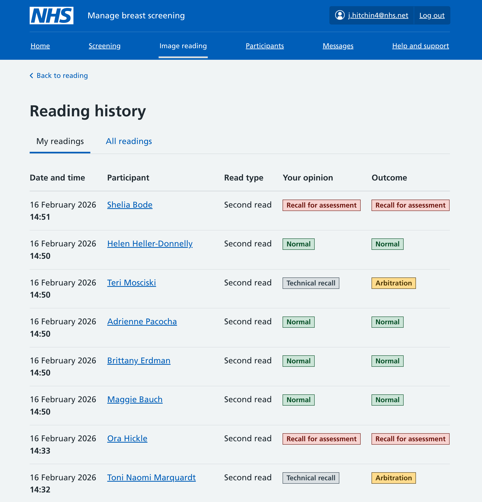

With our private beta for Manage about to start, we're turning our design focus back to image reading. That part of the service was last worked on in June 2025, and this is a long overdue design history to document to work as we left it then.

Following [testing of our first image reading prototype](/manage-breast-screening/2025/05/image-reading-first-prototype/), feedback mainly centred on understanding double reading, and managing the wider reading workflow. We had focused on the experience of giving an opinion for an individual case, but not addressed how readers decide what to read, track what they've done, or how the system handles the requirement for two independent reads.

Our second iteration focused on some of these wider ideas:

- how a user gets assigned cases
- what first and second reads might look like as concepts
- how separate reading opinions could be shown

## Moving beyond clinic-based reading

The big shift we're proposing is to move away from grouping cases by the original screening clinic. Instead, we're introducing reading sessions built around batches of cases.

Batches serve two needs from our earlier research: readers need to work through cases in the right order so nothing gets missed, and they need a defined unit of work with a clear end point – often 30 to 60 cases taking about an hour. Batches preserve these benefits without the artificial constraint of clinic groupings.

In the current paper-based process, admin staff group screening forms by clinic, place them on shelves, and radiologists pick up a bundle to work through. This has evolved around the practicalities of paper – you need a physical way to group and track forms.

With a digital system, we can remove this constraint. Readers shouldn't have to think about which clinic a case belongs to, they simply need to start with the oldest unread case and work forward.

Decoupling reading from clinics opens up lots of other future possibilities such as reading by priority, AI-assisted reads, varying the number of reads per case, and mixing cases or readers from across different Breast Screening Units. None of these are options when reading is tied to a specific clinic.

We've updated the prototype to support grouping cases to read by arbitrary 'batches', giving us future flexibility in how cases are grouped. Batches group together a number of cases based on the criteria set - the default likely being cases where screening happened the longest ago. Fundamentally, the current process is just a batch where the cases are selected based on the criteria of which clinic they were in, so this change is just an evolution of something that already exists.

(Note: 'Batch' is a temporary name we're using for this concept while we test it with users – we'll likely iterate on the word used as we do furthe research.)

## Getting users to start reading

Our first prototype listed clinics in date order with a 'Start reading' shortcut to the oldest clinic. User used the 'Start reading' call to action but were then distracted while they scanned the list of clinics, making sure they were picking the oldest to read.

The new dashboard leads with a clear call to action. The primary card is 'Start reading oldest cases', which creates a batch of up to 50 cases and takes you straight in to start reading. No need to browse clinics first, or look at the list of people in the clinic. We worried in user research that users might be wary of not reading by clinic, but this clear call to action seemed to test well.

We also added a 'Custom reading session' option for readers who want more control – choosing first reads only, second reads only, batch size, or other filters.

We’ve moved lower priority options like clinic lists, reading history, and awaiting priors are under 'Other options' – available when needed but not in the way.

## Reading by batch

In our first prototype, reading was done within a clinic – you'd open a clinic and work through its cases. The batch concept generalises this. A batch is a set of cases to read in one session. It can come from anywhere: the oldest 50 cases, all first reads, a specific clinic, or a custom filtered set.

Selecting 'Start reading oldest cases' creates a batch and drops you into the batch list, showing reading progress and a button to start or resume reading.

The batch list has two tabs. 'Your reads' shows cases from your perspective with your read type and opinion. 'All reads' shows the full picture with columns for first read, second read, and outcome. If blind reading is enabled, second readers can't see the first reader's opinion until they've given theirs.

### Custom reading batches

The custom batch page lets readers configure what to read: the type of reads (all, first only, second only, or awaiting priors), batch size (25, 50 or 100), and additional filters. We're not sure this is needed, but want to explore whether our defaults work for all situations.

### Viewing batches of clinics

Clinics are still available but behind a 'View by clinic' link rather than being the default. We can think of them as a specific type of batch. The clinics page now has tabs for 'Available for you to read' and 'All that need reading', with columns for first and second read progress.

Selecting a clinic creates a batch from that clinic's cases, which works the same as any other batch.

## Supporting first and second reads

Each set of mammograms needs to be read independently by two different readers – double reading. Our first prototype deferred exploring this concept, instead focusing on the actions taken whilst reading. This iteration introduces first and second reads throughout image reading.

The process of doing a read is the same either way, but our batch list pages now show multiple reads and an overall outcome. Batches could be a mix of first and second reads required - the only requirement is the current user hasn’t already read them and they still require a read. A reader cannot read the same case twice – if they've already given an opinion, they see their existing read with an option to change it.

For second reads, we default to blind reading – the second reader cannot see (or be influenced by) the first reader's opinion. This is standard practice in many units to ensure independent assessment. We included a setting to allow this to be changed, as some units don't use blind reading.

### Surfacing read status

First and second read status of a case is now visible throughout the prototype:

- **Dashboard**: Shows total cases needing reading with urgency indicators
- **Clinics page**: Columns for first read and second read progress per clinic
- **Batch list**: Progress counts for first and second reads, with individual case status
- **Reading history**: Shows whether each read was a first or second read

### Seed data for realistic testing

We updated the fake data generator to pre-populate some cases with existing reads, so the prototype starts with a mix of first reads needed, second reads needed, and fully read cases.

## Reading history

We added a reading history section so readers can review what they've done and see what others have read – a gap in the first prototype.

The history page has 'My readings' and 'All readings' tabs, showing when each opinion was given, the participant, read type, opinion, and overall outcome.

The outcome column shows whether a case is waiting for a second read, whether both readers agreed, or whether it's gone to arbitration. This view focuses on individual reads – it probably doesn't support a user who wants to see everything about a case.

## Other changes

### Priority and urgency indicators

We added 'due soon' and 'urgent' labels based on how long ago screening took place, shown on the dashboard and in batch lists. These are similar to existing metrics used in screening.

### Improvements to opinion flows

Based on testing feedback, we made improvements to the individual case reading experience:

- Simplified the normal details page
- Revised the technical recall and recall for assessment pages
- Added marking locations on breast diagram images during annotation
- Improved how symptoms and partial mammography information are displayed

### Awaiting priors

Cases where prior mammograms have been requested from another screening centre are now surfaced on the dashboard. Readers can view these cases separately or include them in a custom batch.

## What we're not looking at yet

Several areas remain for future work:

- **Arbitration workflow**: The dashboard has a placeholder card for arbitration, but the workflow for resolving disagreements between readers is not yet built
- **Viewing completed readings**: There's no way to view both readers' opinions for a single case side by side, or to see all reading activity for a participant
- **Reporting and statistics**: No reporting pages yet
- **Returning to sessions**: Once you leave a batch, there's no way to return to it – you'd need to create a new one - they're ephemeral
