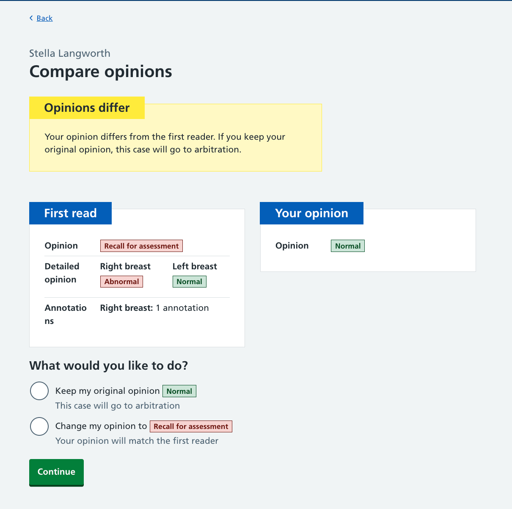
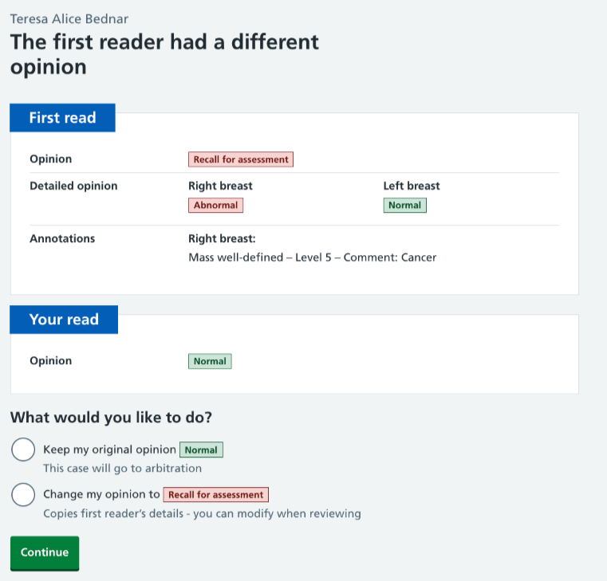
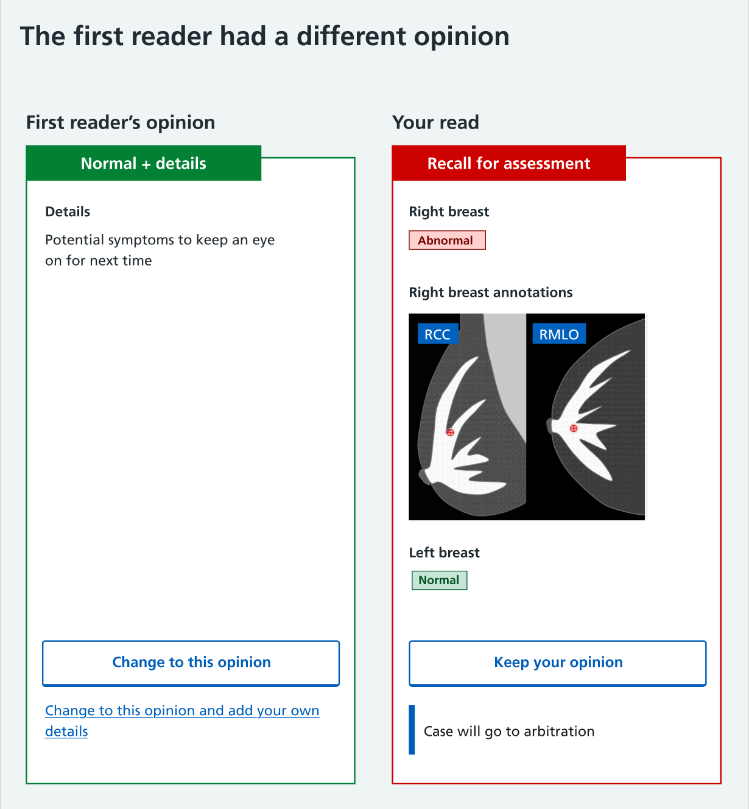
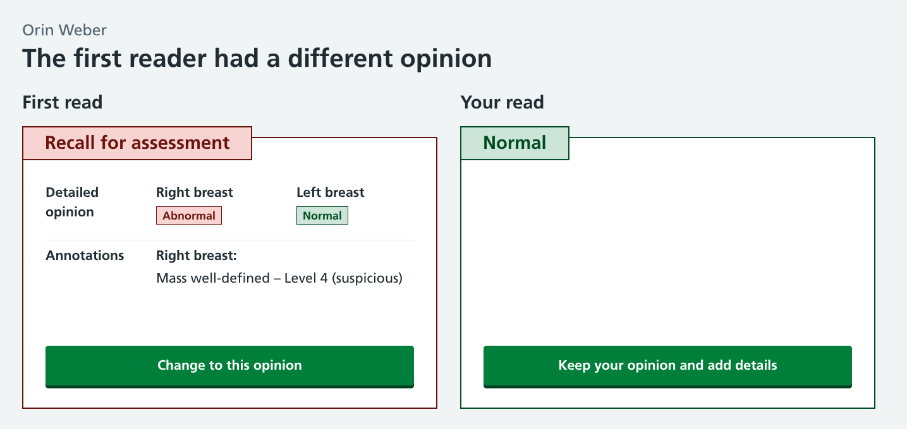
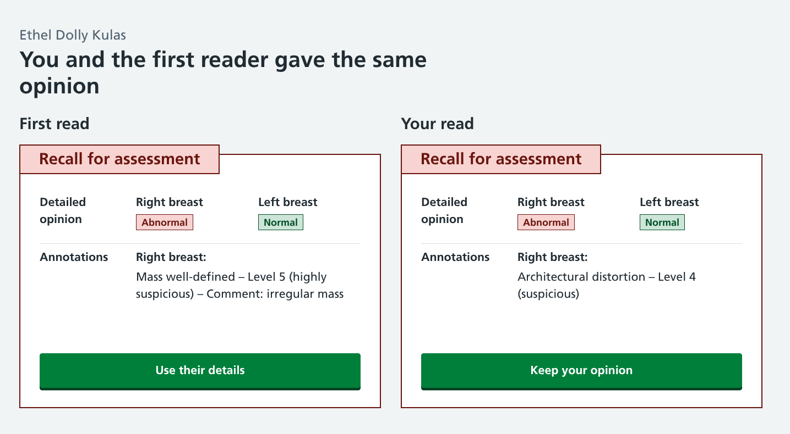
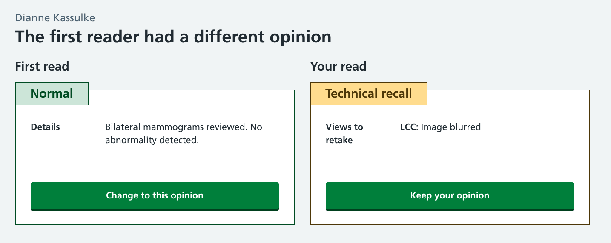

We've been looking at the steps we need second readers to take when reviewing breast screening images before they move on to the next case.

In breast screening, each set of mammograms taken is reviewed independently by two image readers. They each give their opinion on whether any further assessment is necessary. This process is usually conducted 'blind' so the reader who looks at the images second can't see what opinion the first reader gave. The other way of reading is 'open' where the second reader sees what the first said prior to giving their own opinion.

While studies have been done that suggest blind reading is a more effective cancer detection method, there's no conclusive evidence to prove it is better than open reading.  The blind method is generally used in breast screening offices (BSOs) so the second opinion given is unprejudiced by the first.

In the current breast screening system the second reader does not get a chance to ever see the first reader's opinion when blind reading is in operation. The experts we work with have suggested that even when a second read is initially given blind, there may be value in showing the first read to help spot obvious mistakes and avoid unnecessary arbitration.

## Laying out each scenario

What happens next in the reading process largely depends on whether the opinions of the two readers match, or are different.

In our prototype, readers have four opinions they can give:

1. Normal (no sign of cancer)
2. Normal, but add details (when there's no signs of cancer but they want to add a comment)
3. Technical recall (the participant needs to come back for more mammograms)
4. Recall for assessment (a sign of cancer is detected that needs further investigation)

They may also request images from prior mammograms or skip a case, but we'll be looking at those actions in a separate task.

We assessed the various opinion combinations and the relevant next steps. For example:

* `IF` 1st read `IS` Normal `AND` 2nd read `IS` Normal `THEN` go to next case
* `IF` 1st read `IS` Normal `AND` 2nd read `IS` Recall for assessment `THEN` review difference of opinion
* `IF` 1st read `IS` Technical recall `AND` 2nd read `IS` Technical recall `THEN` review recall image requirements

Our proposed solution to handle these is to present a post-opinion screen after second reads that changes based on the combination.

The core components of this are:

1. A summary of the first read, including any associated details
2. A reminder of the user's read
3. An option to keep or change their original opinion

We would also need to show readers the consequence of their decision (i.e. this case will go to arbitration).

Our initial experiments with ways to display these elements included making choices around:

* having an alert to show there's been a difference of opinion or stating this in the page heading
* showing the read results next to each other or one above the other
* asking a question about what to do next (with radio options) or presenting action buttons

### A few examples

## Our preferred design
The side-by-side design with final opinion buttons will be tested with users from BSOs.

## Deciding when to show this

As well as the design of this screen, we are also reviewing the best time to display it to users.

### An early post-opinion screen

We could present the first reader's opinion to second readers immediately after they have given an opinion, but before they are asked to provide any further details.

The main benefit of this is saving duplicate effort. Users can 'adopt' the details that the first reader provided so they don't need to add the same information again if they've seen the same thing.

However, this means only the general opinion is given blind, not the full details. We would need to discuss with clinical assurance and policy teams if this satisfies the requirements of guidance around double reading.

There is also potential that users could 'game' the system. If they select an unlikely opinion, they could see the first read and then change their mind to match it. We can mitigate this by basing performance statistics on blind reads only.

### A late post-opinion screen

The alternative option would be for users to give their opinion, fill in the relevant details (annotations, comments, etc) and then show the details submitted by the first reader.

This would be a truer interpretation of blind reading. Readers would be required to give a complete read before seeing what their colleagues said which would mean a more comprehensive assessment.

The drawback would be a duplication of information. If the second reader identifies the same issues as the first reader, this would create multiple annotations which may then need a separate action to merge and reconcile.

### A delayed post-opinion screen

We also considered building a 'review list' that could be completed following a reading session.

This would allow readers to stay in the 'reading flow' state where they can concentrate on reviewing images and giving opinions. We suspect it's better to interrupt this process and ask them to make an immediate decision rather than requiring them to re-familiarise themselves with cases later on, but we will seek further input from users regarding this workflow.

## The long-term benefits of change

As well as seeing if this improves the image reading workflow for users, we want to find out if it can help address some of the other goals of the breast screening programme.

### Resolving errors more efficienty

As good as image readers are, they can't spot every sign of cancer. If we can tell them that a colleague has seen something of concern when they've given a normal opinion, it offers them an opportunity to take a second look.

They may not be influenced by the first read and stick with their original opinion, but in instances where they've missed something obvious it can be immediately rectified without the need for further intervention.

### Reducing the arbitration queue

Different opinions that are reconsidered by the second reader will decrease the number that are sent to arbitration.

This may be a good or a bad thing. An extra opinion on a case is often valuable and we wouldn't want this new process to result in too many second readers changing their mind, just to avoid the arbitration step.

### Removing duplicate effort

The 'early' post-opinion screen described above allows users to adopt the details already added from the first read. While this may potentially save time, we need to understand if this is better overall than having the extra assurance of both readers identifying the same issue. 

### Preparing for the future

At some point, AI reads will become a thing.

While it hasn't been specifically designed with AI in mind, our post-opinion review page would work well when cases have already had a first read by a robot. Users are presented with a first read which they can agree or disagree with, and may even be none-the wiser as to whether this was completed by a human or a machine.
