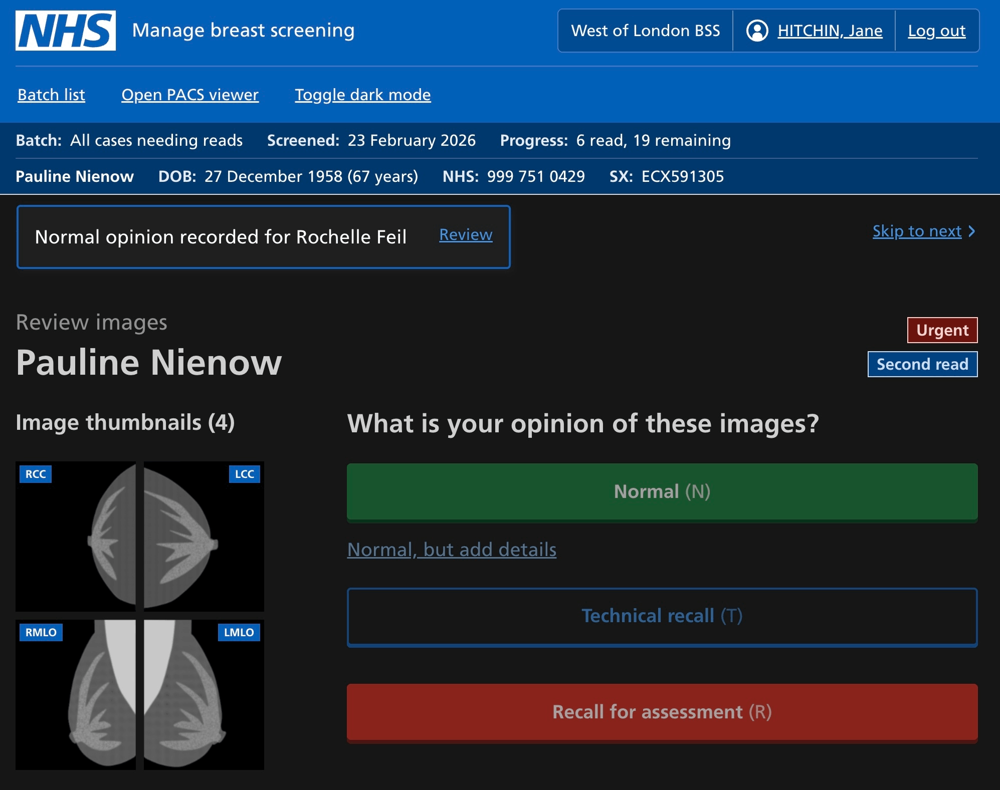

Image readers review mammograms to check for potential signs of cancer that show up on the images. Most cases take under one minute to read, and most cases are normal. The software used to record their opinion makes it possible to record an opinion of ‘normal’ in one click, using the mouse or a keyboard shortcut. 

## What happens currently

Image readers have a set number of cases to get through, and NHS targets state that every case must be read within two weeks of a person attending their screening appointment. It must not be possible to accidentally skip a case. Theoretically, a keyboard shortcut or mouse could be pressed twice, recording an opinion of normal on two separate cases without noticing. To prevent this, NBSS disables the normal button for two seconds after a new case is loaded. This helps the image reader to understand they’re looking at a fresh case, and physically prevents a double click.

We’ve decided to retain the mechanism of disabling the opinion buttons for a period of time after the user gives an opinion on a case. 

## NBSS screenshots 

For context, here are two screenshots showing how NBSS handles the disabled button state and shows feedback for image readers: 

## Disabling opinion buttons
We needed to draw a distinction between:

* reducing the incident of double-clicking the normal button 
* policing the minimum of time we expect readers to review a case

The service should not dictate how long image readers read for. Accidental double-clicking (or tapping a keyboard shortcut) happens in a second or two, so we think disabling the buttons for just 5 seconds should work well for our purposes. We may adjust this number as we see how well it works in practice. 

## The other liminal bits that help the user understand they’ve moved to another case

When moving to a new case, a few things happen: 

* Mammograms reload on PACS (Picture Archiving and Communication System)
* NBSS may have a short lag while it loads new patient information 
* In some BSOs (Breast Screening Offices), users find a matching case on paper to cross-check information and see information on paper that isn’t in NBSS 

All of this serves the purpose of helping the user understand they’ve moved to another case. 

With our new service, some things will remain the same: 

* Mammograms reload on PACS
* Our tool loads new patient information and thumbnails, which may have a different structure depending on the information and number of thumbnails  

But in the new world of our service, there’ll be no paper to shuffle through. And in addition: 

## Toast notification for quick feedback 

We’ll show a new toast banner notification when the user moves to the next case. A toast banner or notification is a lightweight, compact alert that informs the user about something that’s happened. In our case, it’ll show the user what opinion they've given and for whom. 

We think showing this will help the user:

* have reassurance and understand they’ve moved to the next case
* see the opinion they gave on the previous case 
* go to review (and change) their opinion if needed.

## Screenshot

In the screenshot below, you can see the disabled state for the dark mode buttons, and the toast notification (which says ‘Normal opinion recorded for (person’s name)’). 

## What’s next

We need to check if the disabled buttons help serve their intended purpose. We also think it’s possible we’ll want to tweak the length of time the buttons stay disabled – too short means accidentally skipping cases could still happen, too long could be an annoyance. 

