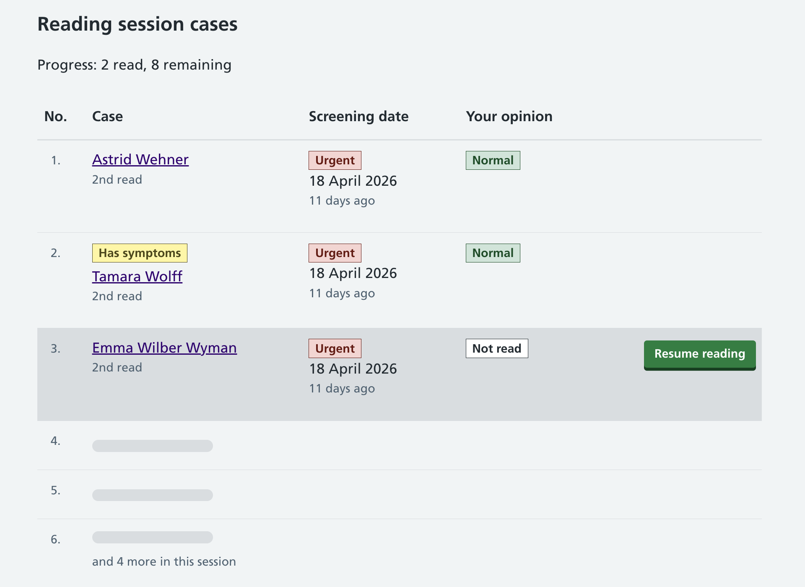

We've been looking at how to give image readers an overview of their reading session so they can review their opinions, and how the session 'container' should work. We've also settled on 'session' as the right term, rather than batch, list, or similar.

For more about the image reading process, see our previous design histories: [understanding image reading](https://design-history.prevention-services.nhs.uk/manage-breast-screening/2025/04/understanding-image-reading/), and [reading in batches](https://design-history.prevention-services.nhs.uk/manage-breast-screening/2026/02/reading-in-batches/). 

## Sessions and the in-progress session 

The image reading session is a container for a number of cases that the image reader intends to read, for example 25 cases. During the session, the image reader looks at each case and gives an opinion. 

If cases were assigned to a reader all at once, any reader who walked away mid-session could leave a block of cases locked and unavailable to others. To prevent this, only one case is locked at a time, assigned to the image reader at the point it's needed. This means the full session list isn't known in advance, but ensures cases remain available to other readers until the moment they're being read.

## Session in progress

While a session is in progress, the image reader can see an overview of cases they've read in that session, and the opinion they've given on each case. 

The image reader can see cases represented as a list: previously read, current, and future cases. The future cases are implied graphically using numbered blocks. The current case (meaning no opinion has been given yet) is indicated with a different colour background, and the image reader can resume from this place in the list. 

## Session complete page 

When the image reader has read all cases in their session, they're taken to the completed session page. This allows the image reader to see a list of their opinions for each case, along with the screening date and a tab where they can see opinions given for first and second read, along with a case outcome, if available.  

The image reader can also choose to 'finalise' their opinions early – meaning they can't change their mind. Once finalised, the case can be read by a second reader. They can also start a new image reading session from this point. 

## Next steps 

We'll need to do user research to see how well the designs meet user needs, and if any further iteration is needed. 
