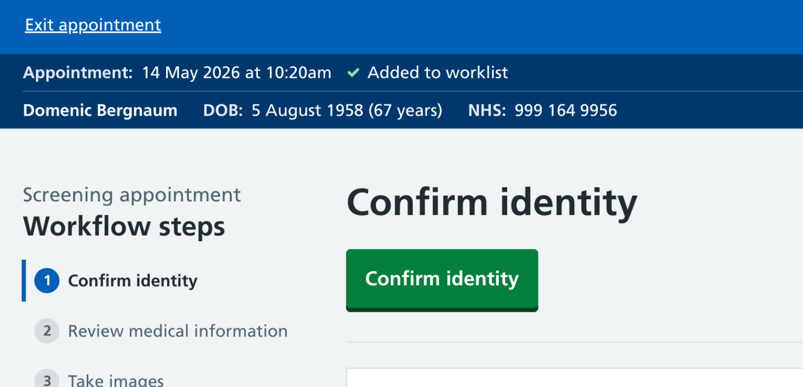
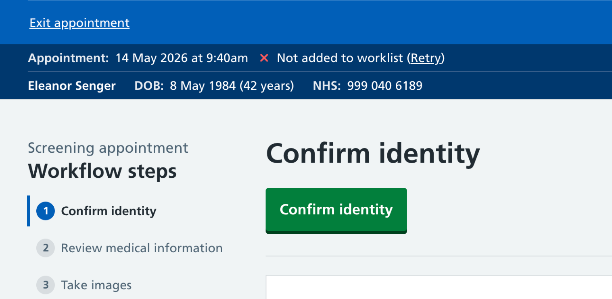
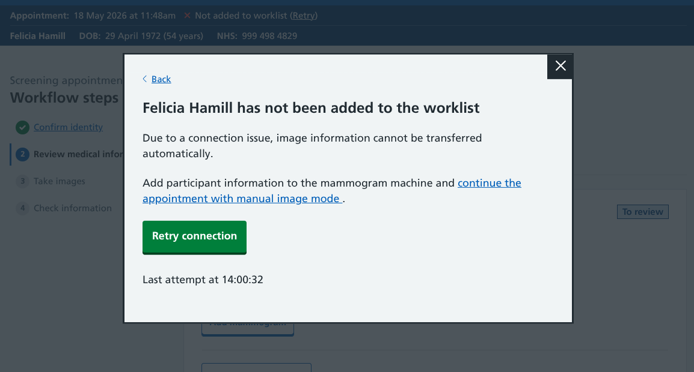
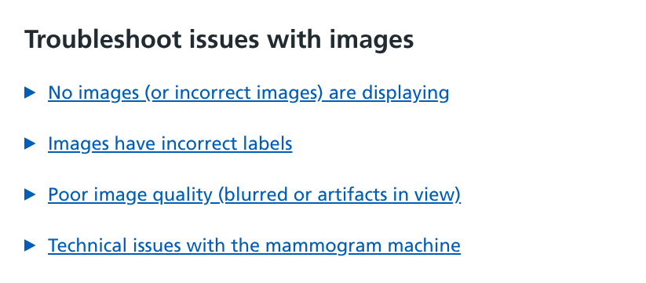
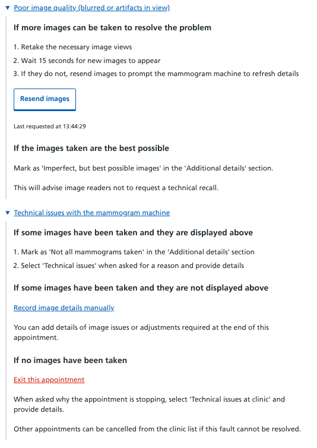
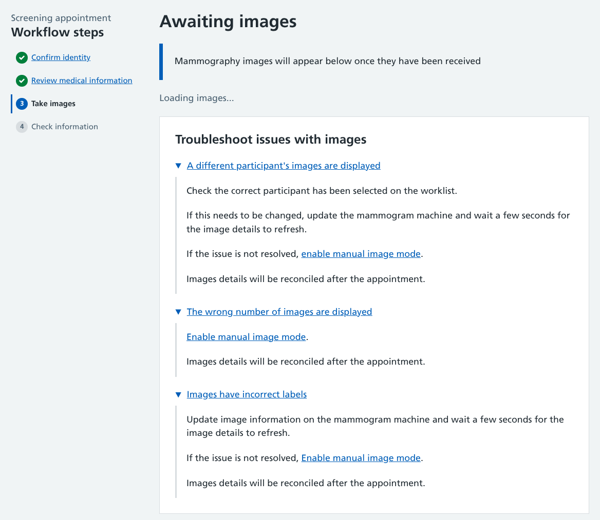

We've been looking into how to let our users know if the connection between mammogram services is working as it should be, and what to do if it's not.

## Getting technology talking

Our team of developers have been busily building the [Rubie](/breast-screening-pathway/2026/05/naming-new-breast-screening-service/) gateway, a technology that will perform a crucial role in our service.

It allows the transfer of participant details and mammogram images between our system and the modality machines in breast screening units (BSUs).

The general plan is:

* when a user starts (or resumes) an appointment on Rubie, the gateway adds the participant details to a 'worklist'
* the worklist syncs with the BSU's modality machine(s), showing which participants are ready to be scanned
* the mammographer selects the person from the modality worklist, and begins taking images
* as soon as the first image has been taken, the gateway starts sending image data to Rubie
* information is transferred live, so image thumbnails and any associated metadata will display on Rubie almost instantly
* once the appointment is complete (either fully concluded or prematurely stopped), the gateway tells the modality machine that the participant can be removed from the worklist.

### Improvements to the current setup

The gateway will automate various manual processes.

BSUs currently export and upload their daily clinic lists from NBSS to a shared worklist on their Radiology Information System (RIS). This worklist can be viewed on local modality machines.

As there is no direct connection between NBSS and the RIS, there is no way for the system to know when appointments are completed. This leads to a bulky worklist that stays on the machines until they are cleared at the end of each day.

After an appointment, images are sent straight from the modality to the Picture Archiving and Communication System (PACS) ready for radiologist review. Mammographers need to enter details of the views they have taken into NBSS.

By transmitting details as they happen, we are:

* making it easier for mammographers to pick the right participant on the modality machine
* showing users details of the images they have just taken so they can confirm them, add details or immediately correct any errors

## What our users need to know

After observing mammogram appointments and speaking with radiographers, we've established how our technology can best fit in with their working practices.

To help things run smoothly, we should tell them:

* when each participant is confirmed on the worklist
* when there's a connection problem and that the participant is not on the worklist
    * how to retry the connection and hopefully fix the issue
    * how to switch to an alternative method of collecting image information if things aren't working
* what to do If the person is on the worklist, but image details are not transferring correctly

## The 'everything is OK' status

An 'Added to worklist' message accompanied by a green tick lets users know that the data transfer has taken place as intended.

It gives them confidence that once they have completed steps 1 and 2 in the appointment workflow, they can move from Rubie to the modality machine and the participant will be there.

As this action was triggered by starting the appointment, we figured that the best place for this to go was next to the appointment time details. This status would be visible throughout the various stages of the appointment.

## The 'everything is not OK' status

While we hope that the system is reliable, no service can guarantee 100% uptime.

So if something fails, we display a 'Not added to worklist' message. This is accompanied by a red cross (to help users notice there is a problem) and a link to 'retry' the connection. 

Our users have told us that they don't want to be doing anything complicated in the middle of a mammogram appointment to resolve issues. With that in mind, we've built a simple screen that either appears when they hit the retry link, or before they get to the 'Take images' appointment stage. 

If their attempt to reconnect fails, the 'Last attempt time' is updated. They can keep trying, or choose to switch to the backup 'manual image mode' where users can tell us what images have been taken, rather than us taking this automatically from the mammogram machine.

If the connection is restored, the users is returned to where they left off (or moved on to the imaging step) with a success message.

### How the backup option works

If the participant can't be added to the worklist, the fallback is for the mammographer to take images as an 'unscheduled procedure'.

They would need to add identifying info (such as the participant's name, date of birth and NHS number) into the mammogram machine then [manually record image info](/manage-breast-screening/2025/12/recording-images-taken/#manual-image-flow-backup-workflow#manual-image-flow-backup-workflow) on Rubie. 

The data would be need to be merged with the participant record later on (in a yet-to-be-determined process).

## The 'everything seems OK, but it's actually not' workflow

If the system believes things are working correctly, there may still be issues encountered by users when the images were supposed to be transferred.

We need to provide troubleshooting information available from automatic images mode.

## An early draft

While the team were figuring out the technical elements, we took an educated guess at some of the errors that could occur and some steps to resolve them.

These expandable components were placed at the bottom of the page where image information would be imported.

We showed these to some users, with a heavy caveat that we didn't yet have the full details of how things would work. 

The feedback was that these steps were far too complicated to follow during a mammogram appointment. This was not the time to be following 'if this then that' type options.

### Proposed revisions

Our updated troubleshooting guide is much more route one.

We're working under the assumption that the gateway will remain open and keep transmitting image data while the appointment is active - any changes made on the mammogram machine (new images or changes to image metadata) will be transferred without the need for any user actions.

As well as simplifying the steps, some of the previous explanations have been removed:

* In instances of 'Poor image quality', mammographers are already trained in what to do. If they decide to take new images these will be automatically synced. If they do not sync, that is covered by other troubleshooting steps so does not warrant a separate troubleshooting item.
* Where there is a 'Technical issue with the mammogram machine', users already have suitable options.
    * If no images have been taken, they can 'Exit appointment' and follow the relevant steps
    * If at least one image has been taken, they can use the 'Not all mammograms taken' checkbox and use the 'Technical issues' option to provide details

## What we're doing next

They Rubie gateway is still under active development. We're working closely with the IT teams at our partner BSUs to ensure the technologies work in the way they have been designed.

The ideal scenario is that our failure messages and guidance will never be seen. While our best minds are working on making that happen, we will keep iterating our designs and content just in case they're needed.

One big unanswered question is what happens if the connection fails mid-way through the appointment. The patterns used so far relate to things either working or failing as the process begins, but in an average 8 minute screening appointment there's a lot that might go wrong.

We also need to think about whether we need to collect more info from users about why they switched to manual image mode. The gateway will hopefully record any faults, but it would also be useful to get users to tell us whey they had to switch.