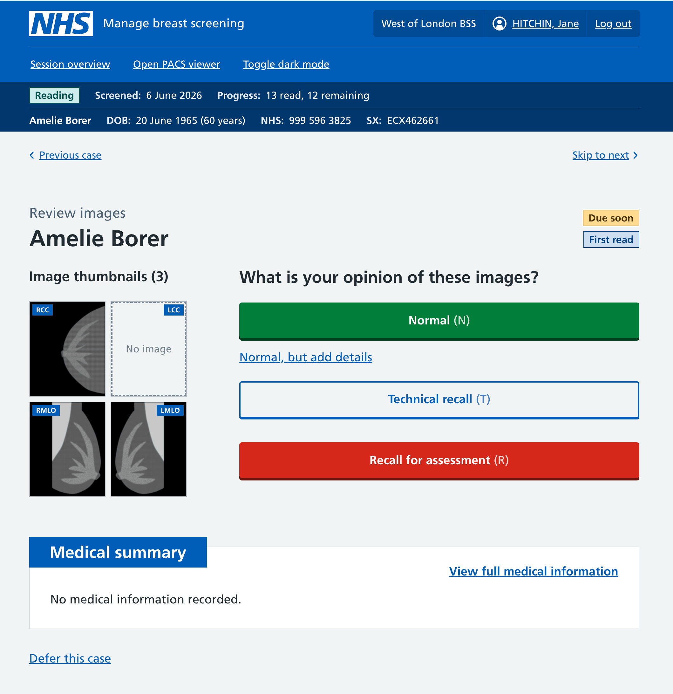
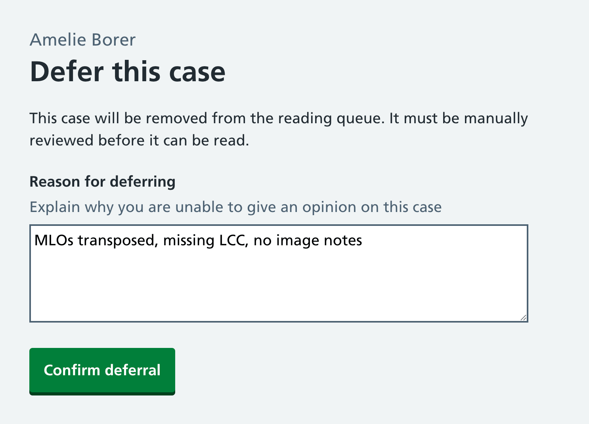
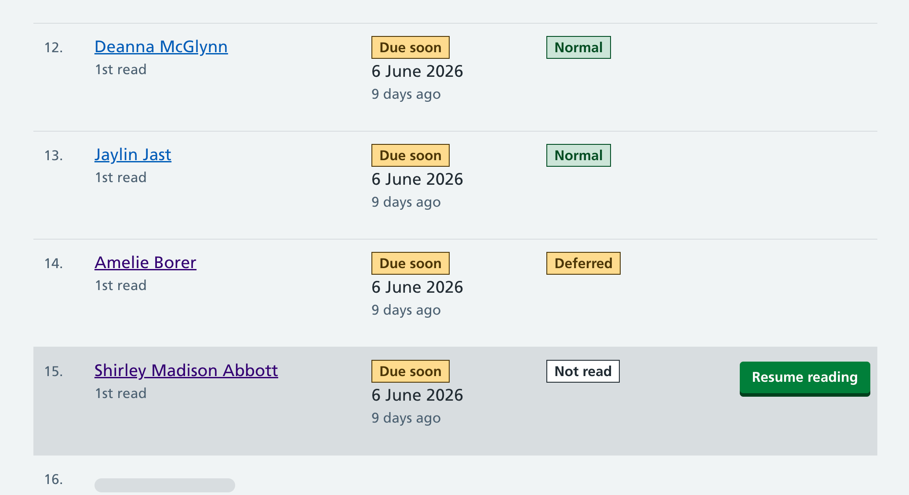
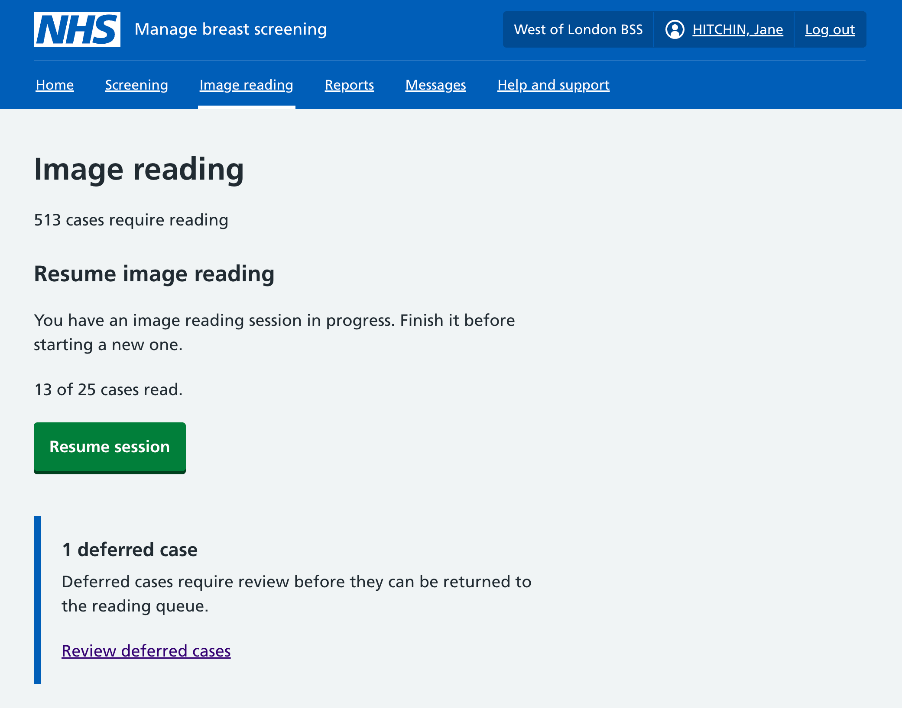
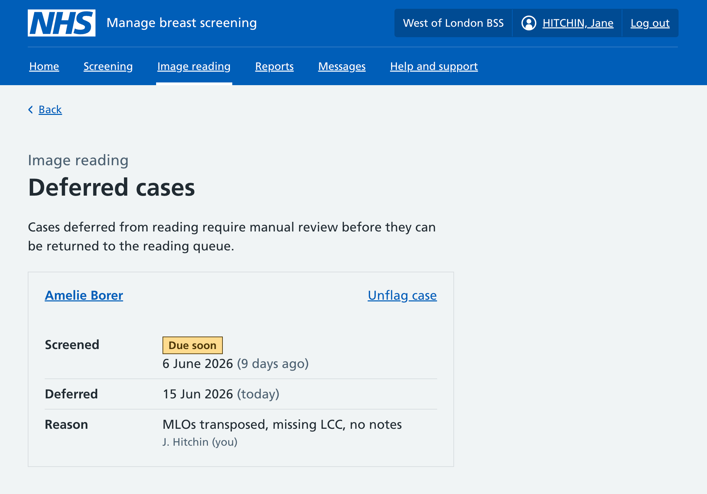
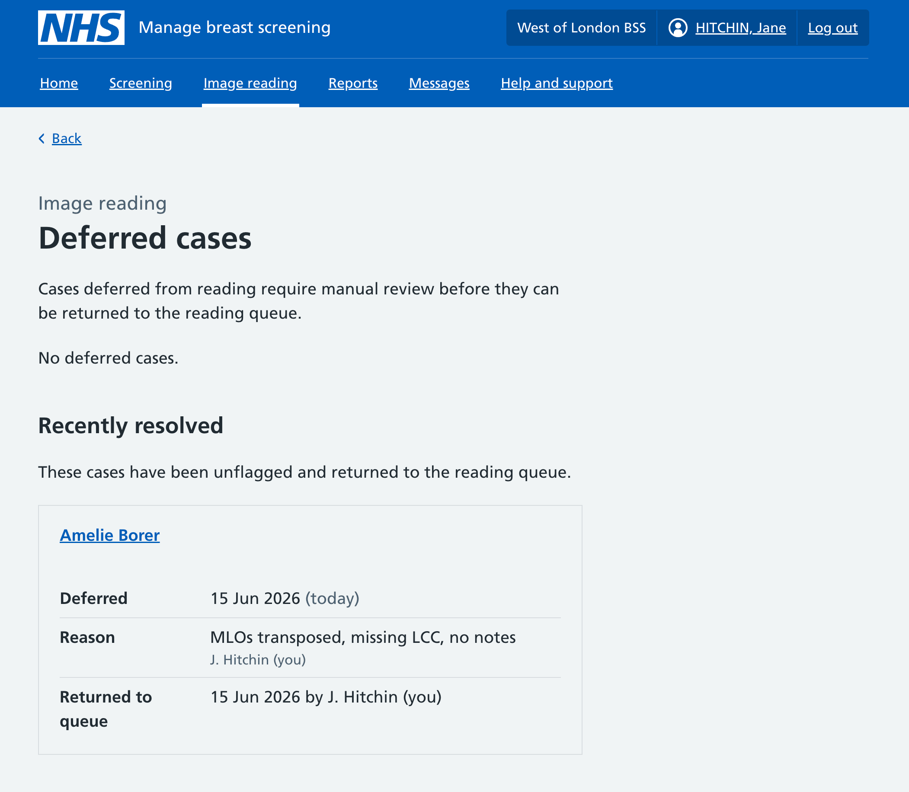

We’ve been looking into how we support image readers in flagging a case that has an issue and cannot be read, and how an admin interface could work for showing these cases.

## Things that might go wrong on a case

There are many checks that happen at each stage of screening to minimise the chance of images not being readable by the time they are looked at by radiologists. With our new service, some of those will hopefully be unnecessary or can be automated. However, we need to allow some flexibility to cope if things go wrong, for example:

- The images don’t appear to match prior images, implying they’re from a different participant
- The images are mislabeled (this might not always prevent reading, but might indicate another issue)
- Images are missing without explanation
- Some other data issue that implies something has gone wrong.

## The current process

Breast screening offices read clinic by clinic, typically with paper bundles for each clinic, but sometimes using NBSS on its own (‘paper light’). Administrative staff will check over the clinics and their bundles ahead of time to prepare them. If they come across any anomalies or issues, they can pull the case from the bundle to be reviewed so it doesn’t go to image reading. This is sometimes called an ‘exception list’. If a case with issues made it to image reading, the reader could also refuse to read it and place the case aside to be reviewed.

## Allowing for flexibility

The great thing about paper is its flexibility. If you need a new checkbox field, you can just draw one. If you need to set a case aside, you move the paper. With the shift towards [reading by session](https://design-history.prevention-services.nhs.uk/manage-breast-screening/2026/02/reading-in-batches/) (previously called batch) and automatically putting oldest cases first for reading, what’s our equivalent?

Our reading interface currently only supports an image reader giving an opinion or requesting priors - but they have no way of flagging the case or putting it aside. They can skip to the next case, but because we always put oldest case first, the case with the issue will keep being offered. We need a way for image readers to mark the case to be reviewed.

## Deferring a case

We’re tentatively calling this new workflow ‘deferring a case’. The flow we’ve designed is very similar to our [requesting prior mammograms flow](https://design-history.prevention-services.nhs.uk/manage-breast-screening/2026/06/requesting-prior-mammograms/). When a case is deferred it will not be included on any reading lists until it’s marked as ready to read again.

### Deferring from the opinion page

We’ve added ‘Defer this case’ as a link at the bottom of the page. The link doesn’t need to be prominent or always visible, just available for the rare time something has gone wrong. This unobtrusive placement reflects the expectation that users should be giving an opinion for the vast majority of cases (even when it's a difficult case to read) and shouldn't be deferring unless there is an issue to be resolved.

In this example there are two issues: the MLO images appear to be swapped (what’s labelled as an RMLO is an LMLO and visa versa), and there is a missing LCC and no image note about it being partial mammography.

### Giving a deferral reason

When deferring, image readers must provide a description of what is wrong. This will be available to administrative staff when they are reviewing this case.

Once requested, the UI moves on to the next case to read. Behind the scenes we block the case from being read and put it into a workflow to be reviewed. From the image reader’s point of view doing a session of 25 cases, this will count as completed - the same as when they request priors.

### Session overview

The case will show as deferred on the session overview, and image readers can revisit that case and change their answer.

### Image reading homepage

When there are deferred cases, these get highlighted on the image reading dashboard. We'll probably find a better home for these in the future as this dashboard is primarily for image readers rather than administrative staff.

### Deferral list

We’ve added a new page to show the cases that are currently deferred. We’ll likely need to do expand this page in the future, but for now it is a list of the current cases and includes the reason each is deferred. When the link ‘unflag case’ is used, the case will be removed from the deferral list and returned to the reading queue.

We don’t currently have the ability to add any further notes - either whilst the case is being investigated or once it’s resolved - but anticipate this may will be needed in future.

We can temporarily keep a list of recently deferred cases in case someone needs to refer to them. We anticipate this may end up as a list with filters and search.
