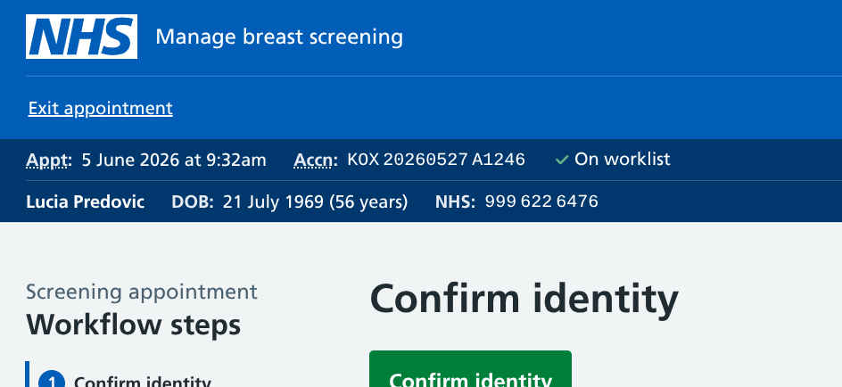
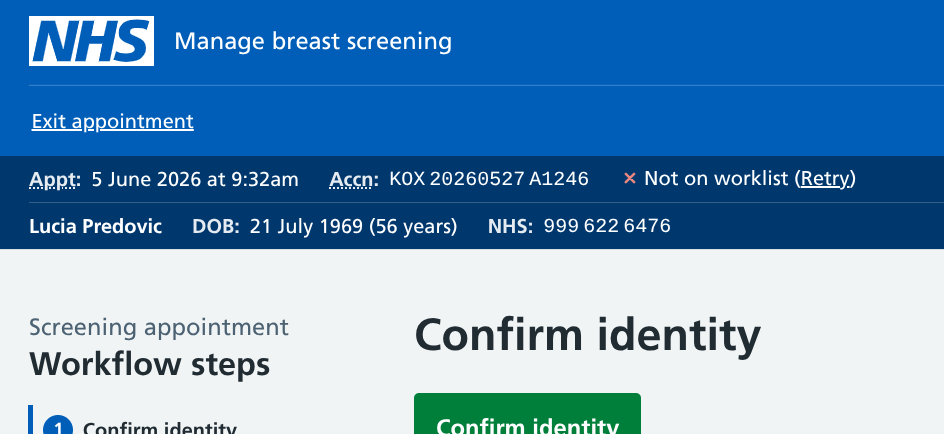
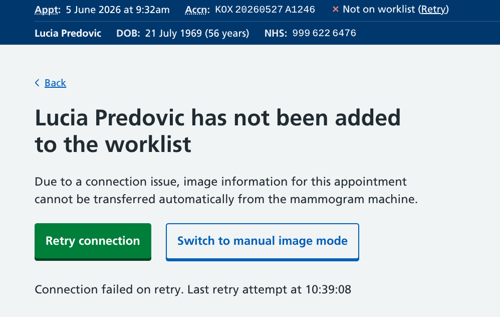
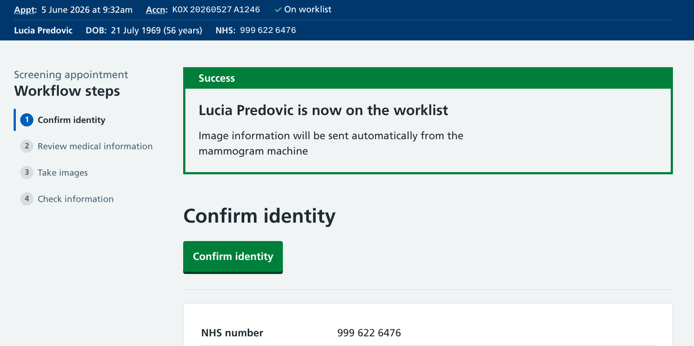
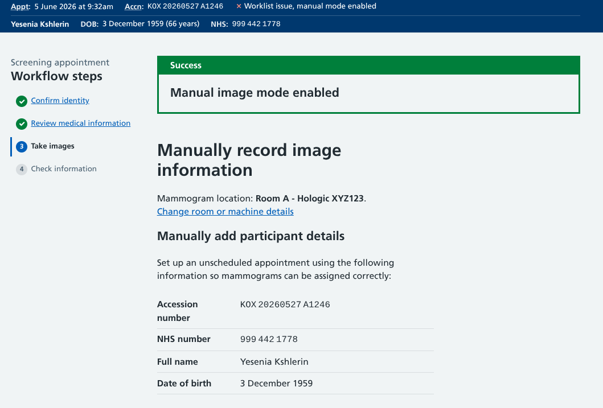
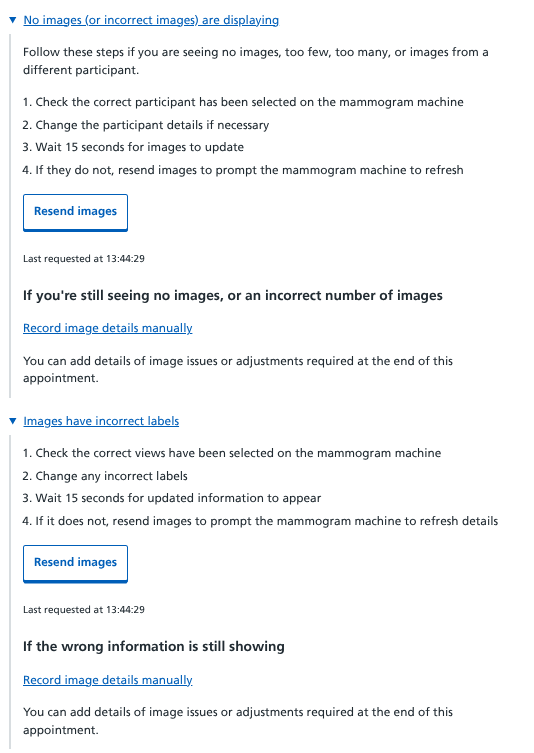
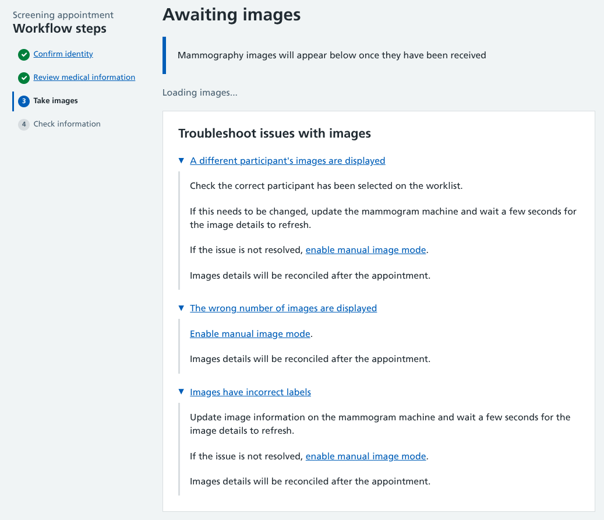

We've been looking into how to let users know if the connection between our service and the machines used in mammography rooms is working as it should be, and what to do if it's not.

## Getting technology talking

Our team of developers have been busily building the [Rubie](/breast-screening-pathway/2026/05/naming-new-breast-screening-service/) gateway, a technology that will perform a crucial role in our service.

It allows the efficient transfer of data between the imaging machines in breast screening units (BSUs) and our service. That means we can send things like appointment statuses, and receive back details of mammogram images and any other associated info.

The general plan is:

* when a user starts (or resumes) an appointment on our service, the gateway adds the participant details to a 'worklist'
* the worklist syncs with the modality machine(s) at the BSU, showing which participants are ready to be scanned
* the mammographer selects the person from the modality worklist, and begins taking images
* as soon as the first image has been taken, the gateway starts sending image data to our service
* information is transferred live, so image thumbnails and any associated metadata will display on our service almost instantly
* once the appointment is complete (either fully concluded or prematurely stopped), the gateway tells the modality machine that the participant can be removed from the worklist

### Improvements to the current setup

Our aim is for the gateway to automate various manual processes.

BSUs typically export and upload their daily clinic lists from NBSS to a shared worklist on their Radiology Information System (RIS). This worklist is then synced to local modality machines where it can be viewed.

As there is no direct connection between NBSS and RIS, human intervention is required to let the system to know when a participant is ready to be scanned and when an appointment has been completed.

Automating these relatively minor tasks could turn into a significant time saving when applied across the 2 million mammogram appointments that take place in England each year.

By transmitting details between our service and the modality, we are:

* removing the need to pre-upload clinic lists
* making it quicker for mammographers to pick the right participant from the worklist (by only showing active appointments)
* allowing users to confirm images are OK, add extra details, or immediately correct any errors before they are sent to the PACS (Picture Archiving and Communication System)

## What our users need to know

After observing mammogram appointments and speaking with radiographers, we've established how our technology can best fit in with their working practices.

To help things run smoothly, we should tell them:

* when each participant is confirmed on the worklist
* when there's a connection problem and that the participant is not on the worklist
    * how to retry the connection and hopefully fix the issue
    * how to switch to an alternative method of collecting image information if things aren't working
* what to do If the person is on the worklist, but image details are not transferring correctly

## The 'everything is OK' status

One an appointment has started, an 'On worklist' message accompanied by a green tick lets users know that the data transfer has taken place as intended. This is displayed alongside the appointment date and time, and the 'Accn' - an accession number, which is a unique ID assigned to each mammogram appointment. 

This status gives them confidence that once they have completed steps 1 and 2 in the appointment workflow, they can move from looking at our service to the modality machine and the participant will be there.

## The 'everything is not OK' status

While we hope that the system is reliable, no service can guarantee 100% uptime.

So if something fails, we display a 'Not on worklist' message. This is accompanied by a red cross (to help users notice there is a problem) and a link to 'retry' the connection. 

Our users have told us that they don't want to be doing anything complicated in the middle of a mammogram appointment to resolve issues. With that in mind, we've built a simple screen that either appears when they hit the retry link, or before they get to the 'Take images' appointment stage. 

If the connection is restored, the user is returned to where they left off (or moved on to the imaging step) with an updated status and a success message.

### How the backup option works

If their attempt to reconnect fails, they can keep trying, or choose to switch to 'manual image mode'.

After they have switched to manual, a 'Worklist issue, manual mode enabled' status appears for the remainder of this appointment. We have removed the link to retry as we want users to move forward and get the appointment completed, rather than returning to make further attempts to restore the connection.

As this status means the participant is not on the worklist, we've included instructions on how to proceed. This requires the mammographer to set up an 'unscheduled procedure' on the imaging machine with details of the participant and appointment then [manually record details of images taken](/manage-breast-screening/2025/12/recording-images-taken/#manual-image-flow-backup-workflow#manual-image-flow-backup-workflow) on our service. 

The image data will need to be merged with the participant record later on (in a yet-to-be-determined admin process).

## The 'everything seems OK, but it's actually not' workflow

If the system believes things are working correctly, there may still be issues encountered by users when the images were supposed to be transferred.

We need to provide troubleshooting information available from the default automatic image transfer mode.

## An early draft

While the team were figuring out the technical elements, we took an educated guess at some of the errors that could occur and some steps to resolve them.

These expandable components were placed at the bottom of the page where image information would be imported.

We showed these to some users, with a heavy caveat that we didn't yet have the full details of how things would work. 

The feedback was that these steps were far too complicated to follow during a mammogram appointment. This was not the time or place to be following complicated workflows.

### Proposed revisions

Our updated troubleshooting guide is much more straightforward.

All of these options encourage the user to switch to manual image mode which is the quickest and easiest way of continuing the appointment. If this option is selected from the first troubleshooting scenario, details for adding the participant to the worklist will be included. If they switch from the links in scenarios 2 or 3, it is assumed that the initial worklist connection was successful so this information is not shown.

We're working under the assumption that the gateway will remain open and keep transmitting image data while the appointment is active. Any changes made on the mammogram machine (new images or changes to image metadata) will be transferred without the need for any user actions.

As well as simplifying the steps, some of the previous explanations have been removed:

* In instances of 'Poor image quality', mammographers are already trained in what to do. If they decide to take new images these will be automatically synced. If they do not sync, that is covered by other troubleshooting steps so does not warrant a separate troubleshooting item.
* Where there is a 'Technical issue with the mammogram machine', users already have suitable options.
    * If no images have been taken, they can 'Exit appointment' and follow the relevant steps
    * If at least one image has been taken, they can use the 'Not all mammograms taken' checkbox and use the 'Technical issues' option to provide details

## What we're doing next

The Rubie gateway is still under active development. We're working closely with the IT teams at our partner BSUs to ensure the technologies work in the way they have been designed.

The ideal scenario is that our failure messages and guidance will never be seen. While our best minds are working on making that happen, we will keep iterating our designs and content just in case they're needed.

One big unanswered question is what happens if the connection fails mid-way through the appointment. The patterns used so far relate to things either working or failing as the process begins, but in an average 8 minute screening appointment there's a lot that might go wrong.

We're also looking into the best place for users to give more info on why they switched over to manual mode. Any feedback will help to ensure issues do not reoccur, but we need to be conscious of asking mammographers to complete extra data fields when they're in teh middle of an appointment.
