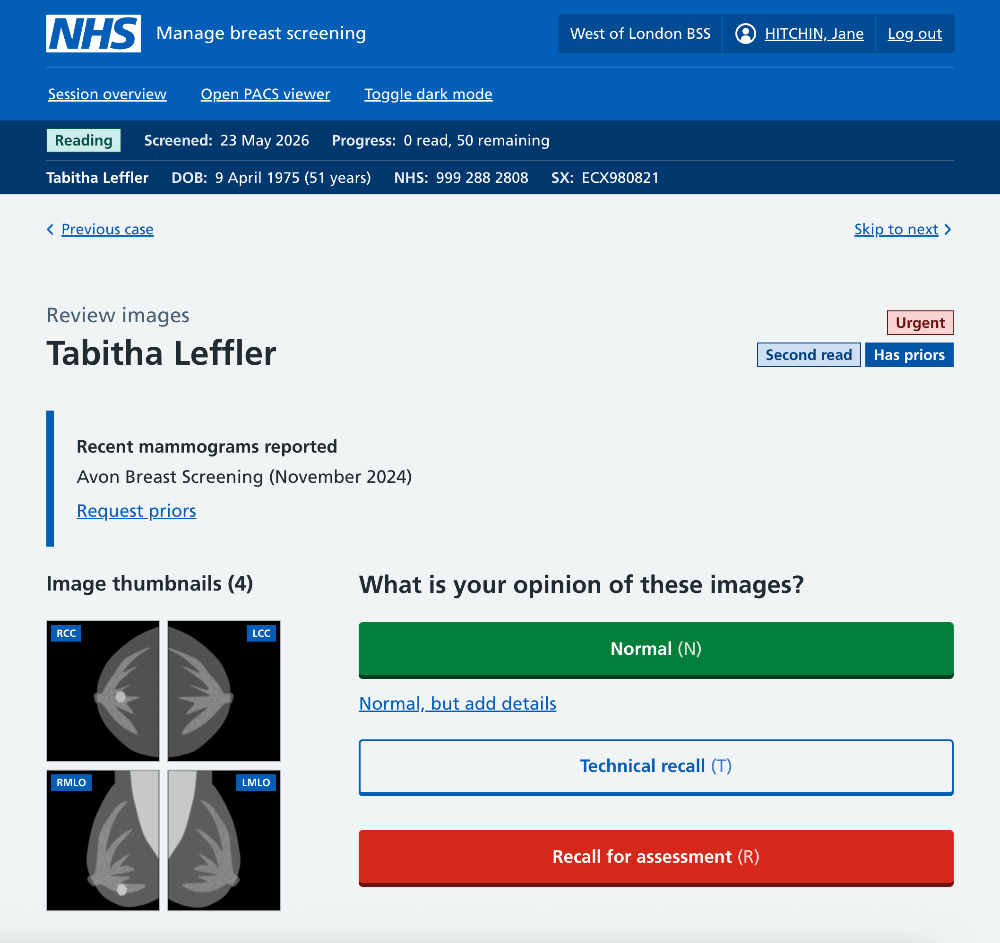
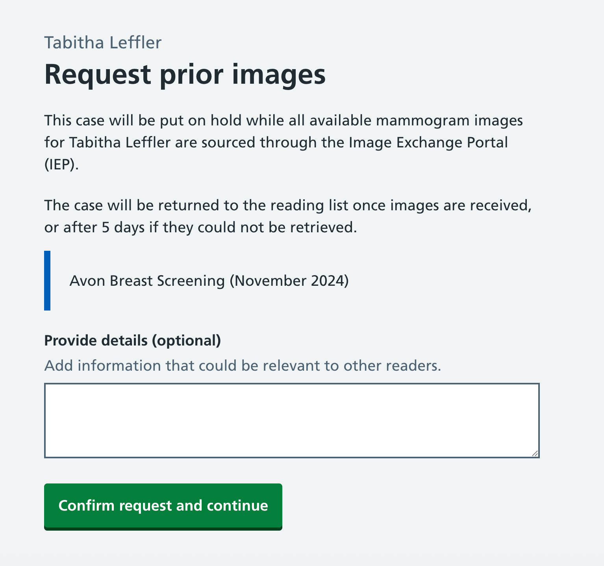
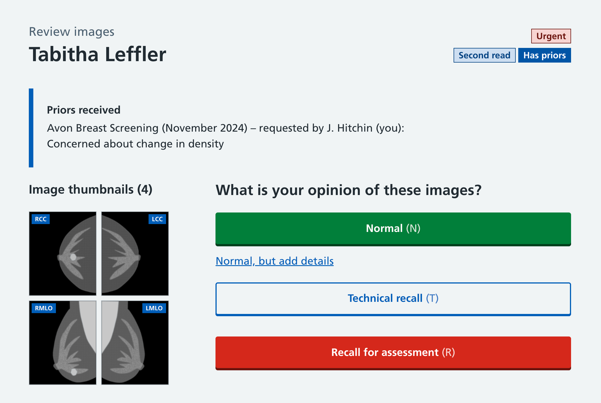
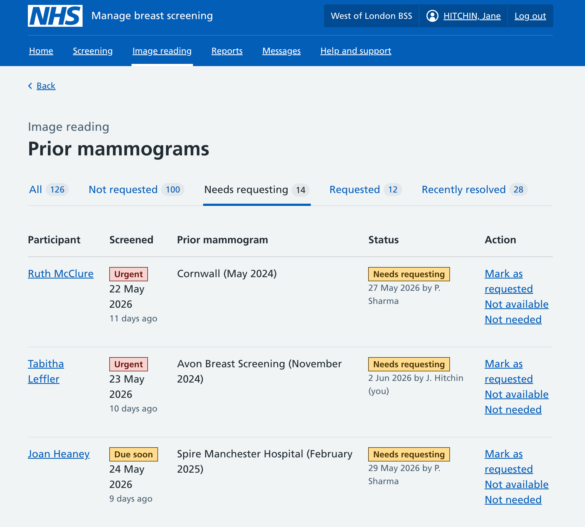
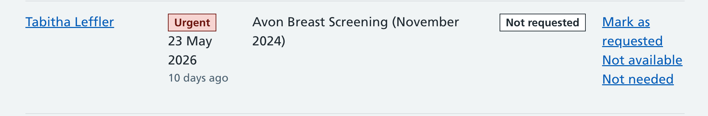
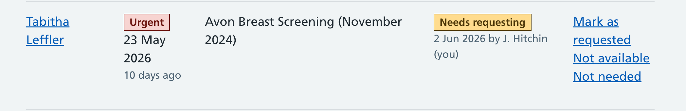
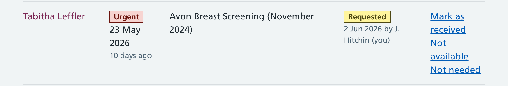
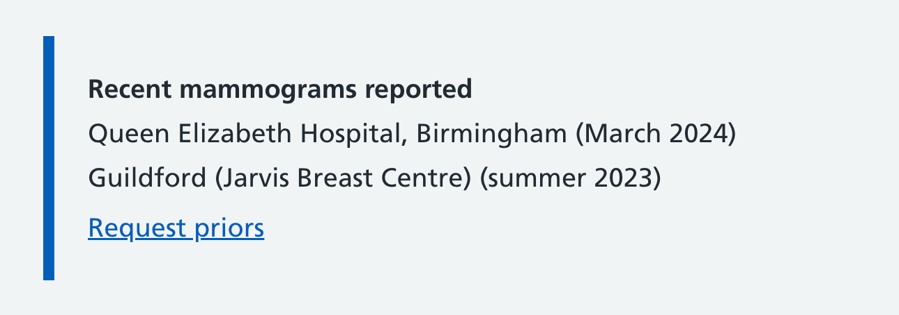
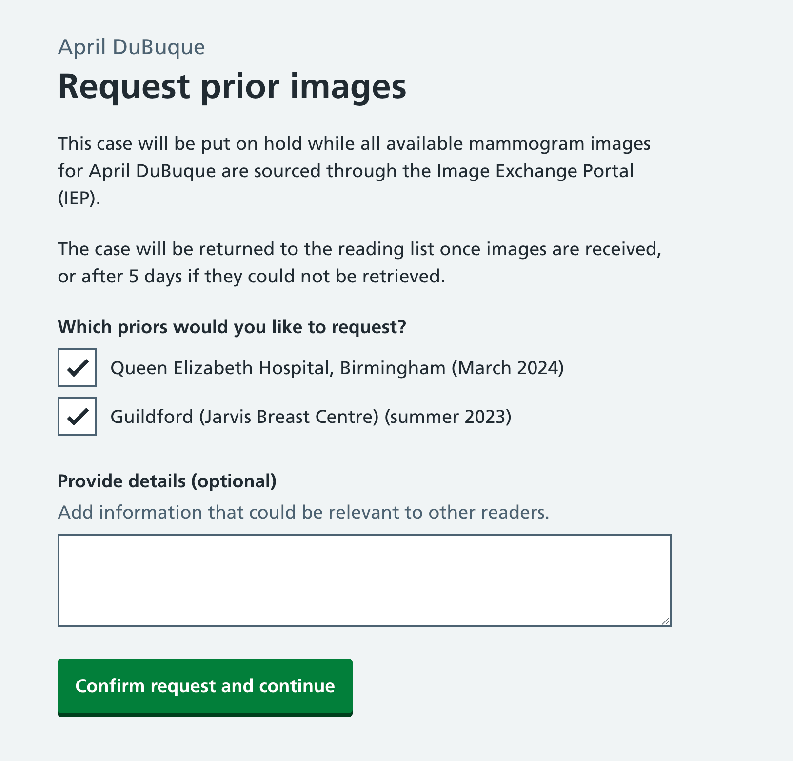
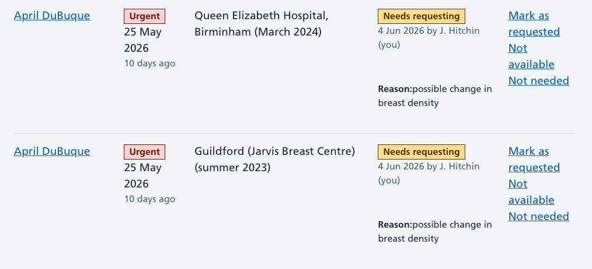

We’ve been looking into how we support image readers in requesting prior screening mammograms before a case is read, and how an admin interface could work for dealing with requests for prior mammograms.

## Why prior mammograms are important

When participants come for their first breast screening, they’re typically about [twice as likely](https://digital.nhs.uk/data-and-information/publications/statistical/breast-screening-programme/england-2024-2025) to be recalled for further assessment. There are a few reasons for this, but one is that when an image reader is looking at those first mammograms, they have nothing to compare them against. Some abnormalities are relatively easy to spot, but some depend on seeing how that breast tissue looked three years previously - the image readers don’t know what ‘normal’ looks like for that participant.

Thus having access to prior mammograms is important for reducing unnecessary recalls.

## Accessing prior mammograms

Prior mammograms taken at the same Breast screening unit (BSU) are easy to access. If they were taken by a different BSU, or privately or abroad they can be quite tricky to access. In those cases during screening the mammographer [record details of the prior mammograms](/manage-breast-screening/2025/06/recording-previous-mammograms/).

We currently refer to these as ‘reported’ mammograms, though this name is likely to change. We consider them a bit different to mammograms taken by the BSU - they’re unverified, and we don’t have data for them (yet).

Some BSUs will choose to proactively try to get access to all reported prior mammograms and delay image reading until they arrive. Others will send the case for image reading regardless, but let image readers request the mammograms be retrieved.

BSUs will have a time limit of how long they’ll wait for priors to come in - typically 5 days. As soon as the priors arrive the case can go to image reading. If they don’t arrive, then the case will have to be read without the priors.

## Requesting priors

Our long term goal is to automate retrieval of priors where we can. To start with, our private beta will have a similar process to NBSS - that is to support image readers requesting priors where they were noted during screening. Or if the BSU has a policy of requesting all priors, to support delaying image reading until those priors have arrived.

### Priors shown on the opinion page

When priors were reported during screening, we’ll show details of those as inset text above the existing reading UI. This is intentionally placed prominently, and pushes the rest of the UI down. It won’t be shown for routine or existing mammograms we already knew about.

The image reader has a choice whether they want to request priors or not. They may decide they can give an opinion without needing to see them; or they may decide that it’s important to see them before they can give an opinion. As each case gets read twice, either of the readers could decide to request prior mammograms.

### Providing context to request reason

When the image reader chooses to request mammograms, they will be taken to a page to confirm and given and opportunity to provide a reason why they are requesting the images. This can be used to provide some context to the next image reader who looks at the case, as it may not come backt to them to read.

Once requested, the UI moves on to the next case to read. Behind the scenes we block the case from being read and put it into a workflow to request those priors. From the image reader’s point of view doing a [session of 25 cases](/manage-breast-screening/2026/05/image-reading-session-overview/), this will count as completed.

### Once priors have been received

As soon as the priors have been received, the case can go back to image reading. If had already been read once, that read will still count. If it hadn’t, then it will still need two reads.

The opinion page will show that priors were recently received along with the reason for request (if there was one). The case can be read by any reader, so it may not be the same user reading it now as did the original request.

## Admin processes

Much of the work of requesting priors is manual and done by admin staff. They will be making requests, keeping track of them, and uploading the images to PACS when they arrive.

Our first designs are not complete but aim to provide the minimum data they’ll need to support their work - show lists of cases that have reported priors, those that need to be requested, and those that have been requested.

Our UI shows cases with reported priors, filtered by the status of those priors. Admin staff have actions available to move them between the various states. There’s not yet any way to see the details of those priors or look at the case - we’ll probably need to add this at some point.

### Priors statuses

The priors UI has a need for several statuses to track the case through the process.

#### Not requested

This is the default status that reported priors get when first added after screening. For BSUs that try to get all priors up front, they’d want to review these as they come in and take action on them. When they have made a request for priors they can ‘mark as requested’. They may decide that the priors are not needed or not available and they can set those statues too.

#### Needs requesting

These are cases where image readers have explicitly requested priors before reading. We can show who made the request and the reason they gave. It will sit in this bucket until the admin staff make the request, at which point they can ‘mark as requested’.

#### Requested

These are cases where the priors have been requested, and we’ve not received them back yet from the third party. Once they arrive, admin staff can ‘mark as received’. If the third party replies and tells us they don’t have them or can’t provide them, then admin staff can mark as ‘not available’. If the priors don’t arrive within a time limit, we can automatically transition the case from ‘requested’ to ‘not available’ and return the case to image reading.

## Multiple priors

During screening participants may tell us about multiple sets of prior mammograms. This is probably an uncommon thing, but we’ve allowed for it in our designs.

When there are multiple priors reported we’ll list all of them, but with a single ‘request priors’ link.

Our request priors page shows details of each of the reported priors and lets the image reader tell us which they’d like to see. As work will need to be done for each set requested, they may choose to just request the most recent ones, or ones they think are more likely to be available.

Each request is currently shown as a separate item for admin staff to action. We may later want to review whether this should be combined in to a single item.
