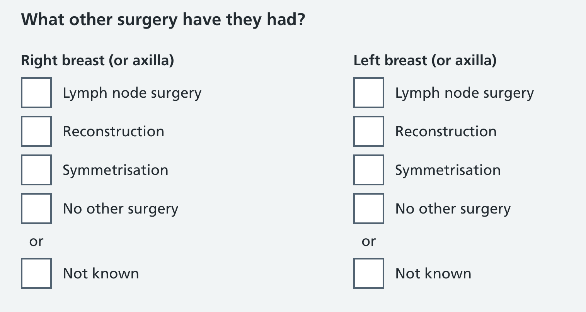
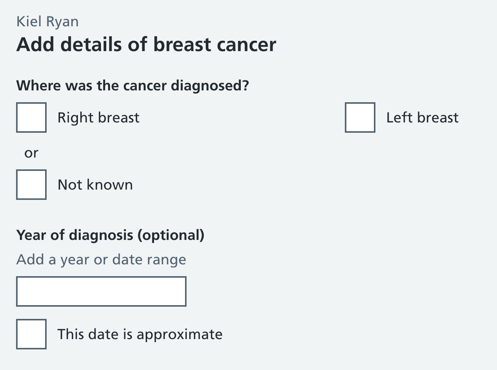

We've made some changes to medical history questions to allow for when an answer isn't known by the participant, or they aren't sure exactly when or where something happened. 

The changes allow the mammographer to capture: 

* when something is "not known" 
* when a date is approximate only

Previously we allowed specific answers only, with no ability to record an answer when something isn't known for treatments and procedures. For example, when a diagnosis, procedure, or surgery took place, there was no way for the mammographer to record that it happened without providing specific answers for what that was. 

A participant may know that they had a breast surgery, but they may not know whether it was a lumpectomy or mastectomy or whether tissue remained; and if they had surgery following this, they may not know if it was lymph node surgery, full reconstruction, symmetrisation, or something else. 

Forcing an answer when something isn't definitely known puts pressure on the mammographer and the participant, and could also have consequences for clinical safety. Recording with certainty a specific type of surgery, procedure, treatment or date could potentially lead to images being read incorrectly. The information is later surfaced to the radiologist, who can see when something isn't known, or when a date is approximate, which could inform how they read a mammogram. 

## Not known: technically more precise 

When something is "not known", it means the participant is aware that a surgery, procedure or treatment happened, but isn't exactly sure what kind. "Not known" could also mean the mammographer was unable to ask the question (for example, in relation to an [observed clinical sign](/manage-breast-screening/2026/07/differentiating-between-symptoms-and-signs/)).

Allowing this uncertainty or lack of knowledge to be captured creates fuzzier data, but technically makes responses more accurate it's now possible to record that a diagnosis, implanted medical device, or surgery happened, even if the details aren't known. Allowing the mammographer to record when something isn't known, yet happened, provides a greater degree of accuracy for medical history. 

## Approximate dates 

We're also making it easier for mammographers to record when dates of a diagnosis, procedure or surgery are only approximate.

When the participant isn't sure of the date, it's now possible to record a date as approximate only. Previously we had an optional field with hint text that said "leave blank if not known", and would not allow non-numerical characters (a question mark, for example).  

## Screenshots 

