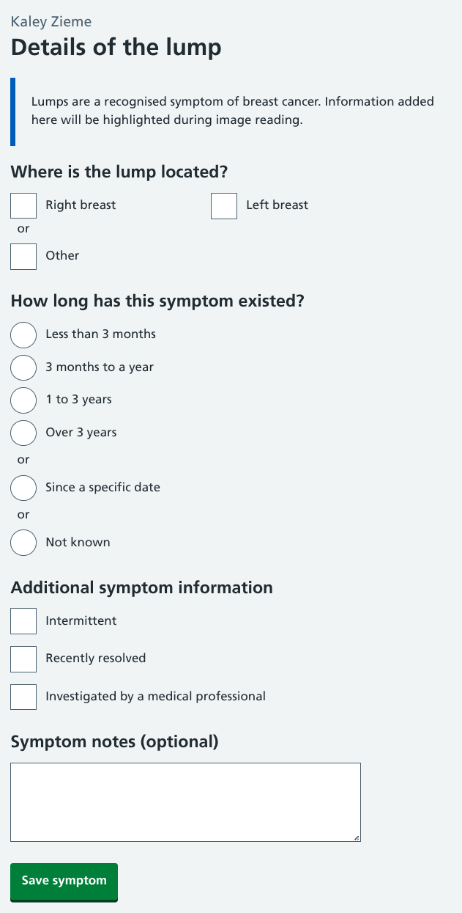
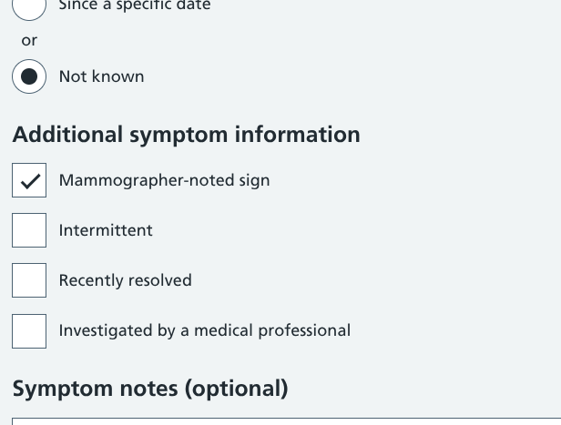
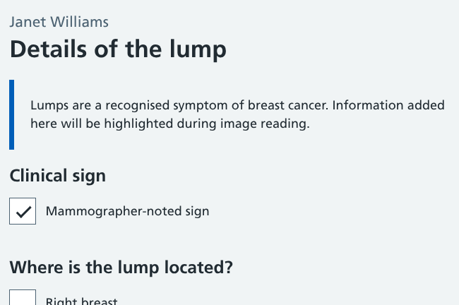
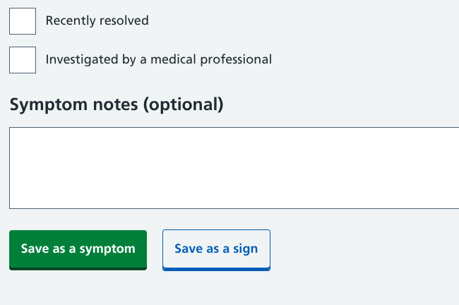
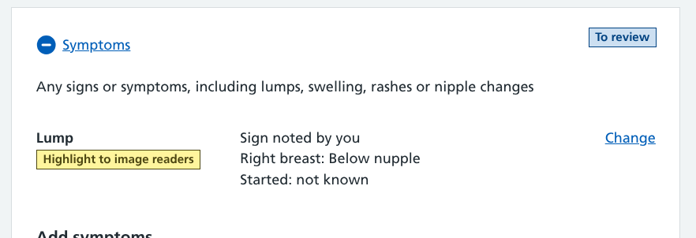
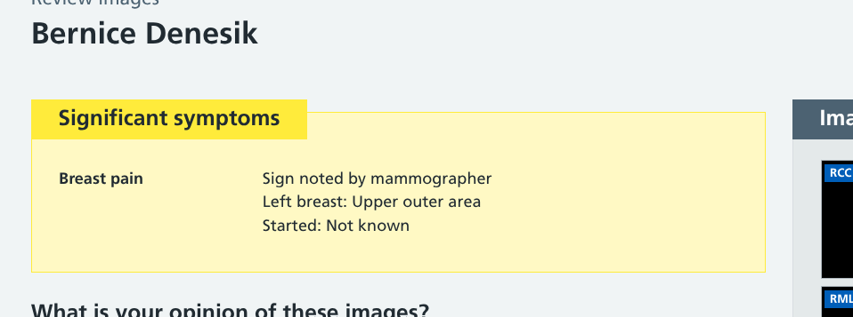

In our service, mammographers can add details of any symptoms they are told about by the person attending their appointment.

But what happens when they notice something concerning that the participant isn't aware of?

We've made an update so mammographers can enter details of any concerning signs they spot.

## A design based on disclosed information

The workflow in our prototype was designed around the medical information conversation that mammographers have during an appointment with the screening participant.

Participants will be asked if they are currently experiencing any breast problems such as lumps, swelling or skin changes. If the participant says *"yes"*, we have a way to add information such as the location and duration of the symptom.

This works well for disclosed information where they have an opportunity to dig into the details of these symptoms.

Any symptom information captured during the mammogram appointment will be displayed as an alert during image reading so it can be considered by radiologists.

## A need to cater for signs as well as symptoms

During testing, users told us that they often notice things they are concerned about with a participant's breasts while they are taking mammograms. This could be a visual issue (such as a rash) or something tangible (such as a lump they feel when positioning the breasts).

In NHS parlance the term 'symptom' is typically used to refer to something patient-reported, while 'signs' are clinician-noted.

Our users want to add information about any signs so they can be made known to image readers, but they generally don't want to mention these to the participant to avoid causing concern or anxiety.

In this instance, some of the questions on our symptoms workflow (when it started, whether it has been investigated, etc) are unanswerable. These are required questions, which means there are validation errors shown if they're not completed correctly.

## Options for how and where to include signs

Our UCD team collectively came up with various ways to incorporate this feature.

### Things we considered

- **Do nothing** - Users can select 'not known' for any questions they can't answer and add a written note that the symptom was an observed sign. We decided that structured data was necessary so we could handle this information appropriately
- **Remove the form validation** - Users could skip any questions they were unable to answer without getting an error message. However, this would mean removing validation for all symptoms which would affect the overall quality of data being collected.
- **Add a pre-qualifying question** - We could introduce a step that asks users *"Is this a disclosed symptom or observed sign?"* before capturing the details. This would give us structured data, but would likely cause too much disruption to the journey if they had to do this every time they added something.

### The viable options

We were left with three possibilities that were worth pursuing.

The benefit with all of these is that they create structured data, and are relatively minor adjustments to a form we already have in production.

**Option 1 - Add a 'Mammographer-noted sign' checkbox alongside additional symptom information**

The user would answer the other questions as appropriate then tick this when they get to the section. The drawback to this option is that it groups the checkbox with things that can only apply to participant-disclosed symptoms - the title of this form section would need to be adjusted if the checkbox were to be included here.

**Option 2. Add a 'Mammographer-noted sign' checkbox at the top**

The user would tick this checkbox then complete the rest of the form as appropriate. This is the most obvious place to put it, however creating a new form section adds vertical height to an already long page. Users have expressed a need to reduce scrolling in our service so they don't need to repetitively interact with it.

**Option 3: Add a secondary save button**

Users would complete the form as normal, but when they come to the end they could select one button to save as participant-reported, or the other to save as mammographer-noted. This feels like a neat solution, but does raise questions about how we'd handle this if they needed to return to the form to make any changes.

## Our chosen option

We've decided to proceed with option 2 within our prototype, so our symptoms form now begins with a 'Mammographer-noted sign' checkbox.

There are valid concerns about the length of some of the forms within our service, but we feel that:

- there's a need to make this a clear and obvious option, and
- other design work is being done to help make the service look and feel more visually compact

For now we won't be rebranding the symptoms workflow as 'Symptoms and signs' as it would be unnecessarily verbose in the UI. Through training and usage we hope that users will know where to find the option to denote a clinical sign when needed.

Other areas of the service have been updated to display where the sign checkbox has been ticked. This can be seen during the appointment and at image reading when symptoms are highlighted to radiologists.

We'll be testing this as part of our ongoing user research, and assessing whether similar functionality needs to be added to [breast feature](/manage-breast-screening/2025/07/medical-annotation-tool-for-capturing-breast-features/) and [medical history](/manage-breast-screening/2025/09/capturing-medical-history/) workflows.
