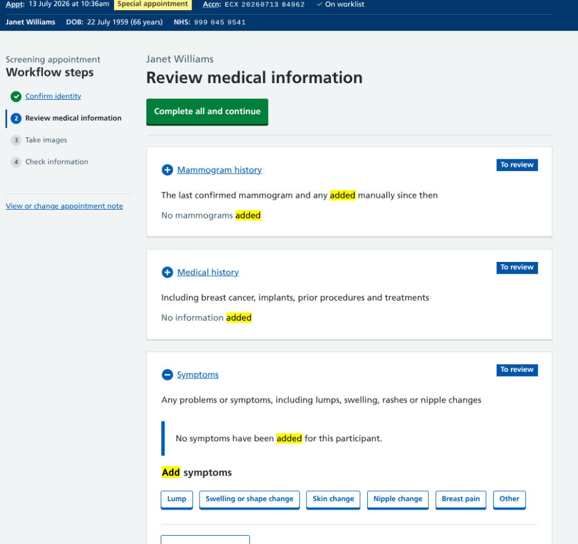

Across the mammogram and image reading parts of our service we've been referring to 'reported' things. This term is used to indicate when a participant has mentioned something during their appointment such as a previous mammogram (that's not on our system) or current symptoms.

However, during testing this has caused some confusion. When something is 'reported' in breast screening, it's generally understood to have come from a radiologist during image reading. 

So we've been working to adjust our terminology to make it clear where this information originated.

## Change the 'record'

Our first instinct was to switch from 'reported' to 'recorded', which was already being used using elsewhere in the UI. The mammographer is actively 'recording' lots of information during the appointment within our service so this term naturally fits into the workflow.

But when making the change, this opened up another area of conflict - 'record' can be a verb or a noun. Users might be asked to 'record a mammogram' to go into the participant's 'screening record'. There's nothing technically wrong with this, but due to the quirks of the English language it doesn't sound or look right.

So we had to fix that too.

## Making things 'add' up

In order to 'record' information in our service, mammographers need to 'add' details. So that seems like a sensible way to reframe the actions, labels and success messages.

* **Reported mammograms** becomes **Mammograms added**
* **2 symptoms recorded** becomes **2 symptoms added**
* **Breast implants recorded** becomes **Breast implants added**
* **Recorded on 10 July 2026** becomes **Added on 10 July 2026**

Through these changes we're no longer implying who divulged the information, just stating the fact that information has been added. We'll be checking that this is understood in future user research sessions.

## A simple change now to avoid future headaches

A sweep of our codebase identified variations of `"record*"` or `"report*"` in 25 files covering UI elements and data fields.

While editing a word may appear on the surface to be an innocuous change, this demonstrates how careful we need to be with our language early on in the build to avoid anything seeping into the fabric of the service which is complicated to undo once it's in widespread use.

