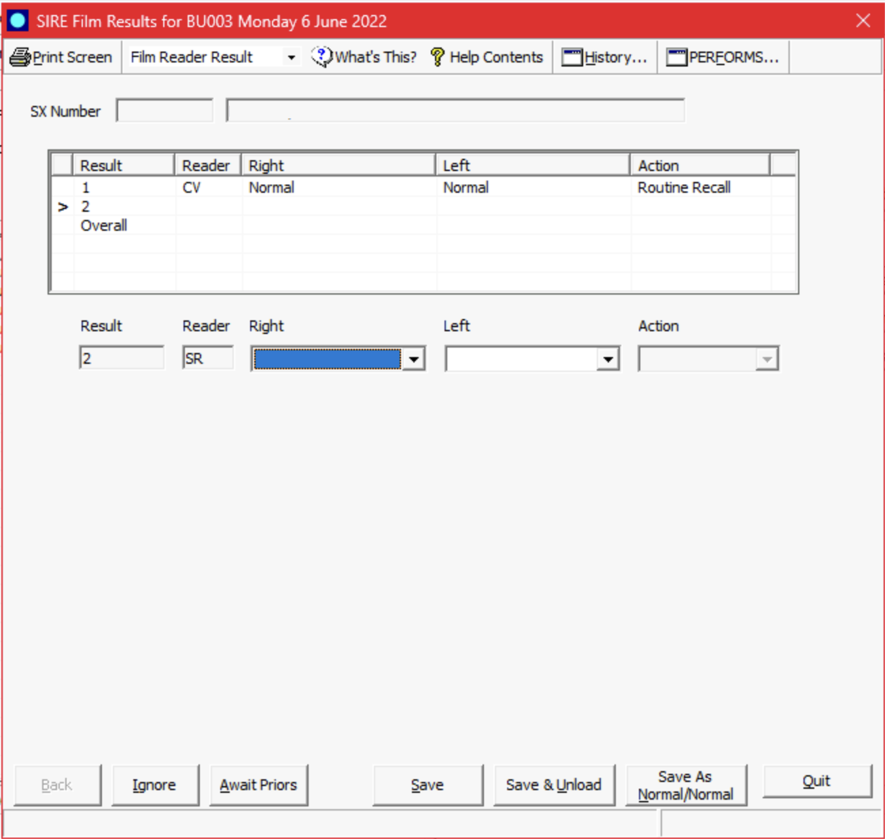
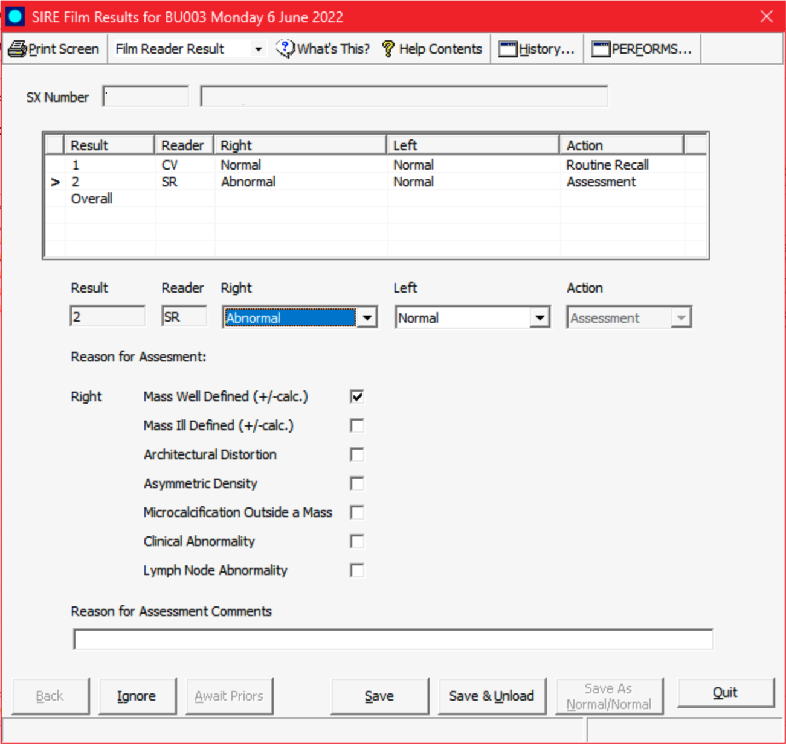
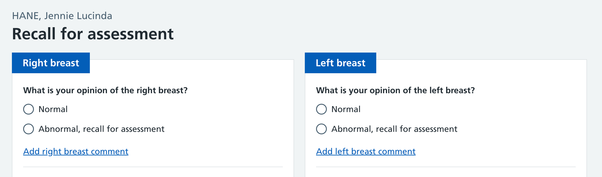
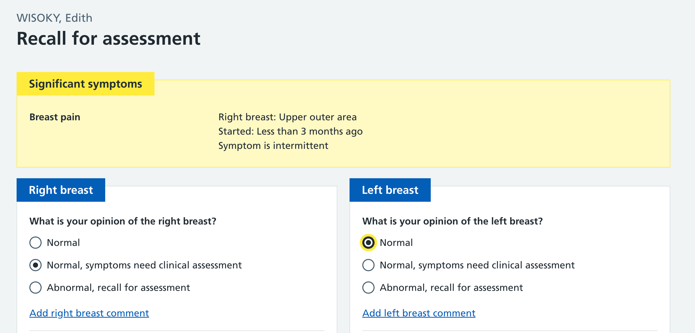
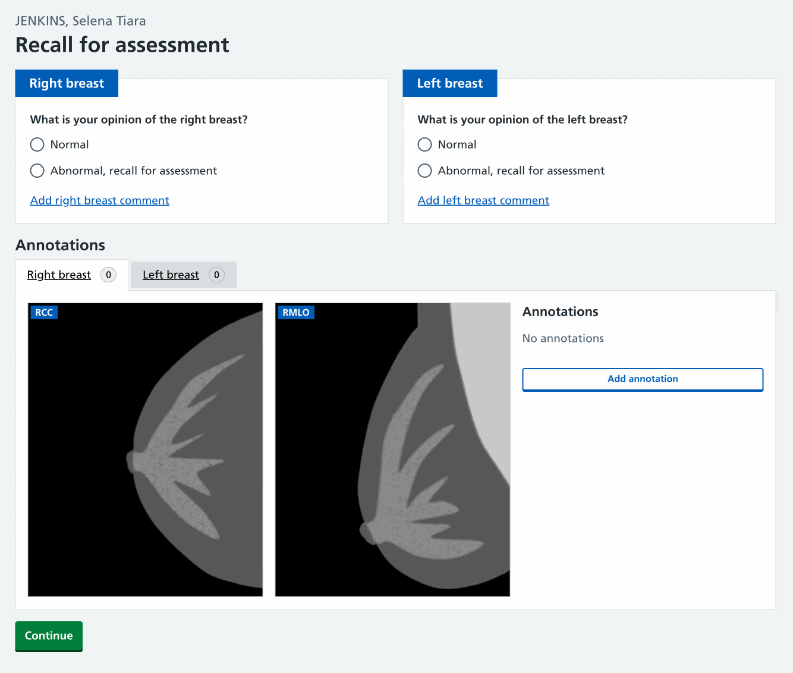
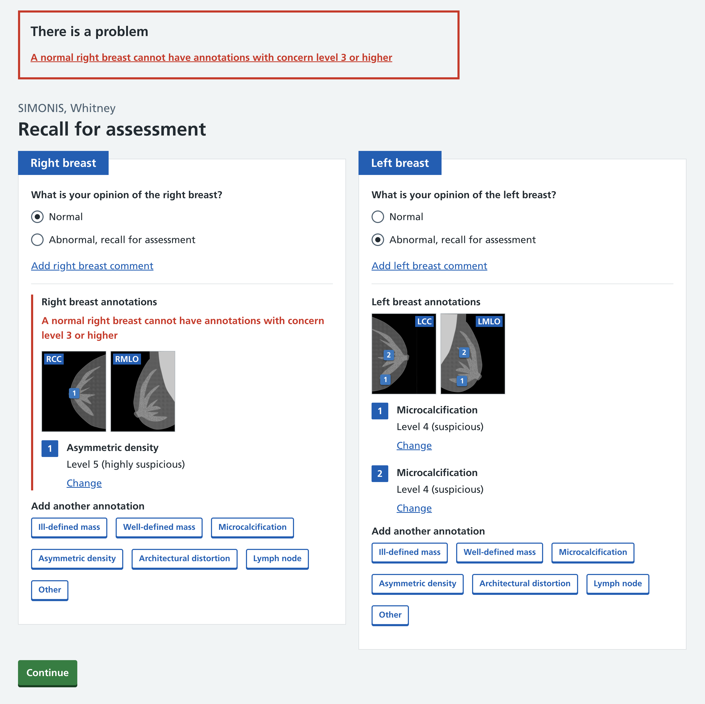
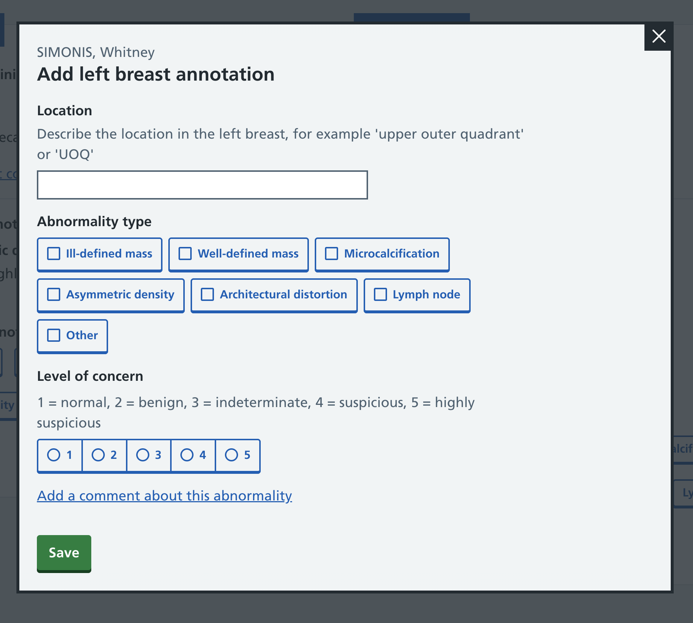

One of the things we’re exploring changing with Rubie is the data collected when an image reader sees something of concern and wants to recall the participant for assessment. We will be increasing the detail of data collected to assist in assessment and later tracking of abnormalities through to treatment.

## Existing process and interface

The current National breast screening system (NBSS) interface focuses on capturing an opinion per breast. In the above screenshot the current user is the second reader (row 2 in the table). They can record that the right and left breasts are:

- Normal - no cause for concern
- Abnormal - something spotted which needs assessment
- Technical - images not adequate enough to give an opinion and need more mammograms taken
- Clinical - no signs of cancer, but participant should have an appointment to check a reported symptom

If both breasts are normal they can instead use the ‘Save As Normal/Normal’ button which sets both to "Normal’ and advances to the next case.

If ‘abnormal’ is chosen, a set of checkboxes let the reader select which abnormality (or abnormalities) they have seen.

### Marking abnormality locations

The NBSS data will capture that a mass was seen in the right breast, but it doesn’t capture where in the breast it may be. If two masses are seen, there’s no structured way to capture this in NBSS. If two checkboxes are selected, it’s not clear if this is one abnormality that could be two things, or two separate abnormalities.

Readers will use the freetext box to describe where the abnormalities were identified.

For breast screening units that use paper, it’s common for image readers to annotate the paper with a sketch of what they see.

### Why we’re not using annotations in PACS

Image readers have the ability to annotate on the mammograms inside their Picture archiving and communication system (PACS). This will often provide advanced annotation tools including changing the shape and size, and adding notes. For example they can draw an elongated circle around an abnormality in an image. The same abnormality visible in two views is not linked - they’re marking abnormalities on images, but not saying ‘these two things in these two images relate to the same lesion’.

We think it's better to add annotations to PACS once there are findings - not whilst you may have two conflicting opinions from readers. We'll need to confirm this over time with further research. Currently if the first image reader adds an annotation, these will be visible and shown to the second reader, which can influence their opinion. It’s possible to hide annotations on first load, but in practice this usually isn’t set up. By annotating in our tool we can make sure they’re not shown to the second reader, and we’ll also have direct access to the data to make it available in arbitration or assessment, and later be able to track image reader performance or which abnormalities were assessed.

The benefits of using Rubie to manage annotations, and only annotating in PACS after image reading has been completed, are:

- true blind reads
- access to data to show in arbitration or assessment
- ability to track reader performance for each abnormalities

It may well be that we can later integrate with PACS so that if something is annotated there we can import it, or if something is annotated in Rubie, we can add it to PACS.

## Capturing recall for assessment and abnormality details

We will continue to capture an overall opinion per breast, and for any abnormalities we will shift to capturing data for each abnormality individually and allow the reader to mark the specific location. We will build an annotation tool [similar to our breast features tool](/manage-breast-screening/2025/07/medical-annotation-tool-for-capturing-breast-features/) to enable image readers to pinpoint where on the mammograms they see the abnormalities.

### Significant symptoms and signs

The overall assessment per breast usually has two options, but where the participant had significant symptoms or signs, image readers have a third option labelled ‘Normal, but symptoms need clinical assessment’ - which allows them to recall on this basis. This is equivalent to the current ‘clinical’ option in NBSS.

## Annotation tool designs

### Design challenges of an annotation tool

Marking an abnormality on the mammogram images is similar to our breast features tool, but with some new design considerations:

- In breast features, you mark a single location only. For annotations, you may need to mark the same thing in multiple images - one for each image the abnormality is visible in
- There are an variable number of images - usually two per breast, but could be 1 or as many as 10
- We need to capture more detail about the abnormality - the type, the level of concern, and an optional free-text comment

We’re also allowing for annotations not necessarily being a negative thing. An image reader might want to mark an annotation purely to say they’ve seen something and consider it harmless. For example, they might see in the participant’s history that they have a scar in a certain location. They may wish to mark this on the image to note that it is not reason to recall them.

We’ve tried two different interfaces for an annotation too. One where you add them one by one (‘annotation first’) and one where you add markers all together and then add details (‘marker first’).

### Tabbed interface / ‘marker first’

In this concept, users have tabs to pick between right and left breast, and then they can immediately click to add a marker. After a marker has been added, they are prompted to provide details about it.

After they’ve added the markers, we show a modal to collect details about the markers they’ve added. This uses a new component we’ve developed to be more compact than standard radios and checkboxes whilst still clear which is selected.

Getting this concept working well required a lot of subtle interaction tweaking. Once you’re familiar with it it can be quite fast to use - but with some usability drawbacks.

#### Video of the interface in action

#### How the tabbed interface tested

Being ‘marker first’ seemed to work well for users, and somewhat matches what they might do when they annotate on PACS. They liked that adding the annotations was on the same page as the overall opinion like the current NBSS interface. But it also gets more complex when there are more than two markers / annotations. Much of this is because we’re not simply clicking in multiple places across multiple images - we’re aiming to link a marker in one image and a marker in another image to the same annotation.

The concept has some drawbacks though:

- You can’t see the images whilst adding details.
- In most cases there’s just a single annotation to add with one or two markers - this interface has a lot going on, most of which is more suited when there’s multiple annotations.
- Some users accidentally created one annotation when they should have added two.
- Some users accidentally created extra annotations and didn’t realise.
- Showing on the same page as the overall opinion has drawbacks. Should users add the annotation immediately after they mark a breast as abnormal, or should they give an overall opinion for both breasts first, then do annotations? In either case, how do you prompt that an annotation is now required?
- Error validating for this is more complex as more could be going wrong at one time.

Several of these relate to us attempting to track the abnormality itself on whatever images it appears and not just separate locations on separate images. Doing so should allow us to track abnormalities through to biopsy and treatment, but also makes the interface harder to design for.

### One by one / ‘annotation first’

As a simpler thing to compare against, we tried an interface where you need to add each annotation as a separate item on its own page, and then select where the markers go. To add multiple annotations (the less common use case) you would add them on their own page.

#### Accessing the annotation form

We originally had the form accessed via an ‘add annotation’ button for each breast. We realised in most cases there’s only one abnormality type and choosing this could be the route in to adding an annotation. This somewhat matches existing behaviour where readers mark a breast as abnormal and then pick the abnormality type they see.

Presenting multiple options like this is something we’ve done before for our symptoms form, and presents the choice sooner, whilst saving a click.

#### Video of the interface in action

NBSS captures the abnormality types on the same screen as the overall breast opinion. Where capturing information per abnormally, we haven’t found a good way to do it on the same page. But we have prototyped using a modal to make it feel faster / closer to the overall opinion.

#### How one-by-one tested

Users were able to use this to add annotations easily. Subjectively they felt this interface was slow, or slow in comparison to what they’re used to with NBSS. Partly this is unavoidable - moving to collecting per-annotation data is slightly more data and that necessarily has a time penalty. The team feels this is worthwhile for the increased data quality.

We don’t think it’s slower versus the tabbed interface, though subjectively it may ‘feel’ slower as you are navigating between different pages. It is the same number of clicks to add an annotation as our tabbed concept. It doesn’t have many of the disadvantages of the tabbed interface, which makes it a better starting point for us:

- You can see the images whilst adding details
- Simpler pages and interactions are easier for us to build
- Simpler to validate because you’re only doing one annotation at a time
- It’s the same number of clicks to add an annotation

Editing a marker position is slower as you need to click ‘change’ first to open the annotation. We think this is acceptable as editing will likely be less common.

We’re going to start with the one-by-one interface, but will keep the tabbed interface in consideration. It may be useful in other scenarios when later looking at multiple annotations at once.

## Validation

The validation on the recall for assessment journey is more complex than a standard page, and has had to come up with new patterns.

We need to check:

- that both breasts are not marked ‘normal’
- that at least one annotation has been added for any breast marked ‘abnormal’
- if a breast is marked as ‘normal’, any annotations added are not level of concern of 3 or higher
- if a breast is marked as ‘abnormal’, at least one annotation must be level of concern 3 or higher

The standard NHS Design system pattern for errors has an error shown in the error summary linking to a specific field in error - but we have cases where two fields could be in error, or two different things could be wrong. We’ve defaulted to both fields showing as in error, with the error summary linking to the first.

This is the more complex validation - if a breast is marked as normal but an annotation added that’s level of concern 3 or higher, we have incompatible data. The user either needs to mark the breast as abnormal, or remove or adjust the annotation.

## Next steps

The annotation tools prototyped here will be tested and iterated further in usability testing. Building them for real will take some time, so for our first image reading release we have descoped the markers and will instead collect a free-text description of the location. This data is closer to what NBSS collects, though still capturing type and level of concern per abnormally, rather than per breast. We plan to later replace this free-text location with the marker interface.

