We've designed a feature in our service ([Rubie](/breast-screening-pathway/2026/05/naming-new-breast-screening-service/)) for users to highlight problems that might prevent a breast screening episode from moving on to the next stage.

Various issues (such as images with incorrect labels or mammograms being taken under the wrong participant ID) can arise at any point before appointments, during appointments, at image reading, or sometime in-between.

These are mostly problems with data that can be resolved with back-end fixes, either in our service or one of the other systems used in breast screening. They're not necessarily things that would require users to [stop or pause a mammogram appointment](/2025/12/exit-pause-resume-appointment/).

## How issues are currently handled

When issues are identified, breast screening office (BSO) staff will usually complete a form and place it into a clinic folder (along with the appointment forms) as a placeholder until the issue is fixed.

Once resolved, the appointment paperwork is returned to the workflow with the issue form attached as a record of what happened and what has been done.

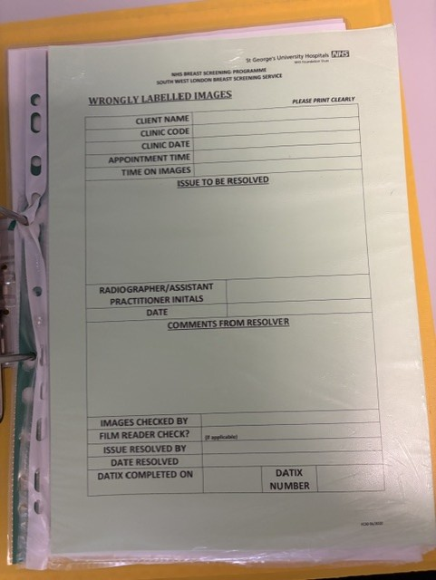

## Adding this process to Rubie

### Putting the feature where users need it

We've placed a 'Raise an issue' link in three places within our service, allowing users a readily available route whenever a problem occurs.

1. On the appointment tab of the screening appointment view.

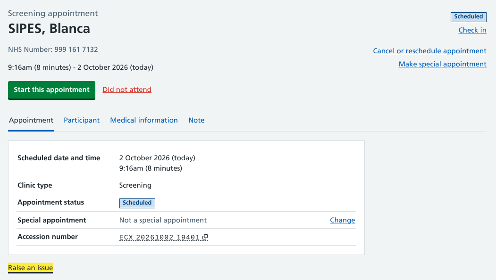

2. Within the workflow sidebar of an active appointment.

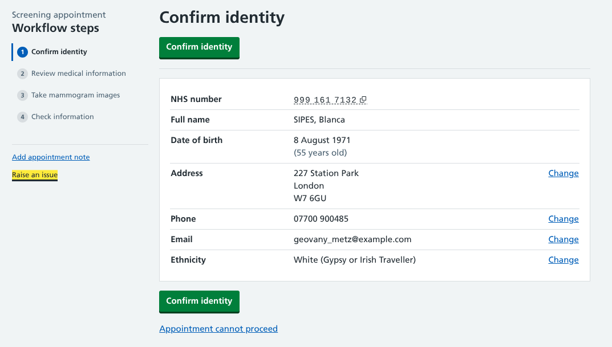

3. On the image reading opinion page (or outcome page if the case in arbitration).

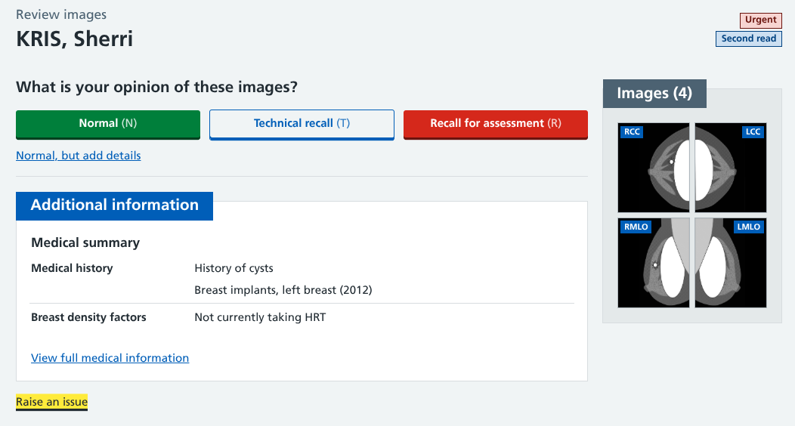

This replaces the 'Defer this case' feature that previously on our image reading prototype (read our [Deferring a case from reading](/06/deferring-a-case/) design history). Raising an issue follows much of the same workflow, but now applies across an episode rather than just at the case level.

### Adding information about the issue

Regardless of when this link is clicked, the same form will appear asking the user to describe the issue.

In future we may look at adding an option to categorise the problem (especially if we want to use this same functionality for 'incidents' as well as 'issues') but the first version is just a simple free text box.

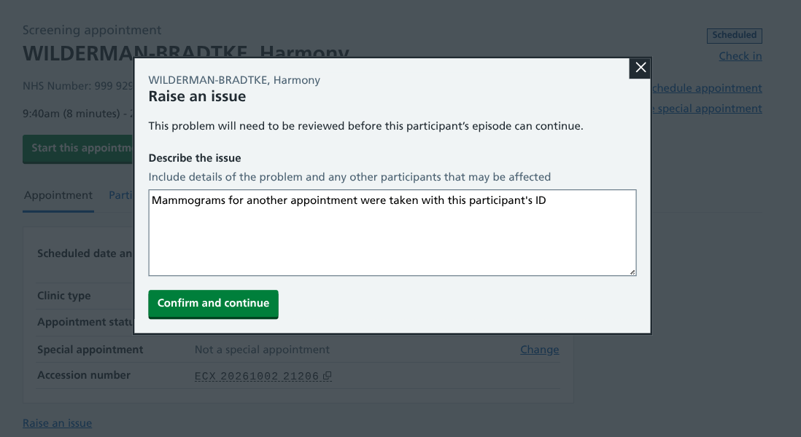

We're conscious that when issues occur, it's rarely in isolation. For example, if a user is seeing the wrong participant's images because they have been taken using the wrong participant ID, there will probably be an associated episode with a similar problem that also needs to be fixed. We have plans for a future iteration where users can attach episodes for multiple participants to an issue and resolve them with a single action.

There is a slight variation if an issue is raised during an appointment, with the text explaining that the appointment can still be concluded. The issues will likely be things that need to be subsequently fixed by an administrator, so we still need to allow the mammographer to go through the appointment workflow steps as normal.

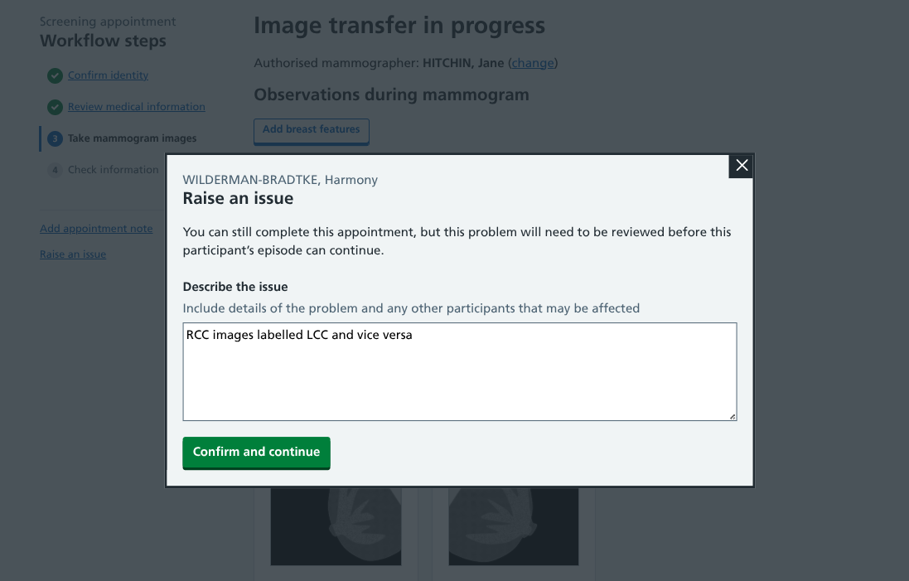

### Showing open issues

The Rubie navigation bar is a work in progress while we work out how the end-to-end service fits together. For now, we're experimenting with showing the number of active issues with a [badge component](https://design-system.nhsapp.service.nhs.uk/components/badge/) from the NHS design system.

This would tell users how many open issues there are, with the link taking them to a page where they can be viewed and resolved.

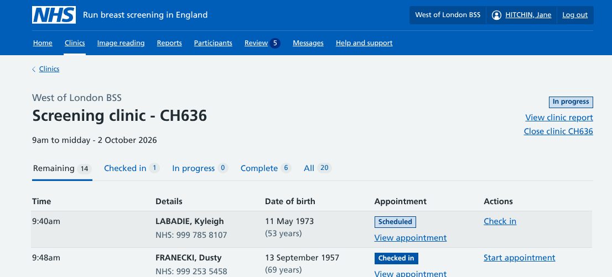

We will also be highlighting individual issues within existing workflows, for example with a tag on an appointment within the clinic view.

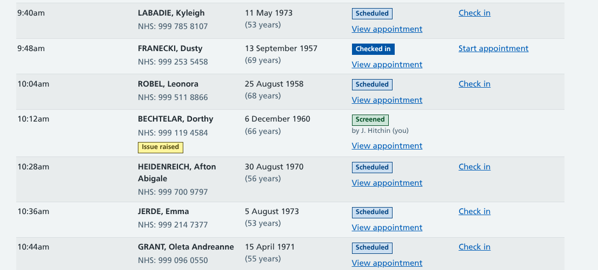

This tag would also be used in place of an opinion if an issue was raised during image reading.

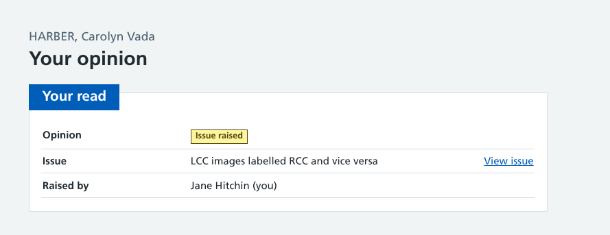

When a user goes to view an appointment or case with an open issue, they would see a warning banner containing the details, who recorded it, and when.

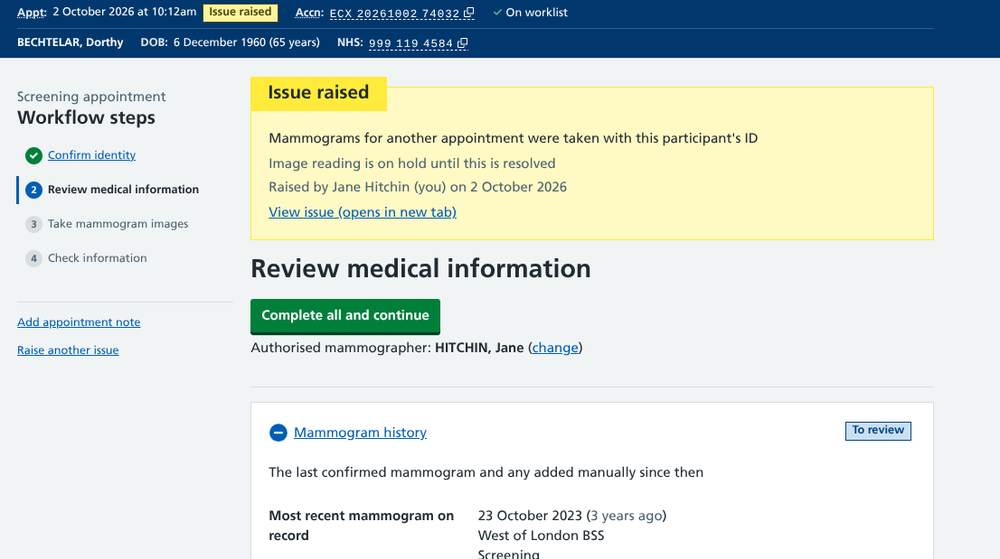

When an issue has already been raised, the various links update to 'Raise another issue'. to remind the user that an issue already exists and deter them from logging a duplicate problem.

### Resolving issues

The 'view issue' links take the user to a dedicated page containing more thorough information that might be useful for the person dealing with the problem such as their NHS number or the image accession code.

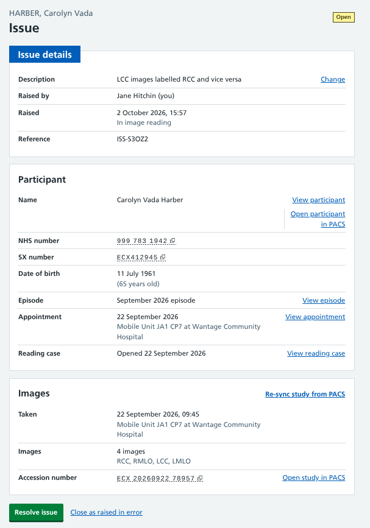

The primary action from that page is to 'Resolve issue'. Users can also cancel the issue if it was raised in error.

The resolve issue workflow asks for a free-text explanation with an option to say who has checked the solution. We're yet to explore in detail which issues need verification to ensure clinical governance processes are followed, but for now we're allowing users to say they have resolved the problem themselves.

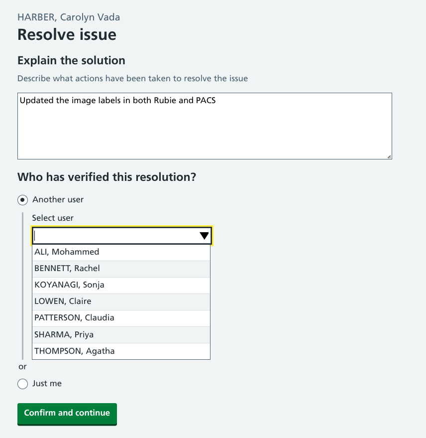

Once a problem has been cleared, the episode is unblocked allowing it to move to the next stage in the screening process. The issue page will be updated with details of the solution, and there will be links from the various places the appointmet or case can be accessed so users can see information about the fix.

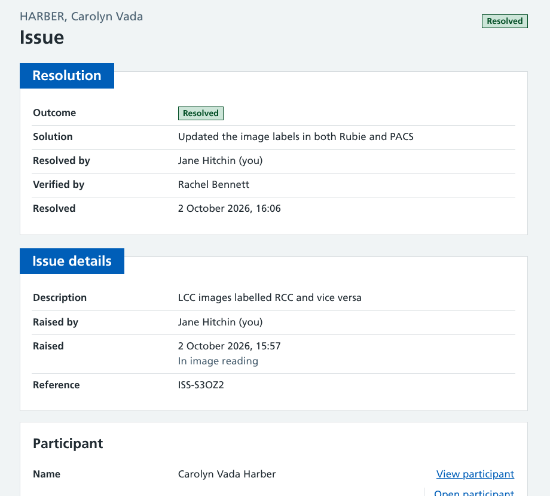

## Plans for the future

This is a relatively lightweight way to raise an resolve easily fixable problems.

The full version of this feature may also include 'clinical incidents' (things that may cause harm to a participant) which have more stringent guidelines regarding how they're handled than simple data issues.

This would likely require some form of issue categorisation to be added to our workflow so each issue can be logged and triaged effectively. 

As well as looking into more serios issues, we need to share this prototype with more users in administrative roles to find out about:

* whether we're using the correct terminology around issues (open, resolved, etc)
* how much detail needs to be recorded when raising an issue
* whether we're making the option to raise an issue available in the right places
* the process when issues are resolved - who is informed and how does the episode get going again?
* whether certain types of issues do not put episodes on hold (for example, when image views are labelled incorrectly, but they can still be read)
* what reports might need to be generated in relation to outstanding and resolved issues