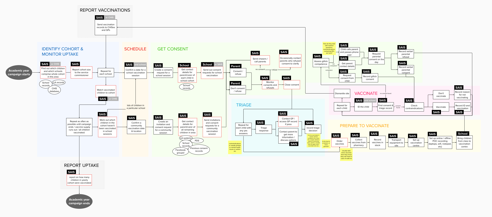

We have mapped the journey that SAIS teams follow over the course of the academic year when delivering each of their vaccination campaigns based on our research interviews with 6 SAIS teams, previous research done by NHS Digital and our own desk research.

The school aged vaccination campaigns are:

- Seasonal flu in school years 1 to 6 (year groups can vary each season)
- HPV dose 1 in school year 8
- HPV dose 2 6 months later (typically school year 9)
- 3-in-1 teenage booster (Diphtheria, Tetanus and Polio) in school year 9
- MenACWY in school year 9 (often delivered together with the 3-in-1)
- MMR catch ups for children who have not yet received both doses (routinely delivered before age 4)

We have summarised the common thread through all of these vaccination campaigns except for MMR catch ups.

The specific needs (e.g. around triaging responses and recording vaccinations) vary depending on the campaign.

Although the activities shown are common to all SAIS teams, the way they achieve the activities and how much work they do on each differs based on the technology they use, their staffing and the demographics of the populations they serve.

## Identify cohort and monitor uptake

We don’t have enough information yet about how SAIS teams achieve this to derive user needs for all of the activities.

### Find out which children and which schools comprise whole cohort in this area

As a SAIS programme co-ordinator:

- I need an up to date list of children per year group per school, so that I can keep track of their vaccination status throughout the school year
- I need to know the size of the cohort per school, so that I can work out how long will be required per school to vaccinate all children
- I need to know which children have received a vaccine at the GP or other setting so that I know not to vaccinate them again
- I need a list of all home educated children, so that I can keep track of their vaccination status throughout the school year

## Schedule

### Confirm a date for a school vaccination session

As a SAIS programme co-ordinator:

- I need to know all schools’ availability, so that I can create a timetable for the year

### Confirm a community vaccination date & location

As a SAIS programme co-ordinator:

- I need to leave time in the yearly schedule to return to schools, so that I can ‘mop up’ as many outstanding children as possible who were not able to be vaccinated on my first visit.
- I need to provide a way for children not educated in schools to be vaccinated so that all children have equal access to vaccination

As a SAIS nurse:

- I need suitable and affordable location to hold catch up clinics, so that I can administer vaccines safely and effectively.

## Get consent

### Create a consent request

As a SAIS programme co-ordinator:

- I need to provide parents with clear and accurate information about the vaccine, so that their decision whether to consent is not misinformed or emotionally charged.
- I need to ensure parents fully understand what they are consenting to, so that I fulfil my duty of care
- I need to provide an accessible method to consent for every parent, so that all children have equal access to vaccination

As a school administrator:

- I need to have a vaccine invitation letter so that I can distribute it to parents.

### Get contact details for parent/carer of each child in school cohort

As a SAIS programme co-ordinator:

- I need to be able to contact parents either directly or indirectly, so that I can invite them to give consent.

### Get contact details for parent/carer of all remaining children in area

As a SAIS programme co-ordinator:

- I need a way to contact the parents of home educated children, so they can be invited to be vaccinated at a community clinic
- I need a way to contact the parents of children in the travelling community, so they can be invited to be vaccinated at a community clinic
- I need a way to contact parents of children who have not been vaccinated in school and have not refused consent, so that I can provide information on catch up clinics

### Send out consent requests

As a school administrator:

- I need to send out invitations on a SAIS team’s behalf so that I can protect the personal information of parents.
- I need to understand what contact information I can legally share with SAIS teams, so that I can support the vaccination programme in the most efficient way for me

### Consent or refuse

Until we research with parents, we can’t derive their needs.

### Monitor consents and refusals

As a SAIS programme co-ordinator:

- I need to know which parents have not responded per school, so that I can chase them or ask the school to
- I need to be able to easily track which school a child whose parents consent to vaccination is attending, so that I know how many vaccines to bring on the day.

### Send chasers or call parents

As a SAIS programme co-ordinator:

- I need to be able to contact parents, so that I can chase them if they don’t respond to the request for consent.
- when a school won’t give me parent contact details due to GDPR, I need the school to have visibility of parents who haven’t responded, so that they can contact them on my behalf.
- I need to limit the number of ‘on the day’ consenters so that I can ensure I have time to triage and vaccinate everyone safely

### Contact parents who refused consent to clarify

As a SAIS nurse:

- I need to understand why a parent has refused consent for a vaccine, so that if this is based on a misconception (e.g. “my child has asthma so can’t have a flu jab”) I can contact them to clear it up
- I need to speak to parents who have refused consent and confirm the reason for this decision, so that I can try to address their concerns or offer them an alternative.

### Close consent

As a SAIS programme co-ordinator:

- I need to leave the opportunity to consent open as long as possible, so that the team can vaccinate as many children as possible on the day.
- I need time to prepare vaccination trolleys and paperwork for the right number of children, so that the nurses can take them into school.
- I need to give the school a list of who has consented prior to the day of vaccination, so that they can plan bringing the children to be vaccinated and minimise lesson disruption.
- I need time to ensure most triaging is done in advance of the session, so that I can make sure all medical queries have been resolved.

### Assess Gillick competence

As a SAIS nurse:

- I need to inform parents in advance if their child may have the opportunity to self-consent to vaccination, so that parents are aware that their child may be allowed to access medial care without their direct consent
- when I’m at a vaccination session with a child in front of me who doesn’t have pre-consent, I need to assess their Gillick competence based on my local SAIS policy, so that competent children can consent to their own vaccination

### Record Gillick consent

As a SAIS nurse:

- when I assess that a child is Gillick competent and they consent to their own vaccination, I need to keep a record of the competence assessment and the self-consent, so that I can explain exactly why a given child was vaccinated if challenged in the future

### Request parental consent on the day

As a parent:

- when I have forgotten to fill out the pre-consent form, I need the opportunity to consent to vaccination on the day, so that my child doesn’t lose out on the opportunity for vaccination

As a parent with low literacy:

- I need to consent to vaccination verbally, so that my child can be vaccinated

As a SAIS nurse:

- I need a way to contact parents who haven’t responded to a consent request at the point of vaccination, so that I can give the child every opportunity possible to get vaccinated
- I need to keep a record of consents received verbally by the SAIS team at any time in the run up to vaccination, so that I can give the child every opportunity possible to get vaccinated
- when I’m at a vaccination session with or without internet access, I need to record verbal consent received from parents, so that I can explain exactly why a given patient was vaccinated if challenged in the future
- when I see a child whose parents have refused consent, I need to speak to the parent and confirm that this decision was correct, so that I can ensure as many children as possible are vaccinated.

## Triage

### Triage response

As a SAIS nurse:

- I need to know whether any of the contraindications for a particular vaccine specified in the green book apply to each child whose parent has consented, so that I can protect them from harm
- I need to triage consent forms in advance, so that I can bring the right stock and maximise the time I have for vaccinating on the day
- I need to confirm everyone filling out a consent form has parental responsibility for the child, so that I know that valid consent has been given

### Contact parent to get more information or discuss options

As a SAIS nurse:

- when a parent has indicated a potential contraindication but not provided enough information for me to triage, I need to contact the parent to find out more, so that I can determine the safest way to proceed
- when I determine that a particular contraindication prevents a child from being vaccinated, I need to contact the parent and inform them, so they are aware in advance
- when I believe that it would be better for a child to be vaccinated at a clinic or hospital (e.g. so that their parent can be present), I need to contact the parent and inform them, so that they will understand why their child is not vaccinated at school and can prepare to attend a session
- when a parent has partially completed a consent form, I need to contact the parent to get the remaining information, so that I can determine the safest way to proceed

### Record triage decision

As a SAIS nurse:

- when I have determined that a child can be vaccinated in school, I need to clearly record the decision and any special measures to take, so that the vaccinator will know exactly what to do
- when I have determined that a child cannot be vaccinated in school, I need to clearly record the decision and the details around it, so that there is no risk to their health if they attend the vaccination session

## Prepare to vaccinate

### Order vaccines

As a SAIS programme co-ordinator:

- I need to provide extra vaccines to take into schools, so that any children whose parents consented last minute can still be vaccinated.

### Record vaccines in stock

As a SAIS administrator:

- I need to record the batch numbers and expiry dates of all of the vaccine doses we receive, so that I meet the Green Book guidelines for maintaining the vaccine cold chain

## Set up online/offline POC recording

As a SAIS nurse:

- I need access to the internet at a vaccination session, so that I can access the most up to date consent, triage and medical records for the children I vaccinate
- when I don’t have access to the internet, I need to still be able to access consent records and record vaccinations for all children in a particular school cohort, so that I can do all the necessary checks and keep accurate records when I’m in a school with no connectivity

## Vaccinate

### ID the child

As a SAIS nurse:

- I need to be certain of the identity of the child in front of me, so that I can access the correct consent & triage record

### Find consent and triage record

As a SAIS nurse:

- I need to confirm that consent has been given before I vaccinate a child, so that I am not at risk of harming a child who cannot receive the vaccine, or prosecution for vaccinating a child without consent
- I need to know about any concerns raised during triage of a child at the time that I vaccinate them, so that I can confirm that it’s appropriate to vaccinate them on the day and take any necessary precautions
- I need it to be really quick and easy to see immunisation history when vaccinating a child, so that I have enough time to check I’m not vaccinating anyone unnecessarily or to inform them of vaccinations they have missed

### Record vaccination

As a SAIS nurse:

- I need to keep a record that I have vaccinated a child, so that it can be recorded in their GP and Child Health records and the SAIS programme can report on uptake
- I need to record the batch numbers and expiry dates of the vaccinations I deliver, so that if there is a problem with a batch, I know who may have been affected

### Record non-vaccination

As a SAIS nurse:

- I need to keep a record that I did not ultimately vaccinate a child and the reason why, so that a SAIS coordinator can determine if the child needs to be invited to a catch up session

## Report vaccinations

### Send vaccination records to CHISes and GPs

As a SAIS co-ordinator:

- I need a quick and simple way to share vaccination records with the relevant CHIS, so that so that I can fulfil my statutory duty to report vaccinations within 5-10 working days
- I need to ensure all vaccinations are recorded in the patient’s GP record within 5-10 days, so that clinicians are aware of the patient’s vaccination status if they have any adverse reactions or when they access health services in the future.

As a Child Health team member:

- I need a record of vaccinations performed by School Aged Immunisation Services, so that I can fulfil my statutory duty to keep comprehensive child health records

As a patient:

- I need my vaccination to be recorded in my GP record, so that clincians are aware of my vaccination status if I have any adverse reactions or when I access health services in the future.

## Report uptake

### Report on how many children in yearly cohort were vaccinated

As a SAIS program co-ordinator:

- I need to report data on vaccination coverage to NHS England, so that I can fulfil my statutory duty.
