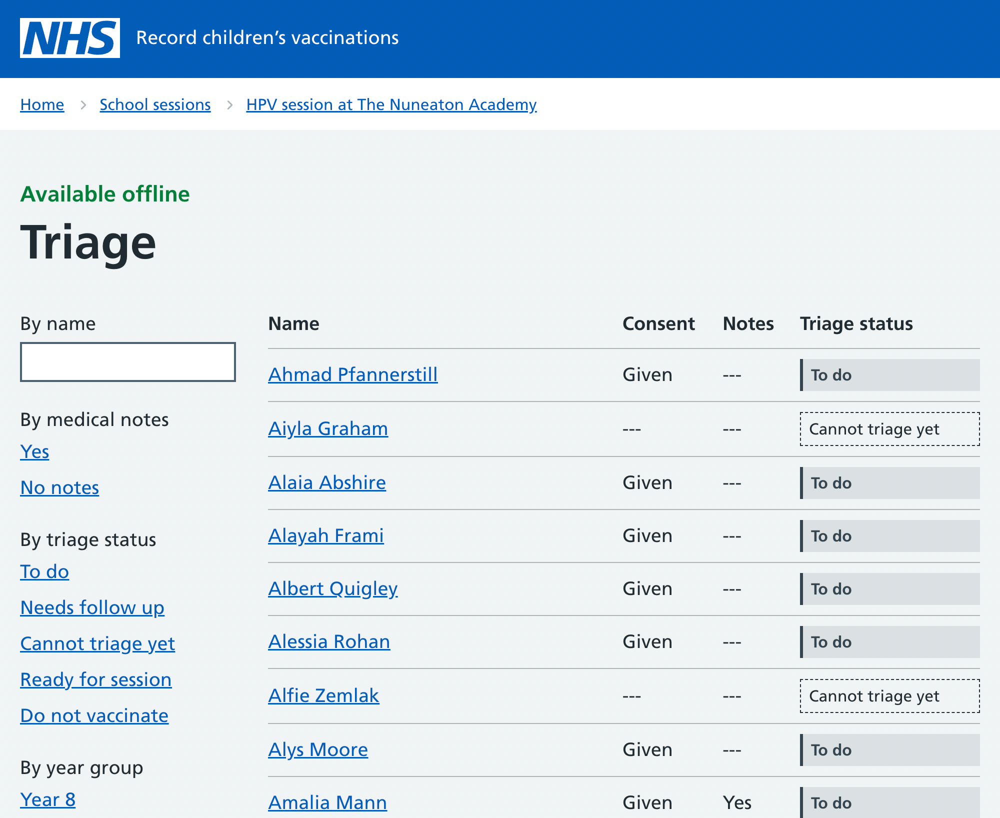
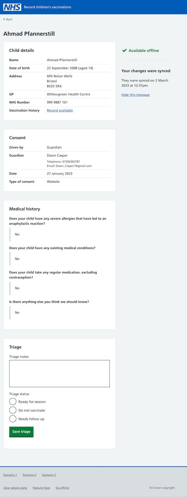

We know that before nurses record vaccinations, they triage consent responses. This is important for:

- knowing how many vaccines they’ll need to bring to a session
- identifying which children they still need consent for (in case they want to chase)
- reviewing parents’ answers to health questions

We’ve created a table view within the triage area of the service. Nurses can now see:

- a list of all children eligible for vaccination
- details of who has and hasn’t received consent (given, refused, unknown)
- whether children have any medical notes or triage notes
- the triage statuses for individual children (to do, needs follow up, cannot triage yet, ready for session, do not vaccinate)

Nurses can filter by:

- year group
- notes (triage or medical)
- triage status

## Information about individual children

The information available about individual children is similar to that in the ‘Record vaccinations’ area. However, here, we’ve added some details about the type and timing of consent because SAIS nurses told us this was relevant.

We also added an area for nurses to add triage notes.

This is a work in progress, and we need to test all these designs.
