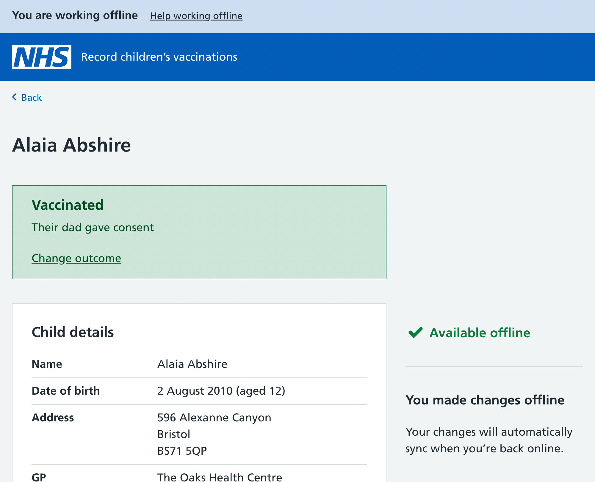
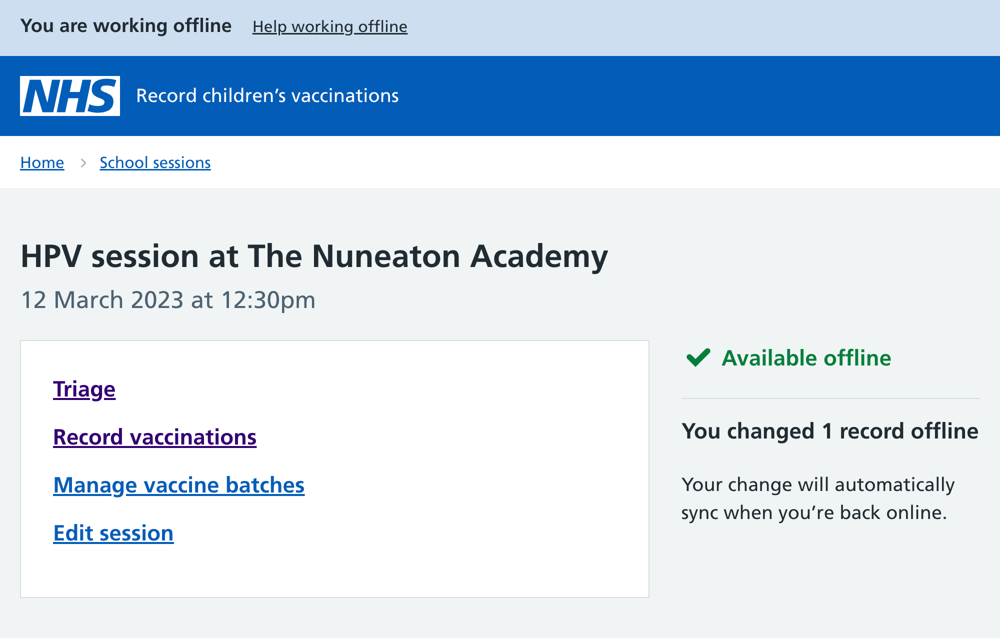
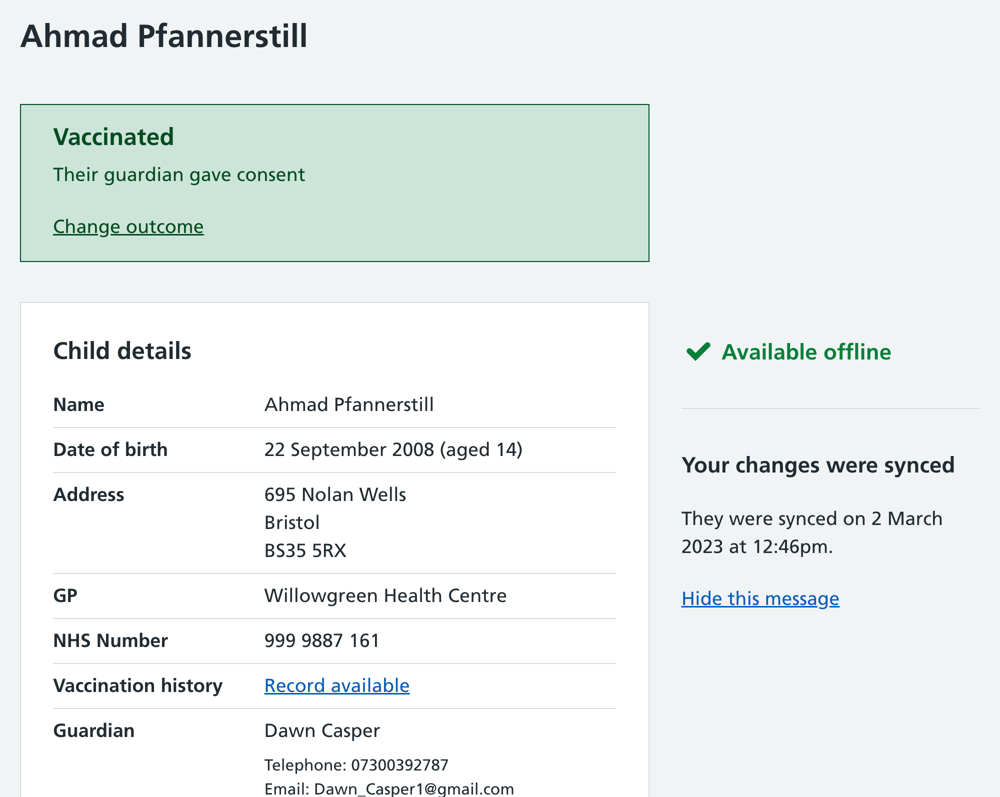

We knew we needed to iterate our offline designs after testing them with just three SAIS nurses because they were fundamentally confused about the syncing process.

They didn’t understand that the syncing process was automatic, and they weren’t clear about which offline changes had been uploaded when they went back online.

## Recording offline changes

We’ve now updated the message that appears on the child information page when a nurse makes a change offline. This makes it clear that any changes will automatically sync when the nurse reconnects to the internet.

## Showing a running total of offline changes

On session pages, we’ve also added a running total of the total number of changes made so that nurses have confidence that everything is being captured.

## Spelling out the syncing process

We’ve also changed the wording nurses see when they go back online. The success banner now reads ‘Your offline changes have synced successfully’ to spell out what’s happened.

There’s also a message on the right-hand side of the child information page telling nurses exactly when their offline changes were synced.

We plan to test all these iterations to see if they help users better understand how to work offline.
