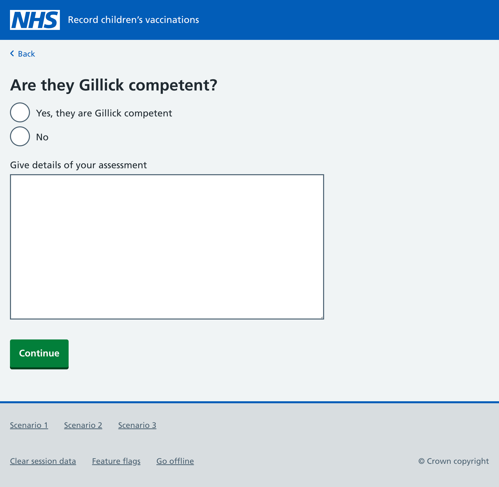
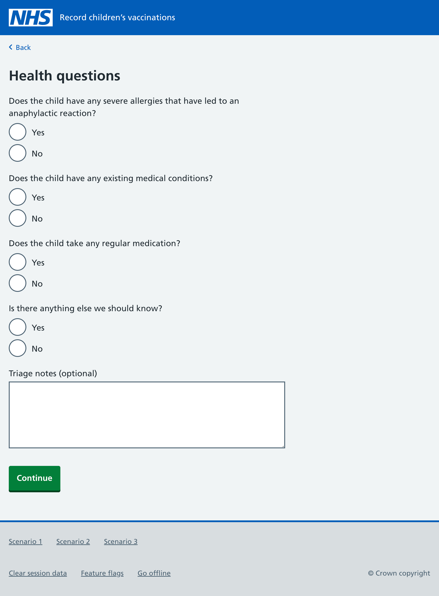

Gillick competence is the principle nurses use to judge young people’s capacity to consent to vaccinations.

Nurses might assess young people for Gillick competence in the following situations:

1. the parent/guardian has not responded to consent requests for an HPV vaccination
2. the parent/guardian has refused to give consent for an HPV vaccination, but the young person has indicated they want it
3. the parent/guardian has given consent for an HPV vaccination, but the young person has indicated they do not want it

We’ve designed a way for nurses to record their Gillick competence assessment through the digital service for the first two scenarios.

## If a nurse decides a young person is Gillick competent

If a nurse decides the young person is Gillick competent and they want to have an HPV vaccination, the nurse will be prompted to ask the same health questions that parents currently respond to when they give consent.

Once the nurse has captured the young person’s responses, they’ll be taken to a ‘Check answers’ page and then back to the main dashboard.

## We still need to test these designs

We haven’t yet tested these designs with SAIS nurses.
