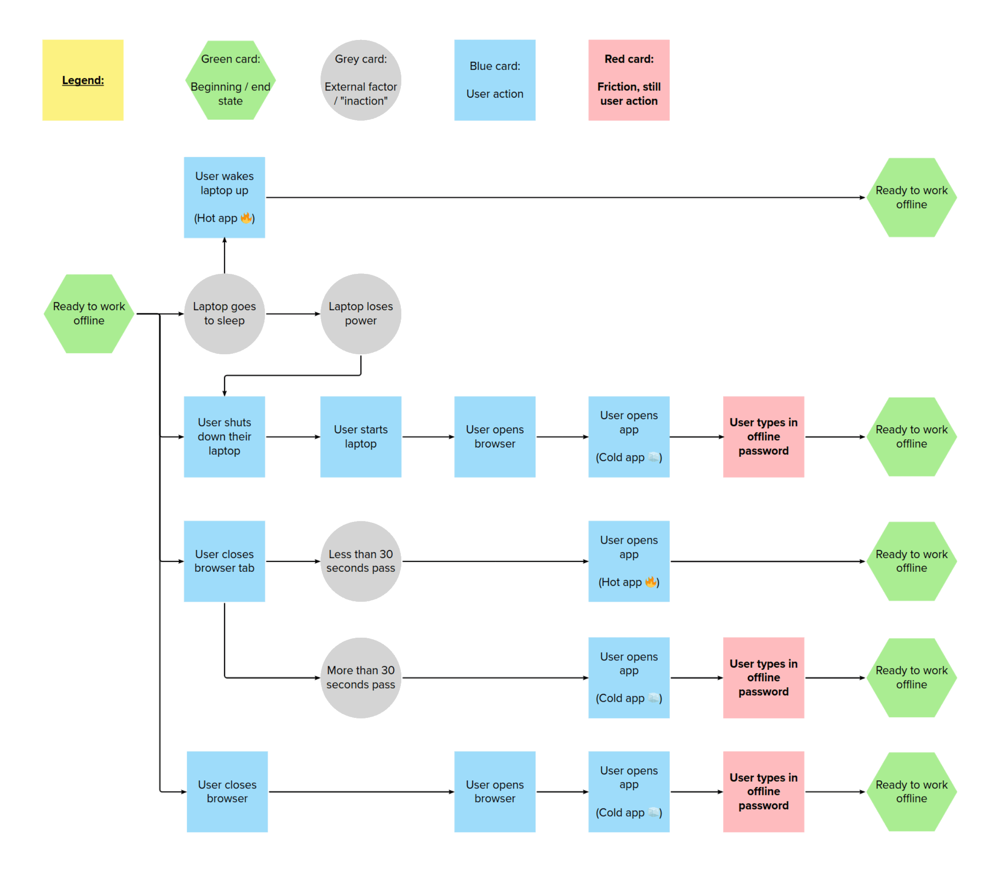

When saving data offline we need to encrypt it. Encryption will make the data secure. We will do this using a secret that the user must remember.

So far we’ve explored two options for doing this. We ask the user to:

- enter a password
- give a code we generated

We’ve chosen to go with the code option because it eliminates half of the pain and risk of a password – that is, the user does not need to try and think of something, and they do not think of something that is insecure. They also do not try and reuse their sign-in password – which has other security implications.

We expect to use 3-word codes, from easy-to-spell word lists. We will make sure the word list in combination with a slow decrypt process will make it very unlikely for attackers to brute-force the encryption.

<video src="https://user-images.githubusercontent.com/319055/236440726-2fe87456-a89c-41c1-82ab-9e259a1d7b74.mov" controls muted></video>

## Potential problems

We haven’t tested any of these designs with users. We are keen to test them as soon as possible, as we already foresee potential problems, such as the need to recall the 3-word code.

Our hypothesis is that some users will forget this code, or if they’ve written it down, forget to bring the written record when they need it. They could also write it down somewhere insecure on their computer.

Unfortunately, asking users to create their own password carries the same problem.

## When we will set the code

We will ask the user to note down their code when they first save something for offline use.

## When we will ask for the code

We will only ever ask for a code when a user is working offline.

The flow diagram below shows the scenarios when we will ask for a code.

A ‘hot app’ is one that is still in memory and unencrypted, meaning no code is needed to decrypt. A ‘cold app’ is not in memory and needs decrypting.

## If the user forgets their code

If they forget their code while working offline they will not be able to access their encrypted offline data. When they go back online their data will be recoverable, we will have an online record of their code that we can use to decrypt the data and save the records.

However, if they are in a session that is offline, they will not be able to record anything. This is a significant problem that we will need to design around.

Examples include:

- trying to minimise how much we ask for their code
- emphasising when to use the code and where to keep it
- trying to make codes more memorable
- encouraging users to save their code in their browser

## Design notes

We will try to minimise risk by keeping the same code for offline use until a user requests a new one. This should make it easier for them to remember their code.

When we ask for the code, we will:

- make it case-insensitive (TOMATO-Lettuce-pear)
- strip out spaces and hyphens, so that everything should work (tomato-lettuce-pear, tomato lettuce pear, tomato - lettuce - pear, etc)
