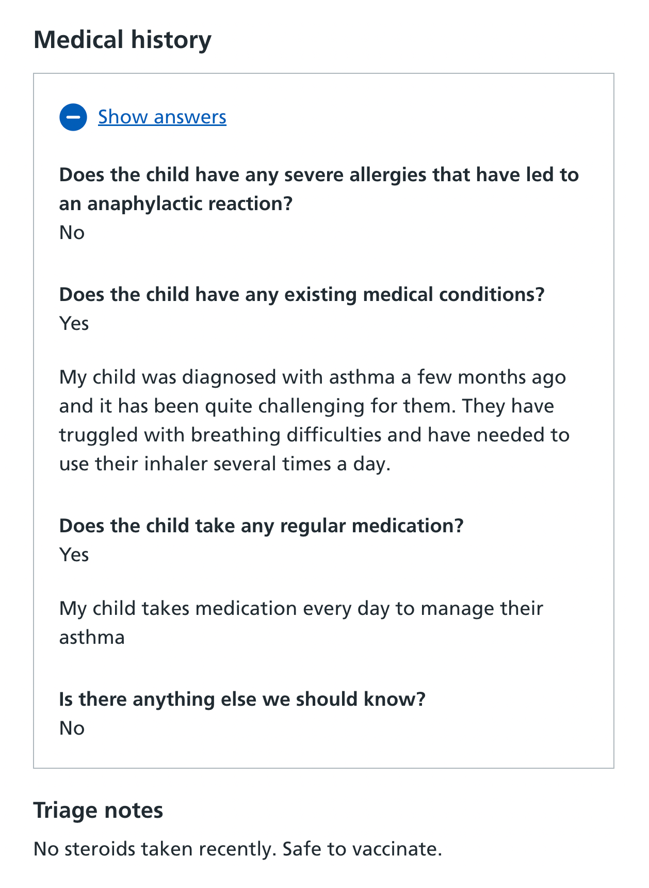
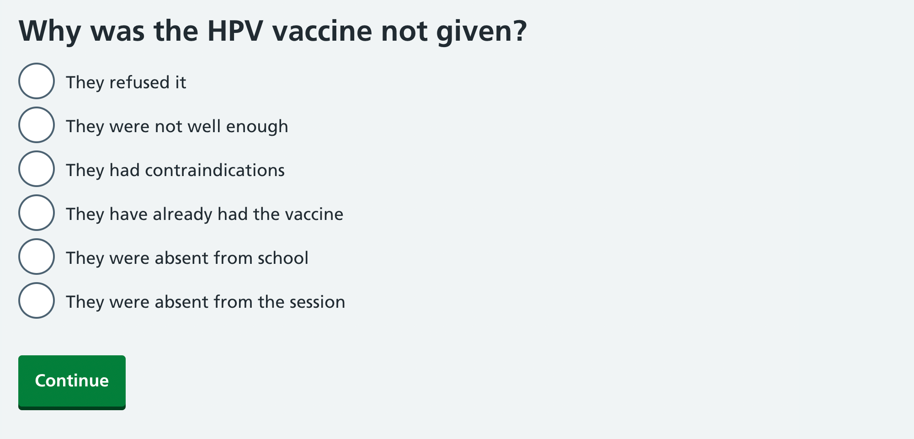
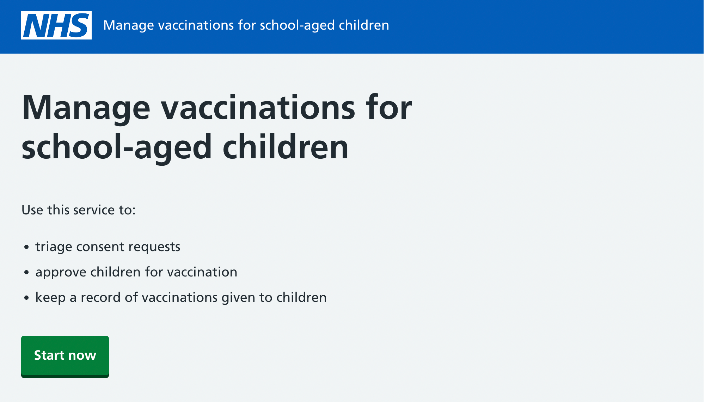

We recently ran a ‘model office’ with Solent NHS Trust. Its School-aged Immunisation Service (SAIS) manages vaccinations for children in Portsmouth, Southampton and the Isle of Wight.

## What we asked nurses to do

We asked two SAIS nurses in separate rooms to carry out some common tasks using our service. This included:

- triaging consent requests on laptops
- recording vaccinations on phones
- recording details of vaccinations not given

We deliberately added some complexity – for example, asking the nurses to triage the records of children with contraindications, and asking them to record adverse reactions to vaccinations.

Our team closely observed the nurses as they worked through a range of scenarios.

## What we’ve changed following nurses’ feedback

Some of the nurses’ suggested changes were so manifestly good, we decided to make them straight away.

### We’ve tweaked the position of triage notes

One nurse commented that the triage notes she saw in the ‘Record’ part of the service were hard to understand because they were above the answers to health questions.

She said it would be more helpful to have the notes below the answers to health questions so she could establish some context first. We’ve now made this change in the service.

### We’ve differentiated types of absence

Another nurse told us that in the system they currently use for recording vaccinations, they differentiate types of absence. Some children don’t come to a vaccination session because they’re not at school, while others don’t come because they’re deliberately avoiding a session (“hiding in the toilets” as she put it). As parents are told why their child hasn’t received a vaccination, it’s useful to specify why they haven’t attended a session.

Our service has a list of possible reasons for explaining this. Up until the model office, there was just one ‘They were absent’ option.

Following the nurse’s comment, we’ve decided to differentiate absence from school from absence from a session. To do this, we’ve added a new radio button to the ‘Why was the vaccine not given’ list.

## Renaming the service

Another minor change we made following the model office was renaming the service from ‘Record children’s vaccinations’ to ‘Manage vaccinations for school-aged children’. We did this to reflect the full scope of the service (requesting consent, triaging and recording). We’ll see how this tests in the next model office.

## How our model office differed from other research sessions

The model office was a particularly rich way of learning from users. It differed from other research sessions we’ve carried out so far in that we:

- used real software rather than a prototype
- asked nurses to perform tasks repeatedly rather than just once
- used synthetic data to generate discussion about scenarios we were interested in

We’re still processing the numerous insights we got, but we don’t plan to make any significant changes until we’ve done more research and analysis. Questions we’re considering following the model office include:

- Do we need to revisit the wording of the health questions, or make them customisable? (Solent’s questions were different from the ones we have in the prototype, and we know there’s variation across the country.)
- Should we consider differentiating ‘Do not vaccinate for now’ from ‘Do not vaccinate ever’? The Portsmouth team currently flag temporary contraindications, which keeps children in the triage area, but they also flag permanent contraindications, which moves children out of triage.
- Do we need to add on-the-day screening questions to the ‘Record’ area of the service?
- Should we consider moving the ‘refused’ records to the ‘Get consent’ tab in triage?
- Should we find a way of personalising the email parents get once the session has taken place – for example, including notes the nurse has left?

We’re planning two more model offices soon – in Yeovil and Cumbria – and we’ll report back on how these go.
