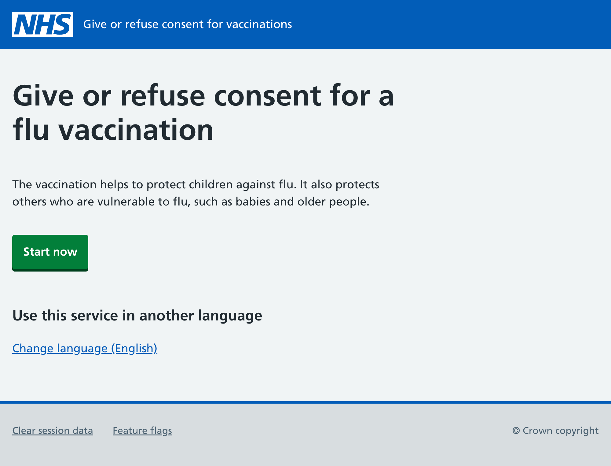
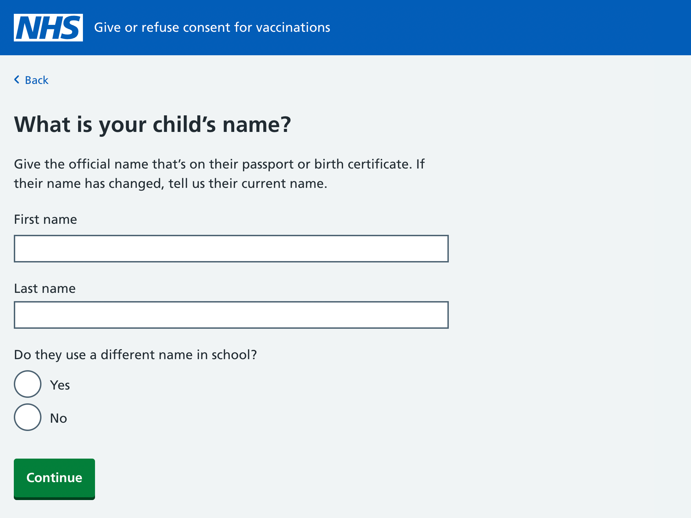
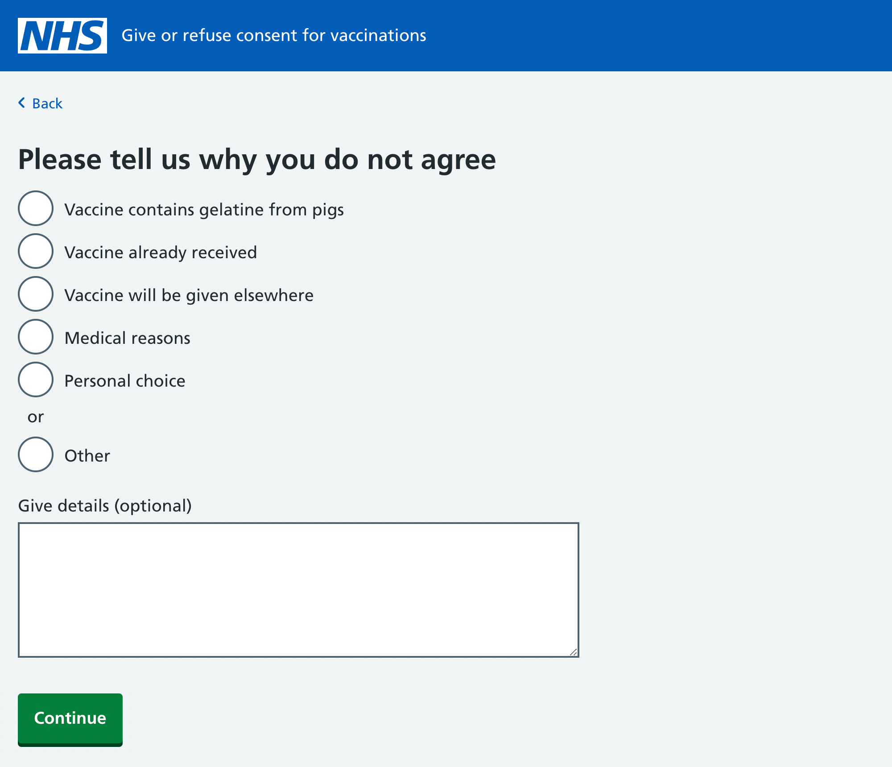

Having decided to pilot our service with Cumbria’s SAIS team in the autumn, we needed to update our designs for the flu journey (Cumbria’s team give flu vaccinations between October and December).

Most of the iterations we’ve made in recent months have been to the HPV consent journey, so we needed to reflect these in the flu journey. We also needed to act on some of the insights we got during our model office sessions in Yeovil.

## Shortening the flu start page

When we tested the start page of the HPV journey, several parents commented that the content there duplicated what they’d read in the email directing them to the service. As such, we substantially cut the volume of content on the start page.

We’ve now done the same for the flu journey, so that parents aren’t reading the same information twice.

## Creating separate fields for the child’s first and last name

Up until now, we’ve only had one field for the child’s name. However, we’ve now created separate fields. This will be useful if the data from the service is exported to the National Immunisation and Vaccination System (NIVS).

## Letting the parent explain why they’re refusing to give consent

During the model office, a couple of nurses said it would be helpful if parents could expand on their reasons for refusing to consent to a vaccination (we previously only had a notes field if the parent selected the ‘Other’ radio button). We’ve now added an optional notes field so that parents can explain their decision, should they want to.

## De-scoping parts of the service

Given the limited time we have to prepare for the pilot, we’ve de-scoped some parts of the service.

In our original designs, there was a way for parents to give consent for a flu injection if they objected to the gelatine used in the nasal spray. As there isn’t time to design and build this journey for the pilot, we’ve simplified what happens if a parent refuses to give consent because of the spray’s gelatine content. They’ll now get a call from a SAIS nurse rather than consenting to an injection through the service.

We’ve also de-scoped the school picker we’d hope to have on the ‘Confirm your child’s school’ page. If the school shown isn’t the right one, we now direct the parent to use the paper form instead.
