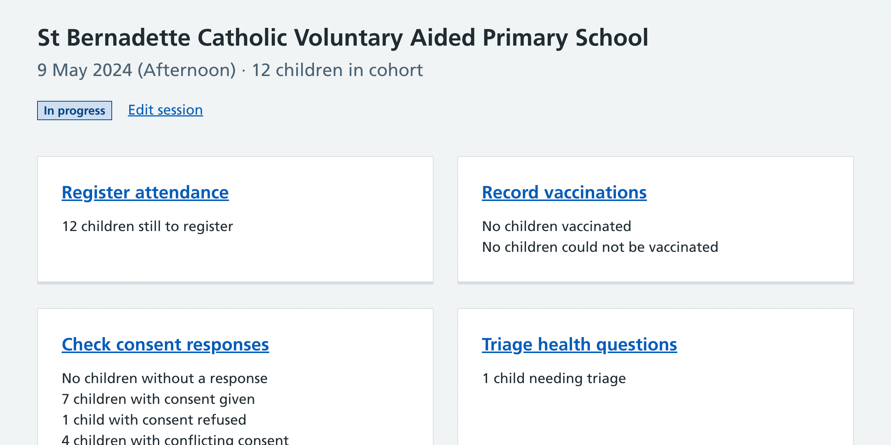
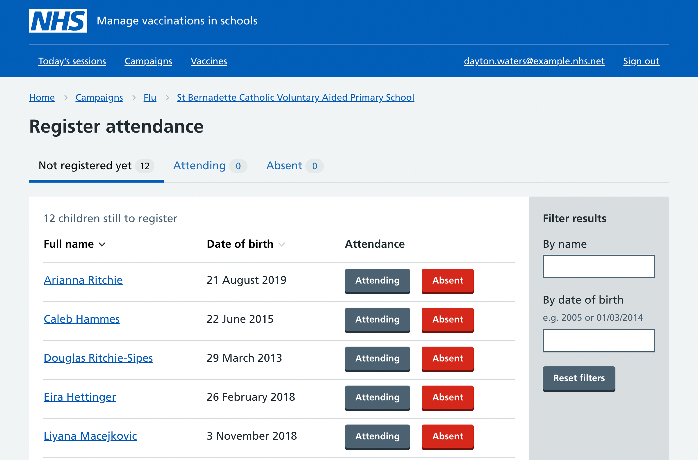
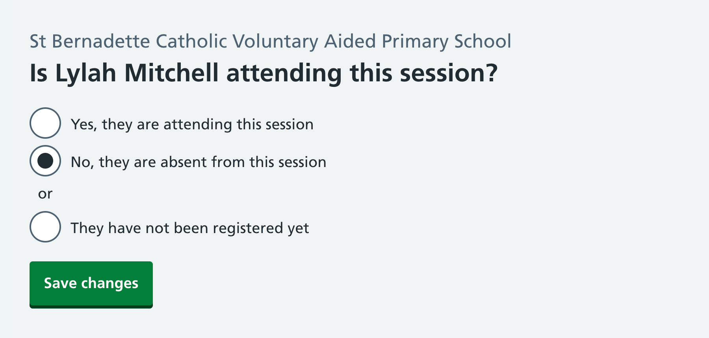
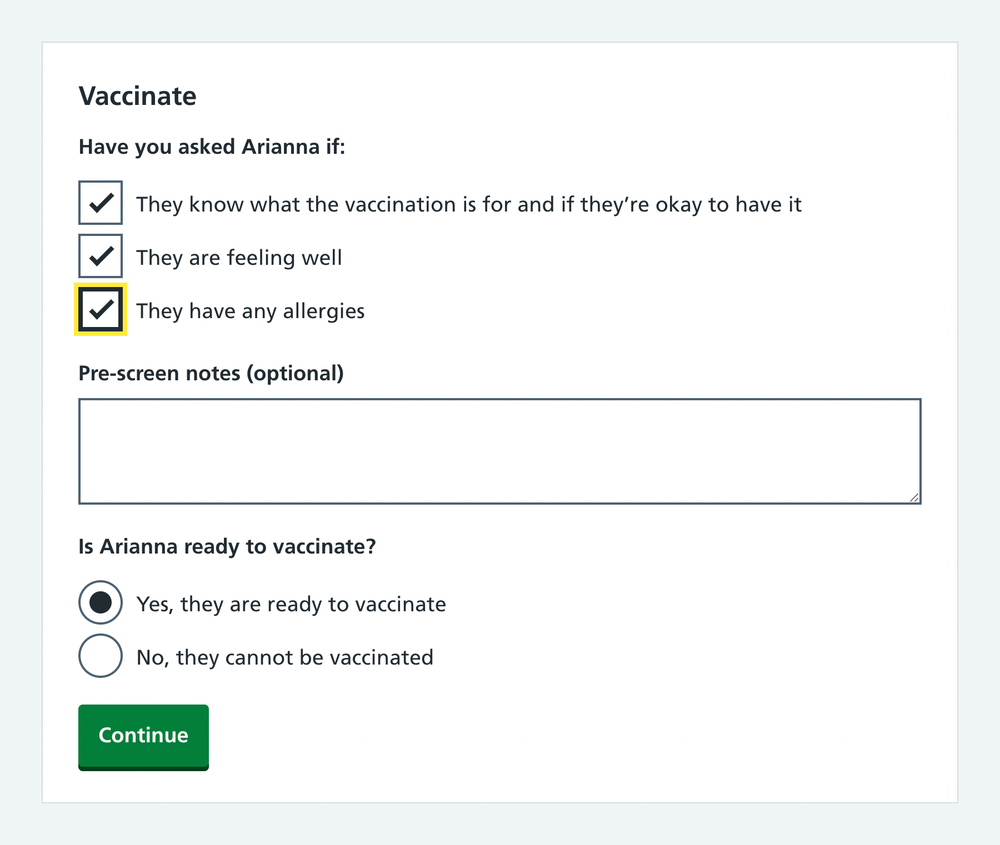
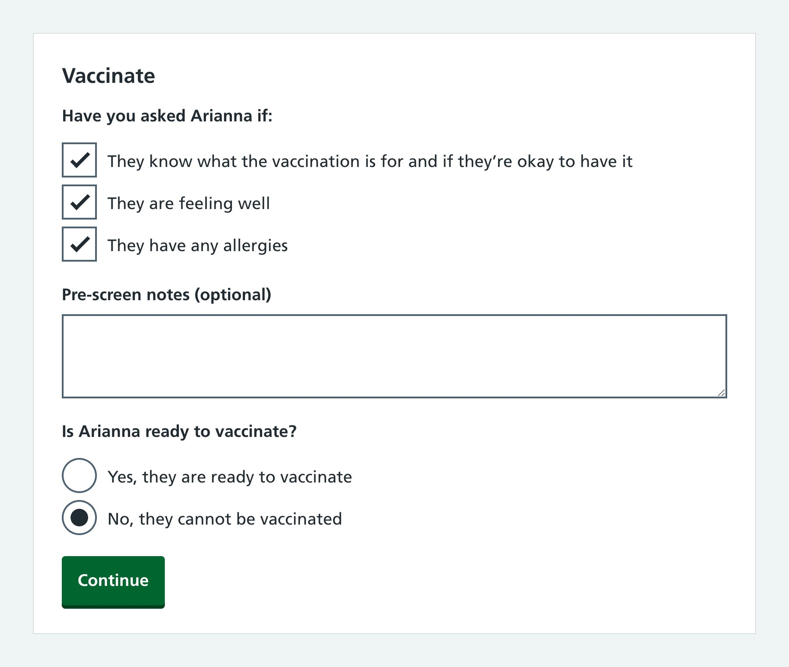
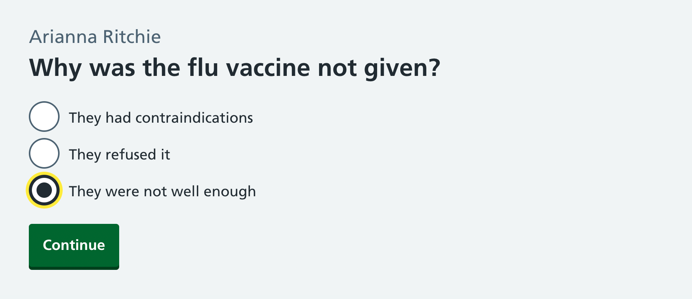

When our project team observed live vaccinations in schools, we noticed that all SAIS teams registered children’s attendance at sessions before recording vaccinations. This process typically involves:

- identifying the child
- checking whether the child has consent to be vaccinated
- directing a child with consent to queue for a vaccination
- directing a child without consent (or without a record) to wait in a different area while someone from the team tries to get consent for them

The main benefit of registering children’s attendance is that it makes the vaccination process smoother and more efficient.

In the sessions we observed, some registrations were carried out by nurses, but the majority were carried out by support staff.

## We’ve updated our designs to include a registration phase

Mavis now has a ‘Register attendance’ flow. It is only possible to record a vaccination once a child is marked as attending.

We believe adding this flow will make it easier to differentiate children at the session who have consent from those who haven’t. It should also be quicker for time-short nurses to find children ready to be vaccinated.

## We’ve also added some questions to the ‘Record’ flow

Another observation we made while attending sessions was that all SAIS teams ask children some standard questions before giving vaccinations. We’ve added these questions to the ‘Record’ flow.

Children’s answers to these questions determine whether the vaccination can go ahead. For example, a child with consent who feels very unwell on the day of a session may have their vaccination delayed.

