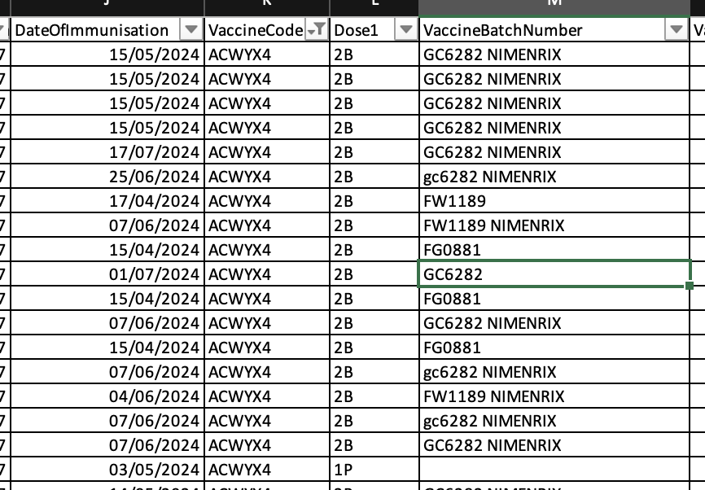
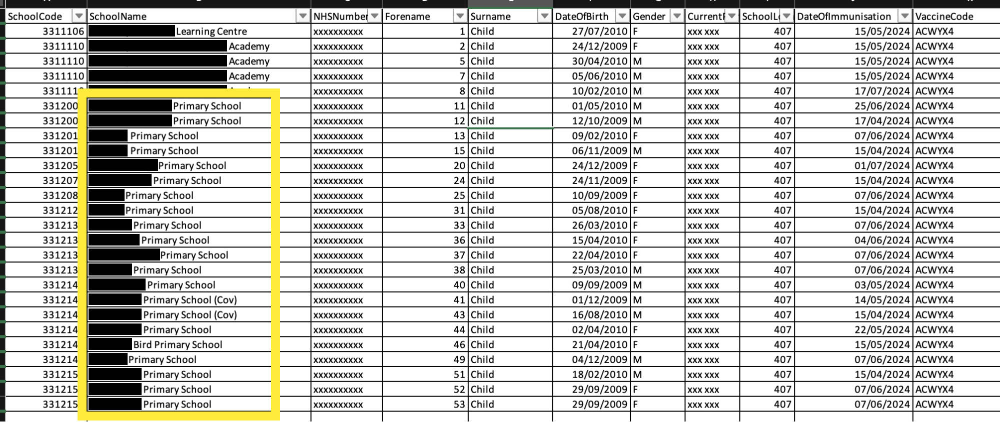

This post describes how we adapted Mavis to handle MenACWY vaccination histories and the issues we encountered when working with an early adopter School Age Immunisation Service (SAIS) team and their Child Health Information System (CHIS).

## Background

SAIS teams need children’s vaccination histories to determine who needs to be vaccinated. According to the CHIS specification (section 12.5.2, requirement CHISIM024), CHIS is required to provide these histories:

> The system must be capable of providing lists of outstanding immunisations required by individual children. The list should include details of the child’s registered GP practice, Health Visitor cluster, School Health Team and Community Paediatric service where available.

This capability is essential for supporting SAIS programmes effectively.

## The problem

When extending Mavis to support MenACWY vaccinations, we encountered several problems.

### 1. Data access issues

- No automated way existed for SAIS to download MenACWY vaccination histories from the CHIS’s IT system in bulk
- No standardised format had been agreed for exchanging this information
- The process to obtain sample data took over a month:
  - Initial delays just to confirm data could be provided (CHIS team needed management approval)
  - Further delays to receive the actual data
- These delays directly impacted our ability to finalise designs

### 2. Confusion around available vaccines

We found conflicting information about which MenACWY vaccines are currently in use:

- NHS.UK guidance stated that MenQuadfi is the only MenACWY vaccine available in England
- The Green Book and Patient Group Direction (PGD) template indicated that three vaccines are approved: MenQuadfi, Nimenrix and Menveo
- Discussions with SAIS clarified that all three vaccines are approved, but selection often depends on cost:
  - MenQuadfi will be used this year (and is the only one available for order from UKHSA through ImmForm)
  - Nimenrix was used in previous years

### 3. Incomplete and inconsistent CHIS vaccination records

Based on the sample provided by CHIS, the historical vaccination data had significant inconsistencies:

- Many records didn’t specify which MenACWY vaccine was administered:
  - Some records included batch numbers and vaccine product information
  - Others had batch numbers but no product details
  - Some records were missing both batch and product information
- Additional missing or incorrect data included:
  - Delivery site
  - Dose sequence
  - Correct care setting

Some vaccinations were incorrectly recorded as given in primary schools, though the MenACWY programme doesn’t involve primaries. We suspect this could have happened as a result of stale school information that hadn’t been updated when the child started secondary school, and incorrect assumptions made about where the vaccination took place.

After the real vaccination data was imported for several schools on Production, it was discovered that the it was missing the vaccination history for Year 11s. We hypothesised that this mistake happened as a result of the manual nature of the report’s production.

## How we changed Mavis in response

Based on these findings, we made the following changes to Mavis:

1. Made data importing more flexible by allowing vaccination records:
   - Without vaccine and batch numbers
   - Without the organisation that performed the vaccination
   - Without a care setting
   - Without a dose sequence
   - Without a time of day
2. Setting up Mavis with all three approved vaccines (MenQuadfi, Nimenrix, and Menveo), while recognising that MenQuadfi will likely be the primary vaccine used in the current academic year.
