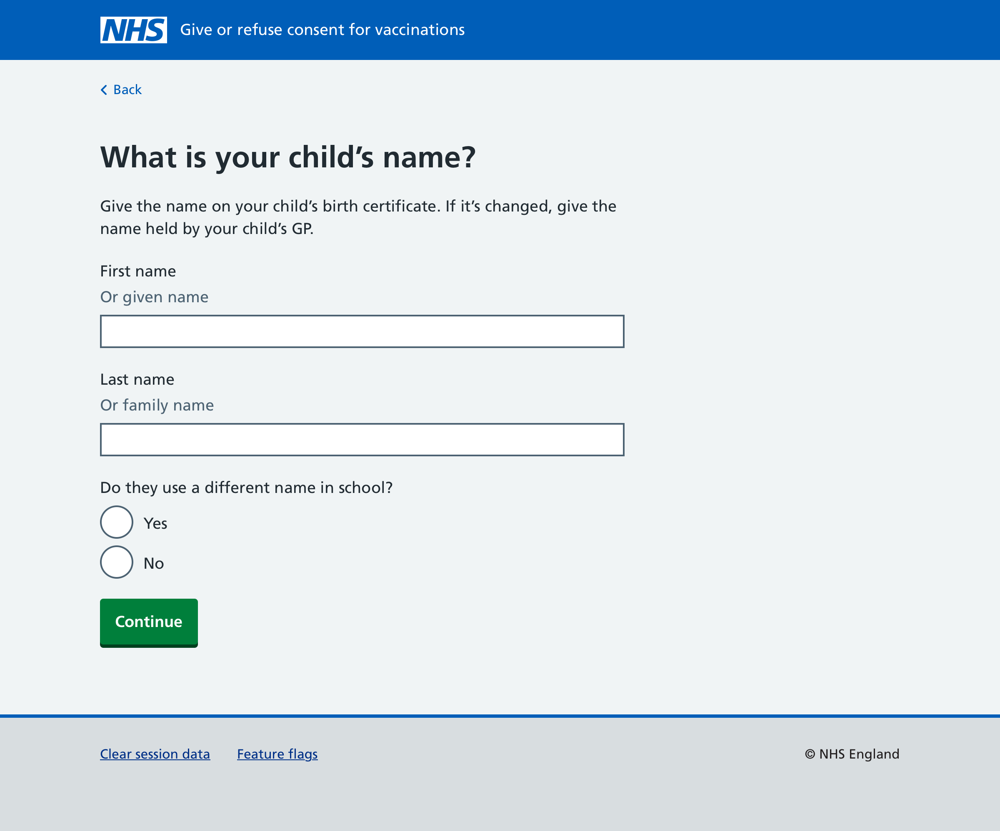
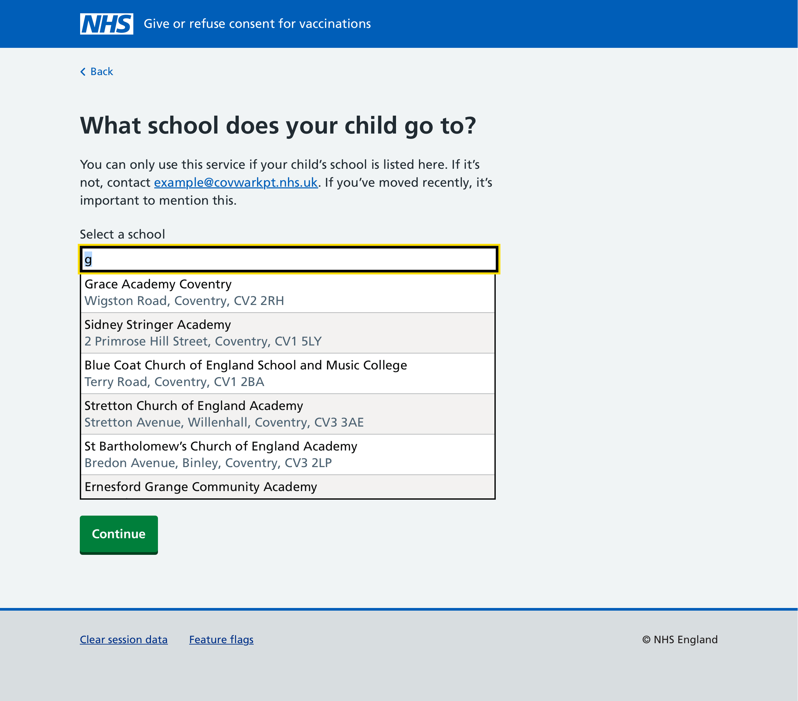
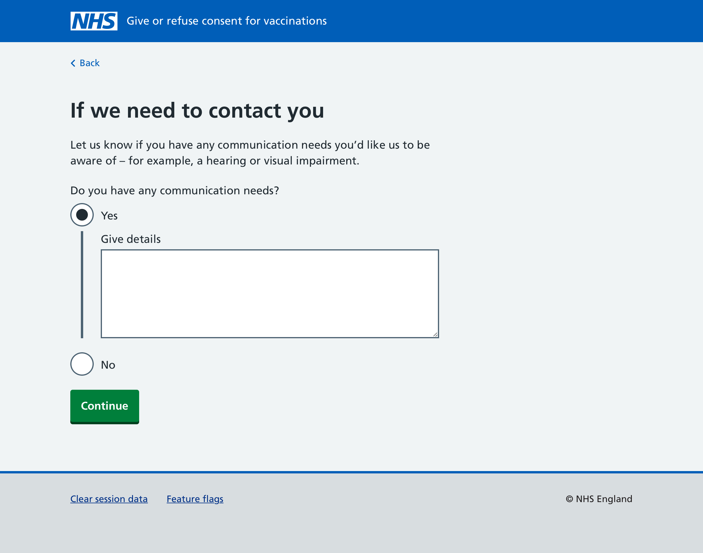
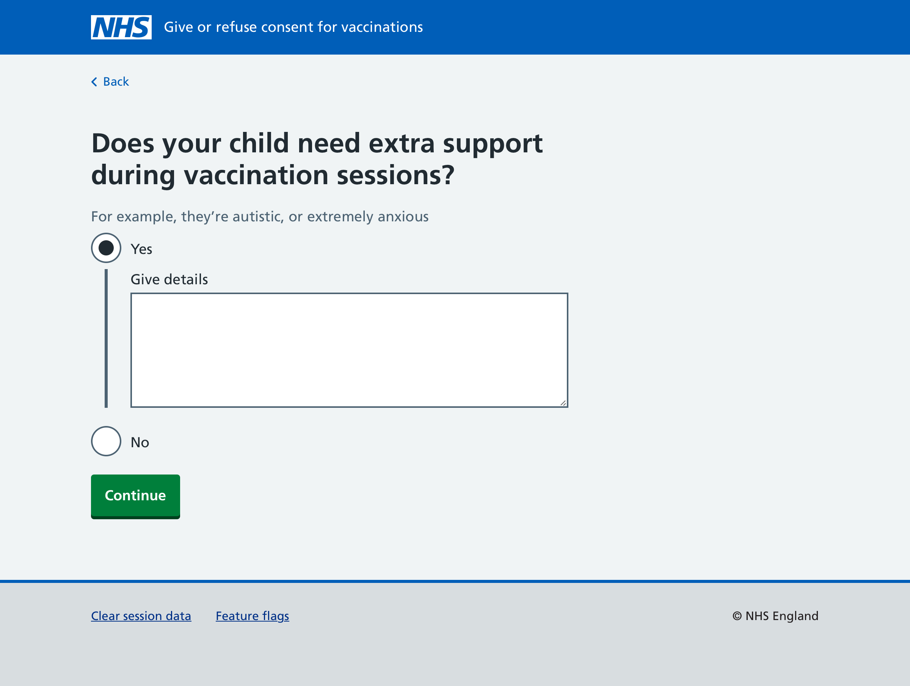
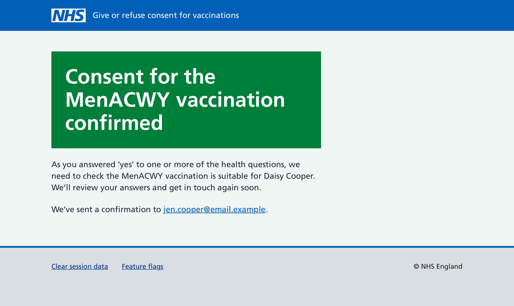

The first SAIS team to use our service was Coventry and Warwickshire Partnership NHS Trust (CWPT). They run HPV vaccination sessions for year 8 students at the start of the Spring term, before turning their attention to MenACWY and Td/IPV sessions at the start of the Summer term.

The private beta launched with support for HPV, so the next 2 programmes we needed to support were MenACWY and Td/IPV:

- The [MenACWY](https://www.nhs.uk/vaccinations/menacwy-vaccine/) vaccine helps protect against meningitis and sepsis. It is recommended for all teenagers. Most people only need one dose of the vaccine.
- The [Td/IPV vaccine](https://www.nhs.uk/vaccinations/td-ipv-vaccine-3-in-1-teenage-booster/) (also called the 3-in-1 teenage booster) helps protect against tetanus, diphtheria and polio. It boosts the protection provided by the 6-in-1 vaccine and 4-in-1 pre-school booster vaccine.

Children are given these vaccinations at around 13 or 14 years old (year 9) as part of [the NHS vaccination schedule](https://www.nhs.uk/vaccinations/nhs-vaccinations-and-when-to-have-them/).

Like many other SAIS teams, CWPT co-administer MenACWY and Td/IPV vaccines at the same time. For this reason, these 2 vaccines are commonly known as the ‘doubles’.

This post details the changes we made to Give or refuse consent for vaccinations, the parent-facing aspect of our service.

## Getting consent for the vaccinations a child needs

Not every child will need both vaccinations. For example some children may have been given:

- the MenACWY vaccine before travel abroad
- the Td/IPV vaccine after injuring themselves
- one or both vaccines in their country of origin before arriving in the UK

Some children may also be eligible for vaccinations they have missed, such as HPV or MMR.

Ideally, the parental consent journey would only ask parents to give consent for the vaccinations their child needs. However, the consent journey is designed to be associated with a session, but not an individual child. This is to prevent PII (personal identifiable information) being leaked from the service; parents enter details about their child, but we never confirm if these details are correct.

A consent journey that used information from a child’s vaccination history would require service design, architecture and policy changes well beyond the scope of the private beta. This is something we’d like to investigate in the future.

For our initial release, we chose an approach where the service could support 2 different consent journeys: one for HPV and another for MenACWY and Td/IPV.

## Updating the consent emails

In addition to updating email communications to support sessions with co-administered vaccines, we also made a number of other changes to improve requests for consent.

To reflect NHS England policy around informed consent, we added links to patient information PDF leaflets for each vaccine to the initial consent request email.

In research, we found that users were already having trouble finding the link to give or refuse consent, and adding more links made this situation worse.

We changed the heading above the call to action from ‘Please give or refuse consent’ to ‘How to respond’, and updated the link text from ‘Give or refuse consent for the [name] vaccination’ to ‘Respond to the consent request’.

Above this link we used indented text for the following words:

> It’s important to let us know whether you do or do not want your child to have these vaccinations. It will take less than 5 minutes to respond using the link below.

This helped draw attention to the main call to action in the invitation email.

We later changed the links to patient information PDFs to guidance pages on GOV.UK. These pages not only provide information about the vaccines, but also provide guidance in other languages (and for HPV alternative easy-read, BSL and Braille formats).

## Updating the consent journey

The journey for doubles is largely the same as that for HPV (or flu), but in this case the consent question needs to allow parents to:

- give consent for one vaccination
- give consent for both vaccinations
- refuse consent for both vaccinations

MenACWY and Td/IPV share the same health questions, although parents are also asked if their child has already had each vaccination. Therefore, we can ask each question once, and only show the vaccine specific questions depending on which vaccinations the parent is giving consent for.

Consent is shown to the parent as one set of answers, but we save separate responses for each vaccination. This is so that consent responses can be managed separately, for example if a nurse discovers a child has already received the Td/IPV vaccination.

## Checking if a child has already had a MenACWY or Td/IPV vaccination

A child’s vaccination record should show if a child has previously had these vaccinations. In reality such data is unreliable, not least because vaccinations may not get recorded in certain scenarios, such as during hospital visits.

If we can ask parents about their child’s vaccination history, nurses can use this information to help determine if a vaccination should be given or not.

During research, we found that parents had difficulty understanding the technical-sounding MenACWY and Td/IPV terms, and had difficulty recalling their child’s vaccination history.

This was especially true for MenACWY, as children get separate MenB and MenC vaccines when they are babies. It’s also possible for this to be given as a vaccination before travelling abroad.

Some research participants suggested adding ‘Don’t know’ as an option, though the likelihood is that most parents would select this answer, making the questions redundant.

In the end we decided to:

- Use more commonly understood disease names (meningitis, tetanus, diphtheria and polio) in the question titles
- Clearly state the relevant timeframe (i.e. the last 5 years)
- Provide examples in hint text of when these vaccinations may have been given previously

## Changes to the consent journey since the pilot

Since [the last design history post covering the consent journey](https://design-history.prevention-services.nhs.uk/manage-vaccinations-in-schools/2024/03/pilot-parental-consent/) we made a number of other changes.

### Start page

Previously the heading on the start page mentioned a specific vaccination (i.e. Give or refuse consent for an HPV vaccination). However, this heading became too long when it included multiple vaccination names.

We updated the heading to use the service name (Give or refuse consent for vaccinations), and added content about the individual vaccinations to the page, under relevant headings.

We included a link to more information about each vaccine on the NHS website, and told users about other ways they could give consent.

### Hint text for a child’s name

We changed the hint text in the question asking for a child’s name. Previously these mentioned a passport or birth certificate but not all parents will have these to hand. Mention of a passport may also concern recent immigrants.

We changed:

> Give the official name that’s on their passport or birth certificate. If their name has changed, tell us their current name.

to:

> Give the name held on your child’s official school records. If their name has changed, tell us their current name.

### Confirming a child’s school

For the pilot, if a child didn’t attend one of the participating schools, a parent couldn’t give consent.

For the private beta, if a child attends a different school a parent can now select another school from any of those the SAIS team is responsible for. If a child doesn’t attend any of the schools listed, they are encouraged to contact the SAIS team.

### Asking for contact preference

Previously, if a parent entered a phone number (with the option to get updates by text message), we then asked for their preferred phone contact method. During research, parents were confused about why this question was being asked, and how it related to the question on the previous page.

We updated this question to be more explicit, and ask parents to provide details of any communication needs they may have with hearing or visual impairment given as examples.

### Asking if a child needs support

In earlier designs, we asked parents ‘Is there anything else you think we should know’. We removed this question in the pilot as the participating SAIS teams were concerned that this question was too open-ended, and would require a lot of time to triage answers.

For the private beta, we have made this question more explicit by asking parents if their child needs extra support during vaccination sessions, with autism or extreme anxiety given as examples.

### Use new panel pattern for confirmation screen

The NHS design system recently added a [panel component](https://service-manual.nhs.uk/design-system/components/panel) to display important information when a transaction has been completed. We were previously using the [panel component from the GOV.UK Design System](https://design-system.service.gov.uk/components/panel/) which has a slightly different design.

We also reviewed the content shown on this page to support new confirmation scenarios such as a mixed consent response.

### Removed GP question

We previously asked if a child was registered with a GP. Since the service now integrates with PDS (Personal demographic service) we no longer need to ask parents this question.
