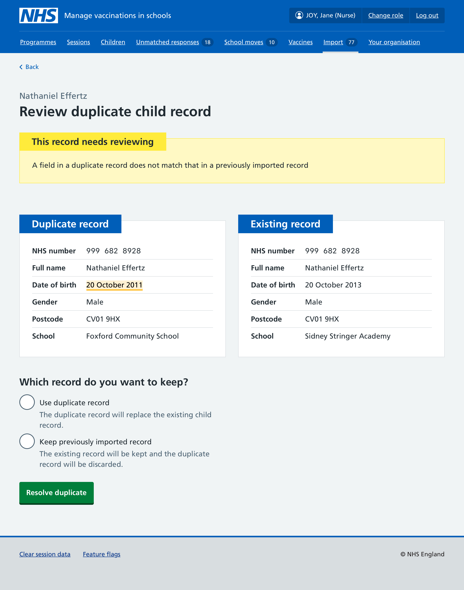
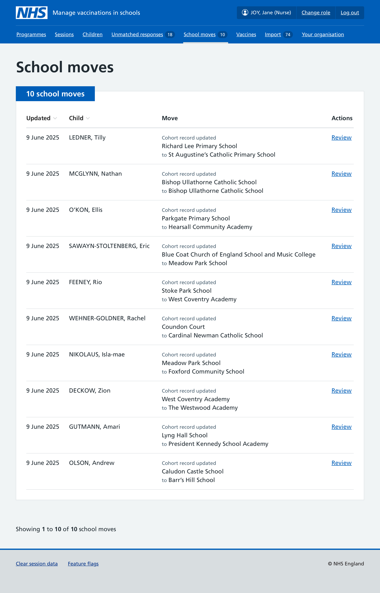
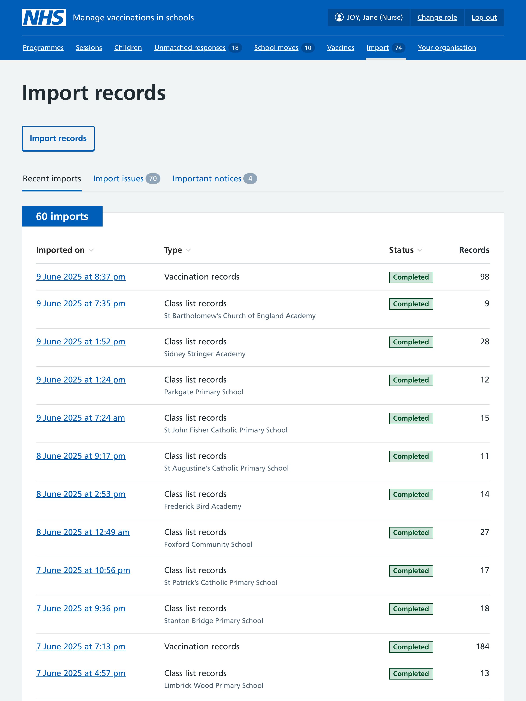
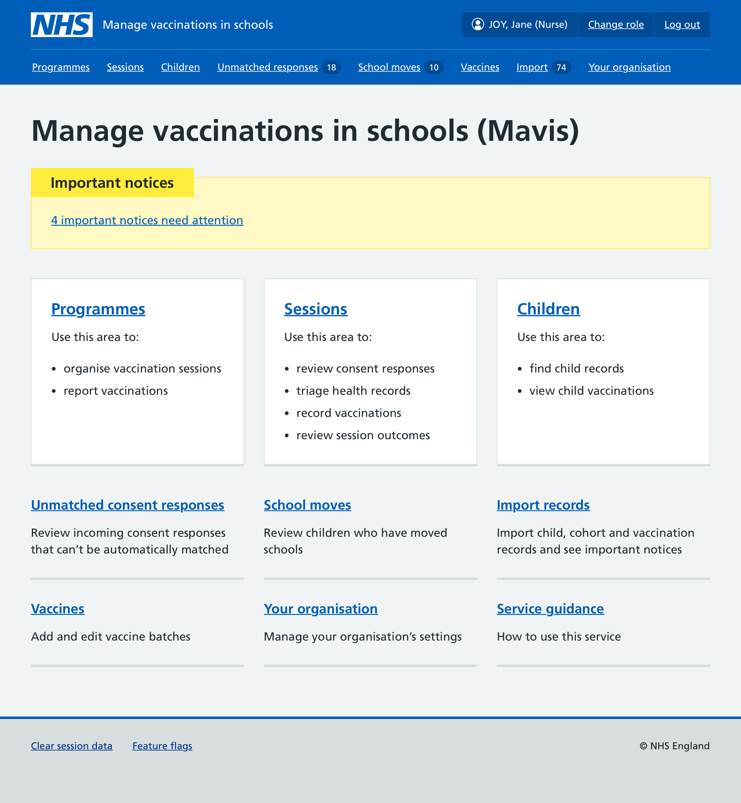

We previously wrote about [the information SAIS teams need to maintain accurate cohorts](/manage-vaccinations-in-schools/2025/02/what-sais-teams-need-to-maintain-accurate-cohorts/). Short of building integrations with different health and GP IT systems, we began operating the private beta by allowing teams to import this data into Mavis using CSV files.

## Types of record

Mavis supports importing 3 different types of record.

### Child records

These are records obtained from a CHIS, local authority or school. They are used to create an initial cohort.

We specify the CSV format for these imports and provide a template in the user guide.

### Class lists

These are records of children obtained from a school. They are used to ensure each child has up-to-date contact details for their parents. They can also be used to determine if a child has changed school (see ‘[Tracking school moves](#tracking-school-moves)’).

We specify the CSV format for these imports and provide a template in the user guide.

### Vaccination records

These are records of previous vaccinations from a CHIS or GP IT system. They are used to determine a child’s eligibility for different vaccinations.

We specify the CSV format for these imports. and provide a template in the user guide. We also support CSVs that use a SystmOne format.

## Values used across different record types

| Value                 | Child records | Class lists  | Vaccination records                           |
| --------------------- | ------------- | ------------ | --------------------------------------------- |
| First name            | **Required**  | **Required** | **Required**                                  |
| Last name             | **Required**  | **Required** | **Required**                                  |
| Date of birth         | **Required**  | **Required** | **Required**                                  |
| Gender                | Optional      | Optional     | **Required**                                  |
| Preferred first name  | Optional      | Optional     | —                                             |
| Preferred last name   | Optional      | Optional     | —                                             |
| Year group            | Optional      | Optional     | —                                             |
| Registration group    | Optional      | Optional     | —                                             |
| NHS number            | Optional      | Optional     | Optional                                      |
| Address line 1        | Optional      | Optional     | —                                             |
| Address line 2        | Optional      | Optional     | —                                             |
| Town                  | Optional      | Optional     | —                                             |
| Postcode              | **Required**  | Optional     | —                                             |
| School URN            | **Required**  | —            | **Required** if care setting is school     |
| Parent 1 name         | Optional      | Optional     | —                                             |
| Parent 1 relationship | Optional      | Optional     | —                                             |
| Parent 1 email        | Optional      | Optional     | —                                             |
| Parent 1 phone        | Optional      | Optional     | —                                             |
| Parent 2 name         | Optional      | Optional     | —                                             |
| Parent 2 relationship | Optional      | Optional     | —                                             |
| Parent 2 email        | Optional      | Optional     | —                                             |
| Parent 2 phone        | Optional      | Optional     | —                                             |
| Programme             | —             | —            | **Required**                                  |
| Vaccinated            | —             | —            | **Required** ‘Yes’ or ‘No’                 |
| Reason not vaccinated | —             | —            | **Required** if not vaccinated             |
| Date of vaccination   | —             | —            | **Required**                                  |
| Time of vaccination   | —             | —            | Optional                                      |
| Anatomical site       | —             | —            | Optional                                      |
| Vaccine name          | —             | —            | Optional                                      |
| Batch ID              | —             | —            | **Required** if batch expiry date provided |
| Batch expiry          | —             | —            | **Required** if batch number provided      |
| Care setting          | —             | —            | Optional                                      |
| School name           | —             | —            | **Required** if school URN is 888888       |
| Clinic name           | —             | —            | **Required** if care setting is clinic     |
| Dose sequence         | —             | —            | Optional                                      |
| Organisation code     | —             | —            | Optional                                      |
| Clinician first name  | —             | —            | Optional                                      |
| Clinician last name   | —             | —            | Optional                                      |
| Clinician email       | —             | —            | **Required** if recording offline          |
| Notes                 | —             | —            | Optional                                      |

## Importing records

### Uploading a file

Each type of import has slightly different requirements, and these differences will likely increase over time. For example, class list records need to be associated with a school and year group(s), whereas vaccination records can be uploaded in different formats.

For this reason, we ask the user to select which type of records they want to import, and explain how each type is used by the service.

The next question asks the user to select a file for upload. We use show/hide guidance to outline the specific columns and values to use in a CSV file.

If no file is selected, or the wrong type of file is uploaded, the user will be shown a validation error. Once a file is uploaded, the data it contains is then validated:

- If values were not saved in a certain format, or don’t contain valid answers, we cancel the upload and show a confirmation screen which summarises the issues found and on which row of the CSV they were found. The import is shown with a status of ‘Invalid’.

- If the data is valid, and if it requires a certain amount of time to process in the background, we show a confirmation screen that shows the date and time of the import, and the type of records being imported. The import is shown with a status of ‘Processing’.

A user can view an import once it has been processed. The import then has a status of ‘Completed’.

### Resolving issues with imported records

Once a file has been imported, each record can be compared with existing records in Mavis. Where there are duplicates or conflicts, a user can review the differences and choose to use the new record or keep the existing record.

For child and class list records, users can also choose to keep both records. This is useful in the case of twins where Mavis thinks a record is for the same person because the date of birth, postcode and last name match.

### Tracking school moves

When class list records are imported, these can show that some children have either:

- moved between schools in the area served by the SAIS team
- moved out to a school in the area not served by the SAIS team
- moved in to a school in the area not served by the SAIS team

These moves need to be confirmed before they are applied. Each school move detected can be reviewed in the ‘School moves’ section of the service, where a user can choose to either update a child’s school, or ignore this change.

### Moving imports to their own section

The ability to import records was previously found within the programmes section. This made sense while there was only one vaccination programme, but didn’t make sense once we added support for MenACWY and Td/IPV as it’s possible to import cohort and class list records that affect multiple programmes.

We therefore built a separate ‘Import records’ area in Mavis, which users can access from the dashboard or the top navigation.

### Important notices

Every record that’s imported into Mavis is checked against PDS (Personal demographic service). This can return the following updates about a child’s record:

Superceded
: This can happen when a child has been assigned a new NHS number after adoption. Mavis will automatically update the record with this new number and no notice is shown to the user.

Invalid
: The NHS number has been flagged as invalid. We display the existing NHS number with a line struck through it.

Sensitive
: A record can be flagged as sensitive to protect the location of a patient who might be at risk. Mavis restricts access to location and contact data shown in their record, and ceases automated communication with a child’s parents or guardians.

Deceased
: A record can be returned that includes a date of death. In this instance, we remove the child from any cohorts and vaccination sessions, and stop any outgoing communication to parents.

While Mavis can perform some actions automatically, it is likely that further actions will need to be taken offline, and so highlighting important notices to users allows them to perform these tasks. Only users with super admin rights can see these notices.

Currently we only have a design for archiving records where the child’s death has been recorded. In the future we will look to designing a method for archiving all types of important notice.

Finally, as important notices are somewhat hidden within the ‘Import records’ section, we show a warning banner on the dashboard when any important notices have been created.

