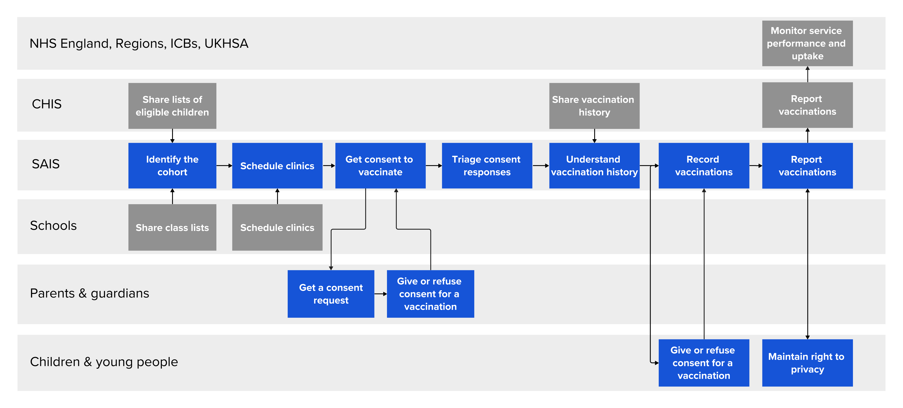

We have always tried to model Mavis and the School Age Immunisation Service (SAIS) as a sequential process, building on the Select/Invite/Book/Record/Report model used in other areas of Vaccinations Digital Services.

At a high level, the Mavis service design looked like this:

But this structure hasn’t served our design team well and we have often felt that we are fighting against it to meet the complex needs of our users.

## Why it wasn’t working

Our research and continuous improvement have shown that SAIS, as well as Child Health Information Services (CHIS) and other children’s vaccinations services, don’t follow a sequential process. In practice, the NHS staff running these local services work on the same set of complementary, interrelated functions on a daily basis, every day of the year.

Identifying the cohort for a school-age programme is a continuous activity that the whole team contributes to; from initial cohort uploads handled by admin users, through class lists sourced from schools and added to Mavis on a daily basis, to last-minute changes made by nurses whilst vaccinating in a session when a child has recently moved into or out of the area. The cohort changes daily until the last day of the programme.

Scheduling, too, is an ongoing and flexible process. Which children are scheduled to attend a session – and which vaccinations will be on offer – depends on many factors, including:

- their individual vaccination statuses, which change constantly
- the team’s capacity and vaccine stock
- the nature of the relationship with the school

Changing session schedules affect who the team needs to seek consent for, how they triage, and how they report their uptake.

Teams are continuously updating their cohorts, reassessing vaccination statuses, re-scheduling and planning new sessions and handling new information from parents. These parallel functions come together organically to make up the School Age Immunisation Service.

Building around a sequential journey has meant we as a team have to treat basic needs for flexibility as exceptions to the process. Handling them became complex because it didn’t fit our default rules. We started to feel like Mavis was made up of more exceptions than rules.

## What we’re doing instead

We decided to update our mental model, our design language, and even our team structure to reflect the parallel, complementary nature of these functions. We’re now thinking about managing vaccinations in schools like this:

We have found that the needs underpinning each of the individual functions listed are broadly the same across teams, within not just SAIS but also CHIS and broader community/outbreak initiatives.

The individuality comes in as local teams bring these functions together differently to form each local special snowflake.

From right to left:

### Get help with Mavis

Our onboarding and support functions – a massive part of making sure that Mavis really works for teams. Doing this in-team has been integral to our team’s agency and our user satisfaction.

### Manage team

Allow teams to manage all aspects of their footprints, including the schools, GPs and geographic area they cover, managing their users and their organisational structure.

Underpinned by the [Care Identity Service](https://digital.nhs.uk/services/care-identity-service) (CIS2) and the Department for Education’s [Get Information About Schools](https://www.get-information-schools.service.gov.uk) (GIAS) (with a gap for team geographies that we would like to address).

### Manage children

Continuous cohorting. Importing of children’s records and parent contacts from CHIS, local authorities and schools, and matching this information against the Personal Demographics Service (PDS) to ensure we maintain a single, up-to-date record per child and deduplicate across teams when children move around. Changing children’s schools, addresses and contacts individually on a daily basis.

Underpinned by [PDS](https://digital.nhs.uk/services/personal-demographics-service).

### Monitor uptake

Producing stats about the vaccination programmes for teams to monitor their own progress, as well as reporting to UK Health Security Agency and commissioners.

### Manage vaccination records

Establishing relevant vaccination history for each child to determine their eligibility for vaccinations. Managing available vaccines and batches. Reporting individual vaccinations given by the team to GPs, CHIS and NHS England.

Underpinned by the [Immunisation FHIR API](https://digital.nhs.uk/developer/api-catalogue/immunisation-fhir-api). Vaccines could be managed through a vaccines API in the future.

### Manage and run sessions

Bringing it all together. Combining the information about schools, clinic locations, children and their vaccination eligibility to schedule sessions, seek consent, triage health information, register attendance, vaccinate and record outcomes.

### Protect your child

This one is a true linear journey: receive a consent request for your child, give or refuse your consent, get updates on what happens next, and if necessary, book and attend a community clinic.

Currently underpinned by [GOV.UK Notify](https://www.notifications.service.gov.uk), in future [NHS Notify](https://notify.nhs.uk) and the NHS App.
