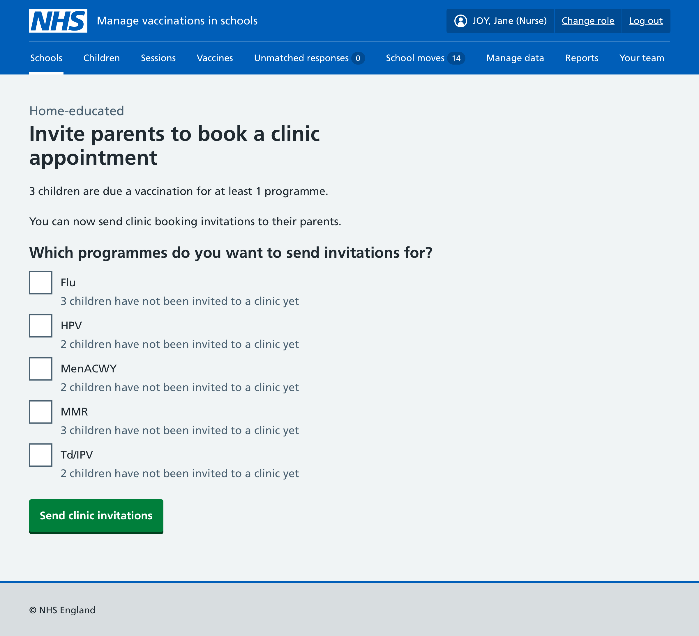
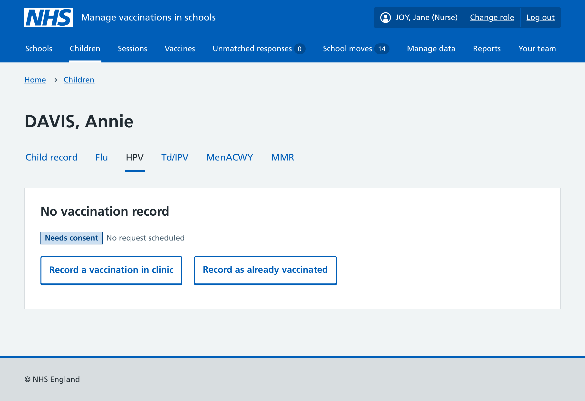

## The problem

In Mavis, children "belonged" to a team's community clinic in the same way they belonged to a school: through a patient-location relationship. Once this relationship was created – for example, when a child was invited to a flu clinic – the child appeared in every future clinic session the team scheduled for any programme they were eligible for.

This meant that when a team ran their second vaccination programme of the academic year, all children previously invited to a clinic for the first programme automatically received clinic invitations for the new programme, bypassing any planned sessions at their school.

This typically became a problem when teams ran their second programme of the year, and got progressively worse as more programmes were added. The Coventry and Warwickshire Partnership Trust raised it in January 2026, with more than 30% of each year group affected.

There was also a risk for self-consent by young people. Automatic clinic invitations for second doses could inadvertently reveal a Gillick-competent child's vaccination to their parent.

## Long-term solution

We are researching and designing a clinic booking journey where parents can book their children into specific clinics on specific dates. This will likely involve bookable clinics and walk-ins, with SAIS teams adding individual sessions for each date and location. This work is at an early stage and will not be completed in time for the current academic year.

## What we changed

Rather than waiting for the full redesign, we simplified the clinic journey by breaking the coupling between children and a team's clinic location, and between scheduling clinic dates and sending invitations.

SAIS teams no longer need to schedule clinic sessions in Mavis to send invites to children or record clinic vaccinations.

### Sending clinic invitations

SAIS teams can now invite children to clinics in 3 ways.

For children in schools, at the end of a school session, teams can use the 'Invite to clinic' button to send clinic invitations for all programmes in that session. This works the same as before, and invites all children who were not vaccinated during the session and do not have a refusal recorded.

For home-educated children and children with unknown schools – now shown separately in Mavis – teams can use a new button in each area to send clinic invitations to any child with contact details, for whichever programmes they choose.

For any child, teams can send an individual clinic invitation for any programme from the child record page.

Mavis will not automatically add children to a clinic session when an invitation is sent. Invitations can be sent independently for each programme.

Teams can also send a consent request for a specific programme to someone who has booked into a clinic individually. This is done from the child record page.

.")

### Gillick competence and parental notification

If a child has been assessed as Gillick competent in a multi-dose programme and has asked for their parent not to be notified, the parent will not receive clinic invitations for subsequent doses in that programme.

### Recording vaccinations given in a clinic

SAIS teams can now record a vaccination given in a clinic – or any non-school setting – directly from the child record page.

To do this, teams:

1. Search for the child in the children list, using the new 'invited to clinic' filter to narrow results if needed
2. Go to the programme tab and record a new vaccination

The steps from this point are the same as recording a vaccination in a school session.

Mavis will add the child to a clinic session for today, keeping a clear record of everyone vaccinated in a clinic on a given day.

We will continue to improve this functionality as we work towards full clinic booking in Mavis.

