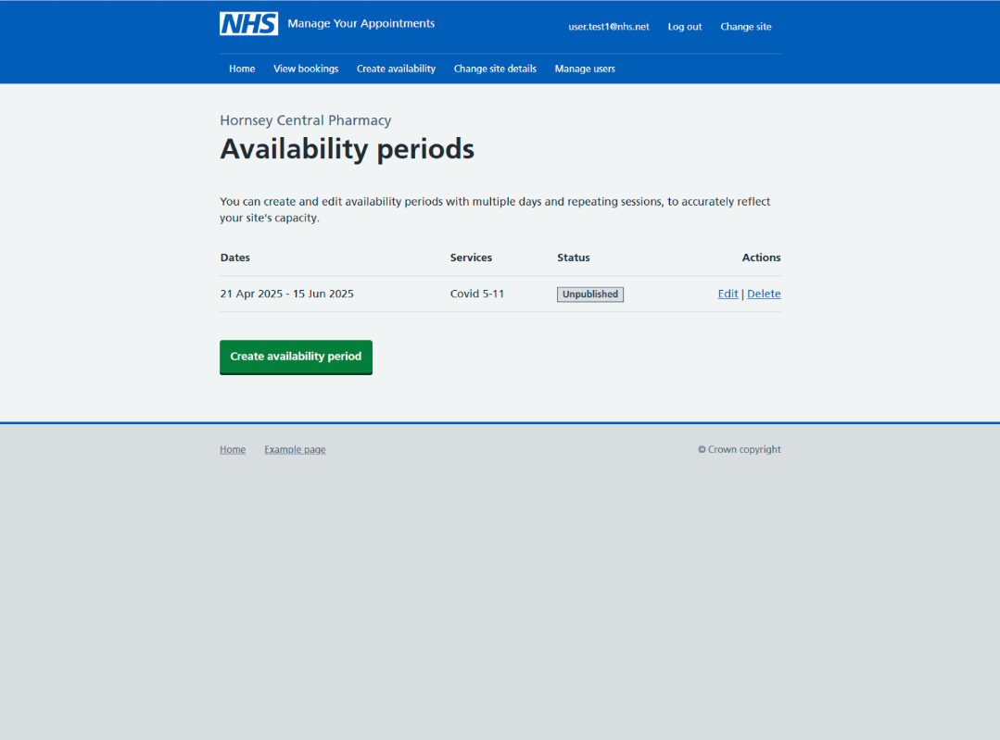

As part of managing availability and appointments, our users need to be able to create periods of availability (sometimes called campaigns).

Creating availability will automatically create and publish appointments to the National Booking Service (NBS), which will enable citizens to book appointments.

## What we did

Our discovery research showed that NHS organisations that operate vaccination sites have diverse organisational structures and operating models, and it was a challenge to create a design that would work across the wide range of models we’d observed

We used the knowledge and insights from testing alpha designs to create an availability journey that would support our users to create:

- sessions that repeat on a weekly basis (weekly sessions) between a range of dates
- one-off sessions that don’t repeat

The aim was to enable users to set up seasonal campaigns, and also have some flexibility to set up ad-hoc clinics if needed.

Due to the short timescale, we needed to produce a design that would allow the vast majority of users to set up campaigns that would fit within their operating models.

## The design

The first iteration of the design allowed user to create availability periods, and add different session types to those periods. Users could create weekly sessions, with times and capacity that would repeat every week, or single sessions, to cover ad-hoc days.

Our approach was designed with flexibility in mind, with the intention of enabling users to create availability periods containing multiple sessions, to allow them to create whole seasonal campaigns in one go.

We created a table containing previously created availability periods, that users could publish, unpublish, and edit.

### Availability overview

### Session type

### Session dates

### Session times and capacity

### Session services

### Check availability period

## Findings

We tested the journey by creating a task for our users. We asked them to create an availability period which contained both a weekly and single session.

Users understood the process of creating sessions and were able to create both repeat and multiple sessions quickly.

We found that the users wanted to save and publish the availability period before they had added all the sessions from the UR task. There was also some hesitation around adding different services to the same availability period.

> I'm not sure they'd mix vaccines like this into one service for flu and RSV because it's a different type of vaccine, completely about availability. Flu vaccine comes from one place. RSV vaccine comes from somewhere else. They're not necessarily delivered together.

We also found that users struggled to see the ‘unpublish’ button on existing availability periods due to the length of the page and the need to scroll. This left them feeling uncertain about how to make changes to existing availability.

Based on these findings, we concluded that the process of creating repeat and single sessions worked for our users, but that we needed to consider the concept of availability periods, and whether these would support the users to create campaigns in the way we had assumed it would.
