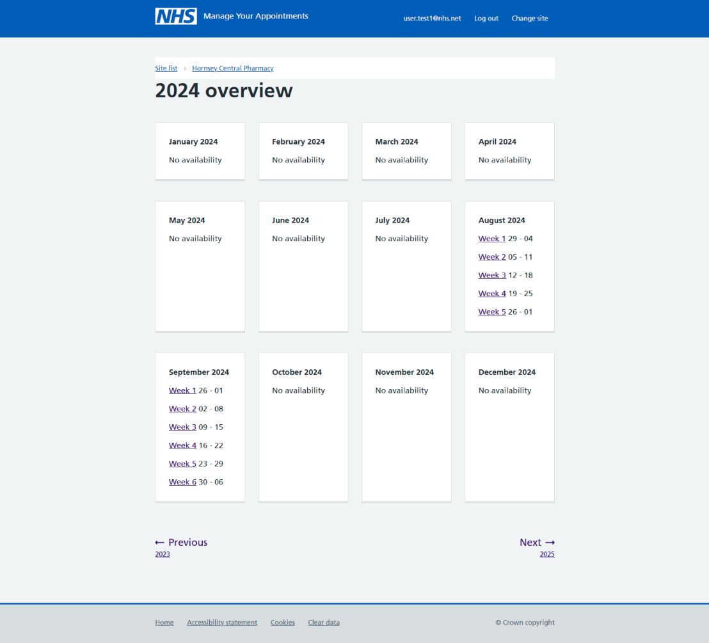
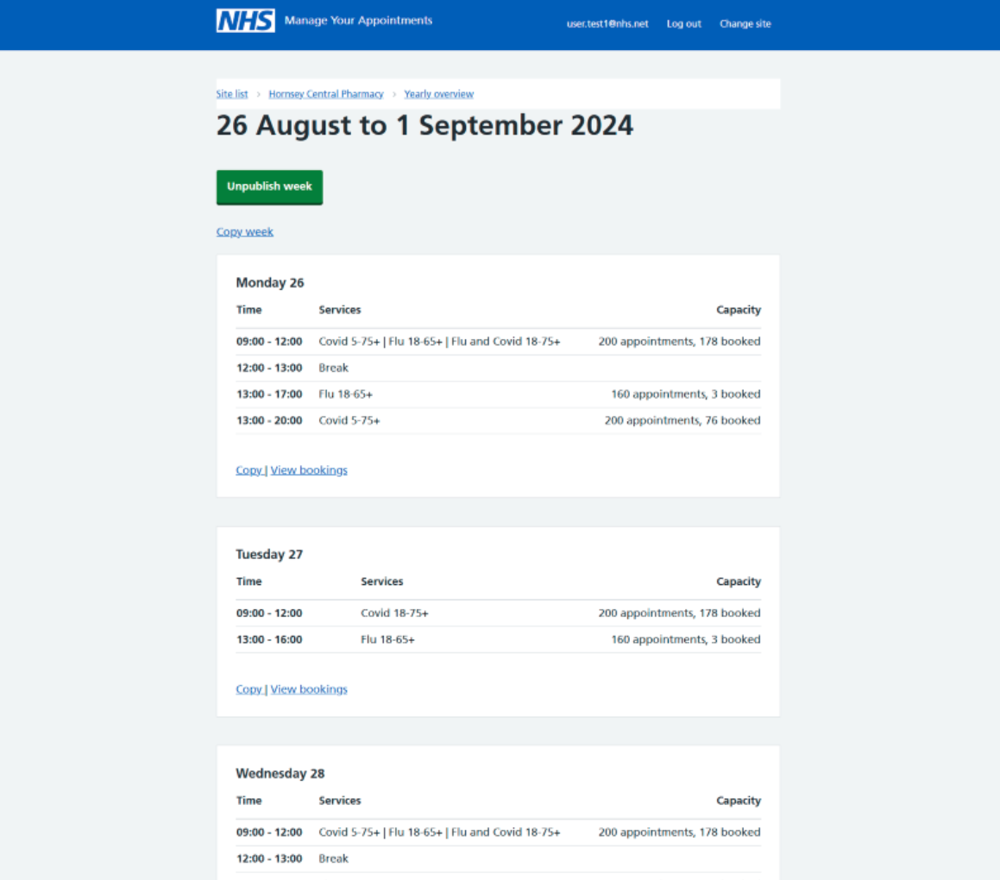
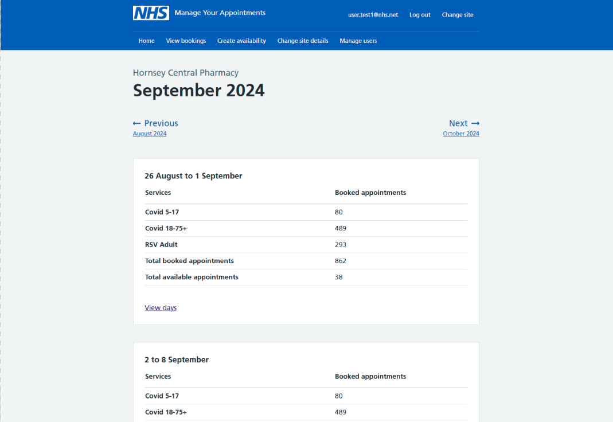
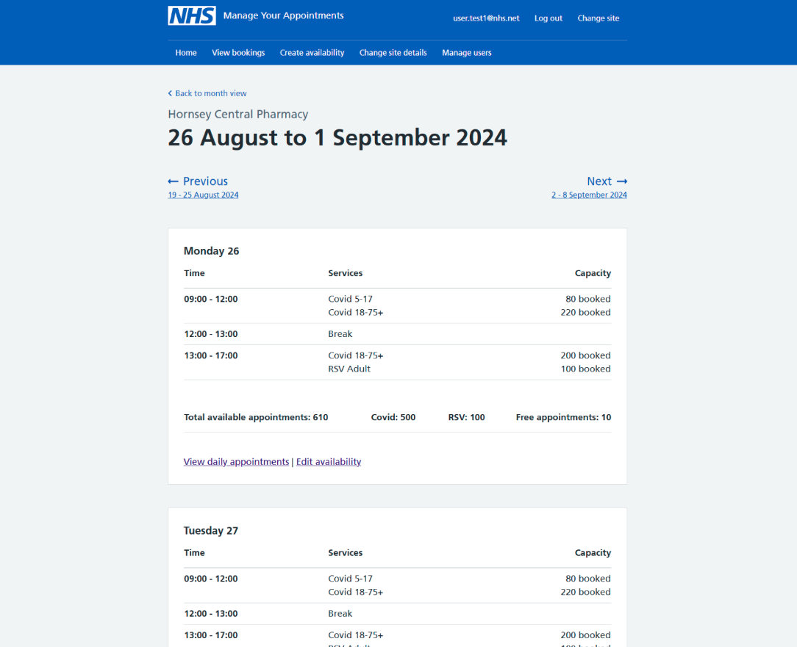
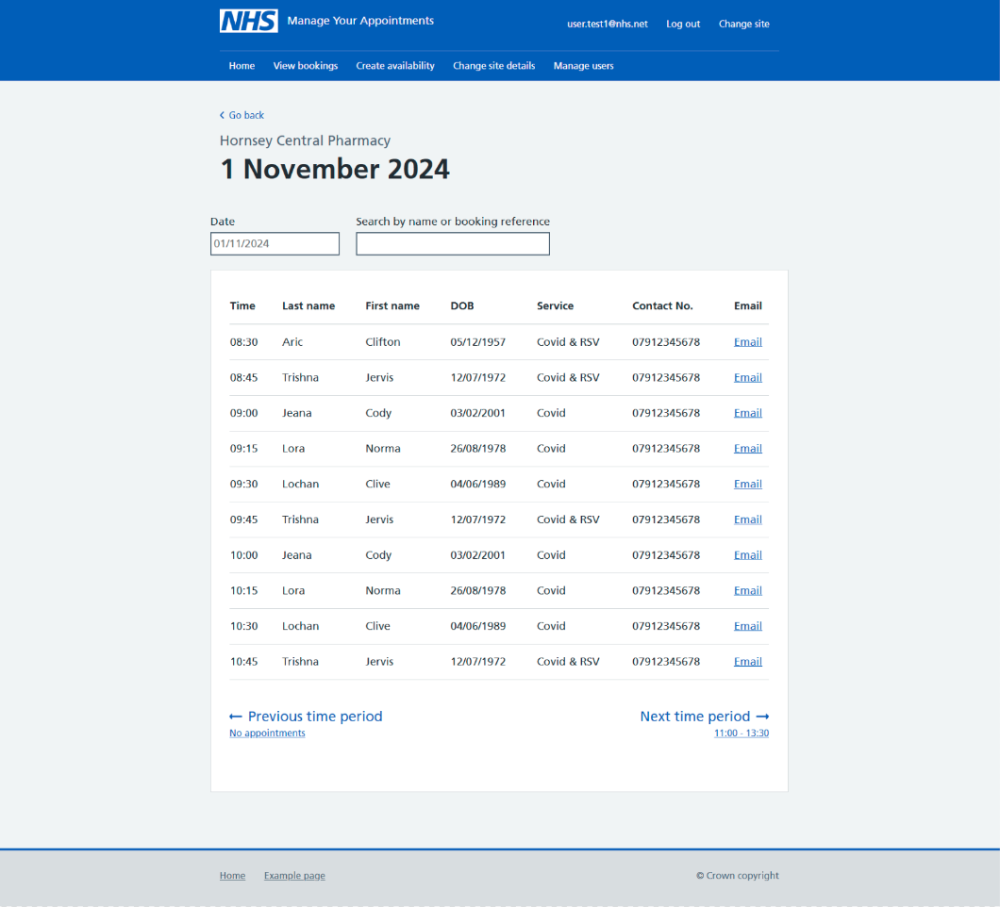

As part of managing availability and appointments, our users need to be able to view availability they’ve created, check how many appointments they have booked, and view a list of daily bookings for their site.

## What we did

From our discovery research, we know that users need to:

- See how many booked and unbooked appointments they had for each day, to help them understand demand for vaccinations.
- See what sessions and services they are providing for each day

## Iteration 1

We used these needs to create an availability view that would show the timings and services for each day, with total numbers of booked and unbooked appointments.

### Yearly view

The yearly overview was intended to allow the users to understand when their vaccination campaigns began and ended, and help them navigate to the weeks they wanted to view.

### Weekly view

The weekly view was where users would find the information they needed to manage their availability, including accessing a list of daily bookings.

### Findings for iteration 1

Users didn’t understand the purpose of the yearly view, and did not find it useful.

> It just doesn't have enough flexibility in terms of like I would want to see different numbers. But I don't, it doesn't appear to me that I have any control over that and that can't be.

Users found the weekly overview more useful but were unable to view a breakdown of booked appointments by service or cohort. This is critical information for determining how many vaccines and what types they need to prepare.

Based on these findings, we concluded that we needed to consider how best to present information in the weekly overview, to ensure that users got the level of detail they needed, and that the yearly overview was not useful in helping our users understand their availability and capacity levels.

## Iteration 2

In V2 of the availability view, we changed the yearly view for a monthly view that would give users a breakdown of appointment totals by week. We also updated the weekly view, so that the booked appointments were broken down by service or cohort for each day.

### Monthly view

### Weekly view

### Daily bookings list

We introduced a daily bookings list in this iteration, to allow users to see which slots are booked, and who is attending the appointment.

## Findings for iteration 2

Users found the monthly view more useful, and the breakdown of data was mostly clear. The term ‘available appointments’ was not understood by all users, and they were unsure how many appointments they had that were not booked.

Users found the breakdown of data by service in the weekly view much more helpful, and found the breakdown of booked, unbooked and total appointments in this view much clearer.

Users liked having an overview of one day, and who was booked for an appointment. They indicated that they’d like to see more details, such as the age of the person, the vaccination type, and to be able to view more pages if there were enough bookings.
