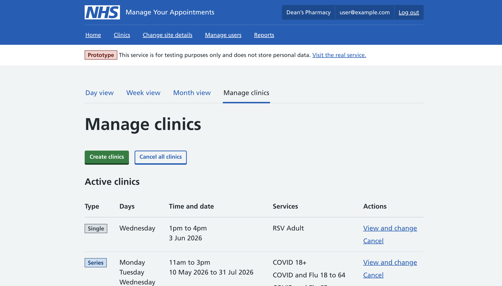

In a previous post we documented [some of our early attempts to make it easier to edit multiple sessions](/manage-your-appointments/2026/01/helping-users-cancel-or-edit-multiple-sessions) in Manage Your Appointments (MYA). 

This post picks up the story now the design work is 'done' and the Jira tickets are wending their way across the board on their journey into the live service. 

The problem we're solving remains the same, but the solution has changed significantly. 

This was made possible by the team's decision to implement recurrence rules in MYA. Choosing this approach, which stores the set of repeating clinics users create as a single editable thing, was a big call. But in the usability testing we've run the benefit for users is clear.

## Managing clinics

### Before: no way to change existing availability in bulk

Previously you could set up multiple sessions in one go, but had to edit and delete them one by one. This was really time consuming and a big pain point for our users.

And, although technically users could also see a record of the availability they'd created, the table was a confusing audit log of all create, edit and cancel events. This made it really hard to answer the simple but important question: 'what clinics are open to the public?'.

### After: viewing, changing and cancelling in one place 

Now users can view, edit and delete the availability they create. 

The old table has also been replaced with an accurate summary of all the single and repeating clinics that are open for bookings.

Although, on the face of it, these are simple changes, making them work for users required some wide-ranging changes to the service.

## Simplified language

MYA previously used 'availability' and 'sessions' interchangeably to refer to the periods of time that the public could book into.

In research we noticed participants rarely used these words and - when they did - used them in ways that didn't really match how they were used in MYA. 

In response we dedicated some time in research sessions to better understanding how our users talk and think about running vaccination services. It quickly became clear that users almost always think in terms of clinics, not sessions or availability.

We decided to test this change in language alongside everything else and see how it worked for users. We were expecting some of our participants, who were regular MYA users, to comment on the change of language but none did. When prompted this was simply because the change was unremarkable to them and aligned with the way they already thought about things.

## Introducing clinic series

As part of introducing recurrence rules we needed to find a clear way of referring to the repeating set of clinics users create. 

The words and phrases users suggested varied considerably and didn't point towards a single, universally understood name. We think this is because in most calendar systems the distinction between one-off and repeating things is primarily communicated by the way they are arranged on screen, not what they're called.

While we've got ambitions to move towards a calendar style interface, that wasn't deliverable within the time constraints we're working to. But we thought it made sense to borrow from their language so decided to refer to a repeating set of clinics as a 'clinic series'. 

In usability testing this worked well, without being perfect. Users understood it, but also said it didn't match the real world language they use. However, when we assessed the other options available we found clinic series was the clearest option for key parts of the service, such as confirmation pages.

## New navigation

### Before: separate create and view sections

Previously there were two areas in the top-level navigation: 'Create availability' and 'View availability'. 

'Create availability' was purely for creating clinics and viewing the confusing table of audit events. If you wanted to change those clinics you had to go to 'View availability', navigate to the week, and select the specific clinic that you wanted to change.

### Iteration 1: manage clinics set the wrong expectations

In our new approach, where you can edit and delete clinic series, 'Create availability' was no longer accurate. 

We tried replacing is with 'Manage clinics' to capture the wider range of actions now possible. But in our first round of usability testing this resulted in users expecting all clinic management to live in this section. Whereas to change individual clinics users still needed to go to the week view within 'View appointments'.

### Iteration 2: a single clinics section, but 'Clinics list' caused confusion

In our second iteration we combined the two sections into a single area called Clinics, and what was previously 'Manage clinics' became 'Clinics list' in the sub-navigation. 

Putting all four views of clinics (from a single day up to a summary of everything) in the same sub-navigation made it easier for users to switch between them. In the second round of testing that people had far less trouble changing individual clinics. 

However, the name 'Clinics list' caused some confusion. Users expected to see every single clinic listed separately when in fact the clinic series users create are shown as a single row. 

### First release: 'Clinics list' becomes 'Create and manage clinics'

To resolve this confusion we renamed 'Clinics list' to 'Create and manage clinics'. We think this signals to users what you can do there more clearly, but we will be checking this in future research to make sure.

## Overview screens

### Before: an approach built for limited editing options

Previously users who went to update an individual clinic in MYA were presented with this screen.

While this approach made sense when users had limited editing options once it becomes possible to edit any property of a clinic series the pattern starts to break.

### Iteration 1: a hub model that resulted in incompleted journeys

We introduced overview screens for both individual clinics and each clinic series. In our first iteration, this screen acted as a hub that users could make multiple changes from before applying them:

 In research we found that users thought changes had been saved and applied after each individual edit was made. They did not realise they needed to click 'Save changes' and continue through some additional screens to confirm the changes.

### First release: each change is its own linear journey

In the vast majority of cases users only want to make one change at a time, so in our second iteration we treated the overview screen purely as the entry point into several linear edit journeys.

## Handling conflicts

Introducing the ability to edit a whole clinic series also meant figuring out how to handle the interplay between changes to the whole series, and individual clinics within it. 

Rather than forcing users to decide what they want to do whenever there is a conflict, we worked with the team to come up with some default rules which are applied automatically:

* Start and end times - edits to individual clinics are preserved
* Number of vaccinators - edits to individual clinics are preserved
* Services - edits to individual clinics are preserved but if new services are added to the series these are also applied to the individual clinic
* Closures - changes to the series are applied regardless of existing edits to individual clinics

These rules were based on our understanding of how our users work, but we still sense checked them in research sessions. We found they aligned with our users' expectations and needs. 

## Communicating conflicts

### Iteration 1: interrupting people making changes

In our first iteration we tried to communicate a conflict between a change to a clinic series and the individual clinics within it via a screen in the change series flow. 

Although participants did manage (with some concerted effort) to understand what was happening when asked to revisit this screen, almost no one grasped it when in task-completion mode. The message was perceived as a confusing distraction. 

### First release: making conflicts visible without getting in the way

In our second iteration we showed individual clinics in the series with edits in the series overview screen:

We also listed any clinics that hadn't been updated due to a conflict on the success screen:

This approach was much more successful. Participants grasped why some clinics hadn't been updated and were able to confirm their interpretation by viewing the clinics with changes listed in the clinic series overview.

## Future considerations

This work puts the foundations in place to make MYA even more flexible in future. Potential improvements we discussed but didn't explore as part of this work included:
* allowing users to navigate from the individual clinics shown on the day and week views to the series they are part of
* being able to add breaks to clinics when creating them
* having the option to create a single more complex clinic series with opening times or services that vary day to day