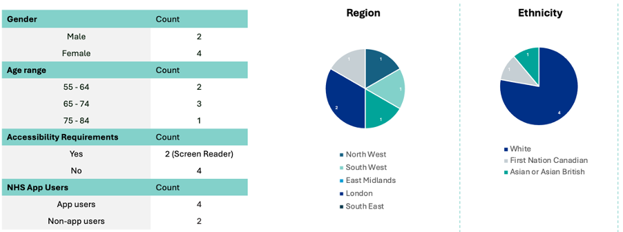

## Research focus

Our goal with this research was to better understand what really matters to people when it comes to managing their screening. We wanted to hear directly from users about what’s working, what’s confusing, and where things could be improved.

We focused on finding out why people might use the NHS App or website for screening—and what would make that experience more useful, reassuring, and easy to navigate.

## Methodology

Generative interviews: conducted for 1 hour via Microsoft Teams to gain in-depth insights into participants' experiences with breast, bowel, abdominal aortic aneurysm (AAA), and cervical screening programmes. The focus was to uncover participants' needs, challenges, and behaviours throughout their screening journey.

Prototype Testing: In the second phase of interviews, we presented a static version of a prototype. Rather than focusing on usability, the goal was to gather users' general thoughts and feedback on the design and features of the prototype.

### Prototype screens (breast screening example):

### Who we spoke to:

Our participants were limited to a small group most of whom had a relatively good health literacy

## Research findings

### There are two distinct user types:

- Information Seekers: Users engage with the app to learn about screenings but don’t manage appointments.
  “I could see myself looking on the app to see what other types of screening there is. I would find that quite useful to see what's out there.”

- Health Journey Managers: Users actively use the app to manage appointments, track results, and organise their healthcare.
  " If the NHS App offered screenings in the future, I’d love to use it to manage appointments and check results. I’m used to using the app for other health tasks, so it would be great to have everything in one place.”

### Screening information and eligibility:

- Users want clear indicators of which screenings they are eligible for based on age and individual circumstances.
- Personalised, age-related messaging is highly valued.
- Some users are concerned about potentially missing screenings they are eligible for.
  Key quote: “I didn’t realise there was a certain age when I’d be eligible for something like the AAA screening, but on the flip side, I wasn’t aware when I’d exceeded the age limit for others either. A reminder or update would have helped.”(Participant 3)

### Results and records management:

- Users want direct access to screening results within the app, presented in simple, clear language.
- Full screening history should be easily accessible, and guidance is needed for missing or incorrect results.

Key quote 1: "It would be so much easier if the app explained results in plain language. A help page with definitions for medical terms would make me feel more confident about understanding everything.” (Participant 5)

Key quote 2: "It would be really helpful to get a notification if I miss a screening or if I’ve missed an appointment. I don’t want to fall behind on something important. And if I could easily contact someone to rebook or get more info, that would make the whole process much less stressful.” (Participant 3)

### User experience and trust:

- High trust in the NHS App and its information, with users seeking a more integrated, seamless healthcare management experience.
- Some users have accessibility needs, such as larger screens or text options.
- Users want clear pathways for resolving errors or issues with their records.

Key quote: "It would help to know what to do if something’s missing, like a screening or results. A clear way to get in touch for support would make it easier to correct any errors.” (Participant 4)

### Conclusion

People use the NHS App in different ways. Some want to explore information and learn more about their screening options. Others use it to actively manage their health—booking appointments, tracking results, and staying organised. The screening service needs to work well for both.

People told us they want clear, personalised information—especially about when they’re eligible, what their results mean, and where to go for help. When the information feels relevant and easy to understand, it builds trust and helps people feel more in control of their screening journey.

Even though this round of research involved a small group, the findings are backed up by previous work. In a recent survey (conducted by VSCR), 76% of people (442 out of 500) said they would find it helpful to have a digital record of their past breast screening appointments and results. This shows a strong need for giving people access to their screening information in one place.

We’ll continue to speak to more people to make sure the service works for everyone. The early results support our original thinking—and the next step, a private beta, will help us learn even more from a broader group.
