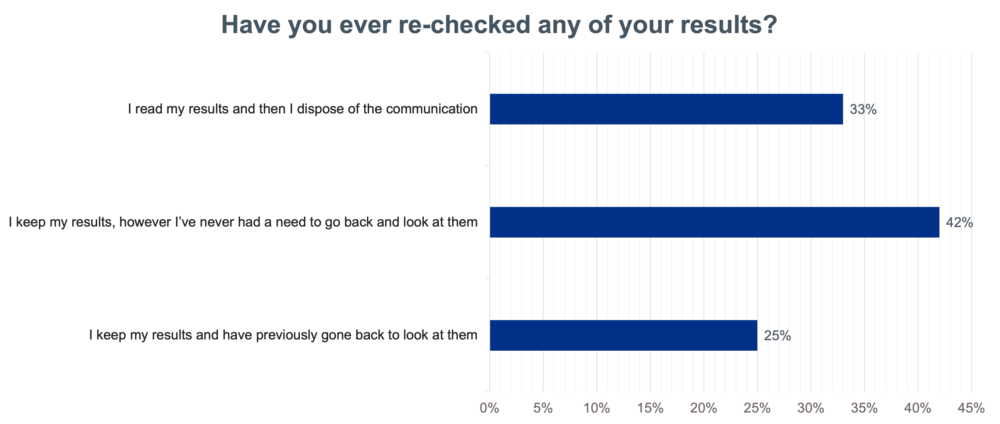

## Overview

Digital survey of 231 users recruited from the Breast screening panel and the NHS citizen panel

Note: Panel members are recruited via NHS digital interactions so there is an inherent bias towards users who are digitally savvy and literate.

Questions focused on users’ feelings towards ’normal’ results - normal meaning results fall within a typical or expected range and show no sign of abnormality or illness.

## Summary

25% of respondents reported a need for being able to view past screening results and 90% stated that they would be comfortable viewing findings in an NHS app.

Of the three contact methods surveyed (letter, SMS, in app) SMS was the delivery method least trusted / wanted when receiving normal results by a significant margin.

## User behaviours surfaced:

### 1. Storing / using results

67% of respondents had kept their medical results with 25% stating they went back to look at them. The remaining 75% either disposed of their results or never went back to them.

#### Reasons why users went back to look at results:

- to go back and compare with other results
- administrative – provide information / proof to employer or insurers
- as a reminder when the next screening is likely to happen
- medical check – when a new symptom appears to check their last results / look at guidance provided in the results
- dealing with their diagnosis – Reminder of what they have been through and to help process where they are now
- confidence booster – going back to a comfort blanket to remind them that they are ‘all clear’
- to share with others e.g. partner

#### Impact on the MAYS team:

- 25% is not an insignificant percentage so a common user behaviour will be to look at past results
- The motivation / needs when looking at results a second time are different to when first reading them

#### User needs this finding relates to:

- CN001 - As a participant, I need information around the services I will be invited to, before my initial invite to the service, so that I'm able to make informed decisions on whether to attend the screening appointment or not
- CN011 - As a participant, I need a choice of communication channels, so that I can receive correspondence in accordance with my preferences and needs
- CN028 - As a participant, if I have concerns, I want to be able to speak to someone about my queries or fears so that I can acknowledge the risks and benefits of screening, understand the treatment options and follow the professional advice I'm being given. I want to receive support at various stages of my screening journey

### 2. Viewing ‘normal results in app:

90% of respondents stated they would be willing to view their normal results in the NHS app.

#### Impact on Mays:

A key question for Mays is how appealing is the idea of viewing results in the app to users and more importantly what the reasoning for not wanting to view results in app are.

We can then look for design decisions that act to increase users’ level of comfort with viewing normal results in app.

Whilst the group polled skew towards NHS app users and those that are digitally savvy it is useful to know that a high percentage of such users are comfortable with the idea of viewing normal results. Meaning there is an immediate useful and beneficial outcome for a good proportion of the NHS app user base.

#### User needs this finding relates to:

- CN011 - As a participant, I need a choice of communication channels, so that I can receive correspondence in accordance with my preferences and needs

- CN002 - As a participant, I need all information around the screening service to be readily available in a format that suits me, so that my needs can be met to help me make an informed decision whether to attend screening or not

- CN011 - As a participant, I need a choice of communication channels, so that I can receive correspondence in accordance with my preferences and needs

## Ranking importance of results information

Participants were asked to rank the information from most to least important for what they think should be within communications about Breast Screening normal results:

1. The result
2. What to do if you notice any breast cancer symptoms
3. How to ask questions about the result
4. A link to further guidance
5. Your breast screening office phone number
6. Your NHS Number
7. When you will next be invited
8. You will stop being invited to appointments after your 71st birthday
9. How to request this information in an alternative format
10. You can still self-refer for appointments after your 71st birthday
11. A thank you for your attendance
12. Disclaimer that the result doesn't mean you will never have cancer
13. The date and location of the screening appointment you attended
14. A reminder to update your contact details with your GP
15. A sign off at the end of the message such as 'kind regards'

#### Impact on Mays:

- This is a useful finding for us to compare our current design ideas against and to inform design decisions. Especially those around which pieces of information are given the most prominent screen real-estate or given the most eye catching formatting

- This is a useful starting point for further surveys / analysis to dive deeper into users’ expectations / needs in regards to what information is shown and what is given the most prominence

- As a previous finding shows that users can come back to findings with a different user need than when they initially read the finding we must also consider which of these ‘states’ we primarily design for and how we can try to incorporate these different user states into the design so it works for a user both when they are initially looking at their result and at a later time when they are coming back to it

#### User needs this finding relates to:

- CN002 - As a participant, I need all information around the screening service to be readily available in a format that suits me, so that my needs can be met to help me make an informed decision whether to attend screening or not

- CN011 - As a participant, I need a choice of communication channels, so that I can receive correspondence in accordance with my preferences and needs
