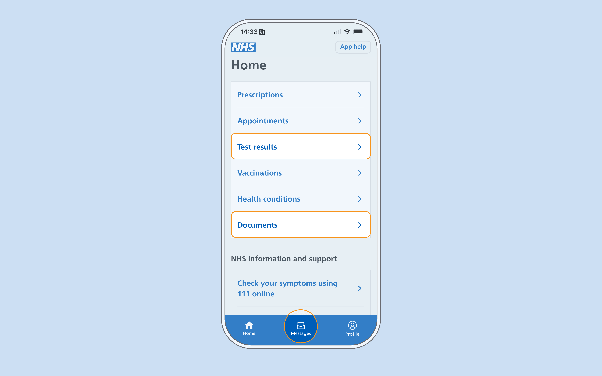

Test results is one of the most‑used parts of the NHS App. Recent changes to the home page are likely to increase the volume of people looking at test results in the NHS App.

Public confidence in how the NHS communicates results has been falling too. In 2025, fewer than half the public (43%) said the NHS is good at communicating about things like appointments and test results, down from 52% the year before.[^1]

[^1]: The King’s Fund, National Voices and Healthwatch England, [*Still lost in the system: the urgent need for better NHS admin*](https://www.kingsfund.org.uk/insight-and-analysis/long-reads/still-lost-system-urgent-need-better-nhs-admin), April 2026.

User needs for test results are broadly consistent:
- timely access to their results, without having to chase
- plain language they can understand
- clear next steps – what to do, or reassurance that nothing is needed
- a way to reach a person when they need one

However, the experience sometimes does not meet these needs. Many results from prevention services appear in the test results feed in the NHS App. This often surfaces content straight from labs, in unclear clinical language, before a healthcare professional has explained what it means. When looking at their results, one user told us:

> I know what HPV is, but so it says positive for HPV. It said grade 7. I did not know what that meant. So, I probably Googled it… It says cervical cytology report, high grade... Squamous, I can’t pronounce it. So, then you think high grade, that probably in this situation is bad

Because the feed pulls results automatically from the GP health record, prevention teams don’t control what appears there. It isn’t how they want results to reach people.

Teams continue to use messages and letters to provide context and reassurance with results. But those sit apart from the feed. So users get an inconsistent experience across multiple channels.

Managing my health sits between prevention services and the NHS App. As the app shifts [from a transactional focus to a companion](https://digital.nhs.uk/blog/transformation-blog/2026/the-nhs-app-from-digital-front-door-to-lifelong-companion) that follows up over time, results are a place to start – they’re personal and a potential first step towards more connected journeys.

We want people to:

- be notified when there’s something to know
- see a record that makes sense
- have clear next steps, if needed

Currently, that loop breaks in different ways depending on how the result reaches them.

We ran a discovery to see if there’s an opportunity to show results in a consistent way, with context and clear next steps, and to create the foundations for those journeys. We focused on the two channels we can most influence, and that point to the long‑term direction for services – the app’s results feed and messages.

## How users get results

There are 3 main ways users get results in the NHS App:
- the test results feed
- documents
- in‑app messages

Each has limitations, and they’re not mutually exclusive. For most screening results, users get both a message (in the app, by SMS, or by letter) and the same result in the test results feed.

### Test results feed

Results move from the lab to the GP record to the app, often before a clinician has added any context.

Roughly speaking, this is the sequence by which results arrive in the NHS App’s test results feed:

1. Result produced – a sample is tested. The lab’s Laboratory Information Management System (LIMS) records the result, and a clinician validates and authorises it
1. Result sent – the LIMS sends the authorised result out, formatted (often via integration middleware) as an EDIFACT[^2] message following the NHS’s current Pathology Messaging standard (there are plans to move to FHIR)
1. Carried over MESH – the lab posts the message to the patient’s registered GP practice’s MESH mailbox
1. GP system fetches it – the GP clinical system (EMIS Web, TPP SystmOne, Vision or Medicus) polls MESH, collects the message, and acknowledges it
1. Filed into the GP health record – the result is added to the patient’s record. Often a clinician reviews it first, though some results are filed automatically or by admin staff
1. NHS App fetches it – the NHS App reads data from the GP health record, via IM1 or GP Connect
1. Identified and presented – the app works out which entries are test results and formats them for display
1. Shown to the user – the result appears in the test results feed

[^2]:EDIFACT (Electronic Data Interchange for Administration, Commerce and Transport) is an electronic messaging standard from the 1980s, originally created for exchanging business documents like invoices and orders. The NHS adopted it for pathology because it was a way to send structured data between systems long before the web existed. Results are sent as plain text with a coded structure.

### Documents

The flow for results given to users via documents is roughly the same, although documents won’t have started in a LIMS. Documents are usually correspondence, though results can be included in them.

Documents reach the GP health record via clinical document transfer routes – for example GP Connect: Send Document, which also uses MESH to carry the file. They arrive in a GP practice’s document management system, where staff review and then file them. Filing pushes the documents into the GP health record.

The NHS App reads the record (via IM1 or GP Connect) and lists them under Documents. Users open or download them – viewed as they were sent, no transformation.

### Messages

Teams can send users messages that include results. NHS Notify can send these as in‑app messages, SMS, email, or letter. The in‑app and SMS versions are formatted text and can contain links.

## How the way users get results affects their experience

How a result reaches someone shapes how they experience it. 3 things matter most:
- the words used to convey it
- the speed and discretion with which it arrives
- the noise and structure it sits within

### Content design

The test results feed surfaces results directly from the lab. It’s possible for the lab or GP practice to add content before the result reaches the user, but in most cases users get results as they come from the lab. The results contain medical terms and are not designed to give reassurance or clarity. We have seen examples where users found the results confusing and distressing. Faced with a result they can’t understand, people turn to Google and AI tools to work out what it means.

NHS Notify gives teams much greater control over what users are sent and when. The in‑app and SMS messages are limited to text and links, but a well‑written message – especially where there’s no need for immediate action – gives users the information they need to feel reassured.

We didn’t spend much time in discovery looking at documents. Their content relies entirely on the service upstream. Our focus was on teams using the app to convey messages to users.

### Speed and discretion

For prevention, the way a result arrives matters.

Of the 3 routes, the test results feed is likely to reach a user first. A result can flow from the lab into the feed automatically. National guidance sets release timing for the most sensitive results – some are held back for weeks, and some, like genetic testing, are never released this way. But the feed relies on that timing being set correctly. When it isn’t, a result can appear before a clinician has reviewed it.

The test results feed does not notify users when a result is ready. It does not show whether they’ve seen it either. A message does both. It sends a notification, and because it knows whether it’s been read, it can fall back to SMS or another channel if the user misses it.

The principle within the NHS has generally been that a person should not receive a potentially concerning result without the support of a healthcare professional. That safeguard relies on a clinician reviewing a result before the patient sees it. In the feed route, that review is meant to happen when the result is filed into the GP record. But the result can surface in the feed without being reviewed. A distressing result can reach someone with no explanation and no next step.

The cervical screening team sends its messages as quickly as it can, covering all outcome types, so whatever the result, the user gets plain language and a clear sense of what it means. Their work shows it’s possible to give people a range of results and, with good content, still offer the reassurance they need.

### Noise and structure

The channel a result arrives in also shapes the experience. Both the test results feed and the message inbox can fill with noise, with important information shown in the same hierarchy as everything else.

Because the test results feed, with a few exceptions, pulls results as they appear in the GP health record, tests that should be grouped together can appear as separate records. For example, HPV and cytology results may show separately, even though the user gave a single sample and experienced it as one test.

Test results also sit within a menu system that exposes the seams of how the NHS works. Hospital‑ordered tests are held in a different place and currently hand the user off to an external service, so they’re displayed separately from GP‑ordered tests. A third type is coming: tests people order themselves, without a clinician – it’s not yet clear where these will sit in the app.

The message inbox can fill with things like GP surgery satisfaction surveys, booking reminders, and messages about documents, making an important result hard to find. In‑app messages have a fallback – if the user hasn’t read the message, an alternative channel like a letter can be used.

### What this means for users

It’s possible for a user to have an inconsistent experience of 3 screening results in the NHS App within a short period.

For example, a woman in her 50s could get:
- cervical screening results as an in‑app message and a test results feed entry
- breast screening results as a letter and an in‑app document
- bowel screening results as a letter and a test results feed entry

These results also follow different release rules – some are shown quickly, others are held back – which adds to the inconsistency.

We’ve not done primary research into the experience of getting results across these different channels, but it’s a reasonable assumption that this inconsistency gives people little confidence in what they’ll be told and how. Given how stressful these results can be, doing more to help people know what to expect, where to look, and what they mean will improve their experience.

## Where alpha starts

The discovery showed there’s an opportunity for us to improve how things work. Each set of results is its own combination of systems working together. We don’t want to improve results with a single fix for everything – that would take too long and is almost certain to fail. Instead, we’re looking to build something that improves the system as it exists now, where we can prove value quickly with a small number of services and grow the approach.

In alpha we’ll answer:
- can messages and test results work together consistently?
- can we give teams more control over the result, the content that explains it, when it’s shown, and the next step offered?
- can this work across services in Digital Prevention Services that handle results differently?

A successful alpha will tell us if we can support teams to give people results in the app with the context they need, at the right time – which, for some results, means when it’s clinically appropriate, not as fast as possible. It will show us if we can create a foundation for the next steps after a result. Delivering results well is a necessary step towards more people taking action to prevent or reduce ill health.
