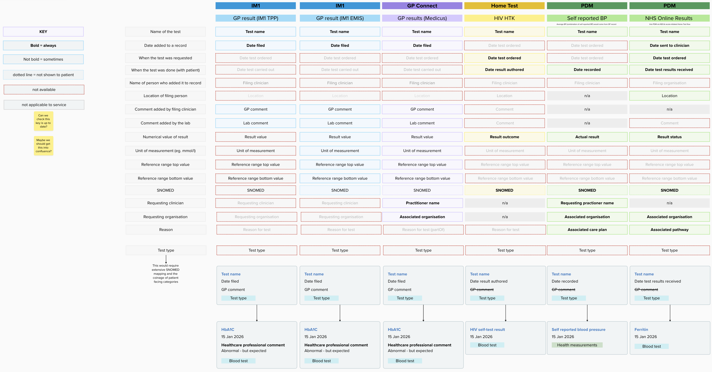

A two-day, cross-team hack at NHS Canary Wharf on 22–23 July explored one of our key alpha technical hypotheses: can test results from different data sources be combined into a single, coherent feed?

The short answer is yes — and we now have a working technical adapter and prototype to show for it.

## Why we ran the hack

Users currently access test results in different parts of the NHS App depending on where the data comes from. As we set out in [Helping users do more with their results](/managing-my-health/2026/07/helping-users-do-more-with-results/), user research consistently shows that people think in terms of the information they need, not the service that supplied it. Organising results by source rather than by user need makes the experience less intuitive and less joined up.

The number of test result sources available in the NHS App is expected to grow. Without a more coherent technical approach, users will increasingly need to navigate multiple areas of the app to find related results. The hack gave us two focused days to test whether we could do something about that.

## Four teams, one exam question

The hack brought together in person teams from across the NHS App and prevention services programmes:

- **NHS App**: Health Information
- **NHS App**: Information Architecture
- **Manage My Data and Devices**
- **DPSP**: Managing My Health
- **DPSP**: Home Test
- **National Diagnostic Service**
- **Clinical Assurance**

The exam question was: **how might we help users find and understand test results from multiple sources in the NHS App?**

## The data is similar enough to combine

Before writing any code, the group mapped the fields available from each data source against a common set of information a user might need: test name, date, result value, reference range, unit, and so on.

The mapping showed that despite different underlying formats the data is similar enough to be normalised into a common structure. The technical spike proved this in practice.

## What we built

We split into two subteams.

One focused on design and UX, building a web prototype in the NHS Prototype Kit to explore how a combined results feed might look and feel for users — including early work on categorising results by type rather than by source, covered below.

The other started by mapping out the existing architectural landscape: identifying where data feeds originate, what format they use, and where in the stack combining them would be most feasible. From that, we identified the most realistic short to medium term opportunity and built a technical spike around it.

The technical spike is a Python adapter that combines GP test result data with results from a supplementary source (PDM, which covers home test and self-reported results such as PSA). There are two GP data feeds depending on a patient's GP system. The NHS App PFS API already handles EMIS data in a compact, device-friendly format. GP Connect (used by Medicus practices) returns FHIR STU3 bundles, which the adapter transforms into the same format. Only one GP source applies per patient. PDM results are converted to the same format and appended to the GP results, producing a single unified list.

## One key architectural decision: rejecting raw FHIR

The NHS App PFS API already exists as a backend-for-frontend layer that abstracts over GP supplier differences. We chose it as the **target format** for all sources, rather than exposing raw FHIR to the App frontend directly. Two reasons drove this:

1. **Complexity** — transforming FHIR in the frontend is impractical and brittle.
2. **Payload size** — FHIR bundles carry significant additional data, which is wasteful to send to devices over potentially poor mobile connections.

## A decision made in the room: categorise by result type, not source

We initially tagged each result with its data source — GP or Home test — so the frontend could display provenance. During day two, we agreed to deprioritise this in favour of categorising results by type instead.

Grouping results as Blood, Health measurements or Lifestyle felt more meaningful from a user perspective than knowing which technical system produced them.

<!-- TODO: Steve to confirm — is the result-type categorisation approach supported by existing research from Health Information? -->

## What we didn't cover

The hack was time-limited. A few things were left open:

**Data matching** — the adapter appends PDM results to the GP list but doesn't yet try to identify related results across sources (for example, a PSA result in PDM that corresponds to one already in the GP record). This is the logical next step.

**Where the adapter should live** — we prototyped this as a standalone service. An alternative is folding the logic into the existing NHS App PFS API. Both are workable; the right answer depends on team ownership and deployment constraints, and needs input from the App team. Architectural decisions around ownership have been a blocker in the past and need to be resolved quickly.

**Notifications** — out of scope for the hack but part of the longer user journey. We explored this in [An early sketch of enhanced test results](/managing-my-health/2026/07/enhanced-test-results-sketch/).

## Key outcomes

The test results problem is now properly in focus for the NHS App team, given the volume of new data sources coming online over the next six to twelve months.

The attendees reflected on the value of working in person, across teams. Stronger cross-team relationships formed during the two days and closer working will be instrumental to achieve better access to results in the app.

**TODO**: wording. Performance is a current consideration because some users have a large number of results. Adding additional feeds and matching could further impact performance. Session-scoped caching is currently handled withing the NHS App frontend. Opportunties for backend caching and processing should be considered to ensure a smooth user experience.

## What's next

The hack confirmed that combining feeds is technically feasible. The next question is how to do the data matching across sources, and how the adapter eventually integrates with the NHS App — another of our alpha technical hypotheses.

We'll be running a retrospective with all teams before planning next steps.

**TODO: repos are private - don't link to them?**

The code for our technical spike is on GitHub at [combined-feeds-team-1-tech-spike](https://github.com/NHSDigital/combined-feeds-team-1-tech-spike), and the prototype at [combined-feeds-team-1-web-prototype](https://github.com/NHSDigital/combined-feeds-team-1-web-prototype).
