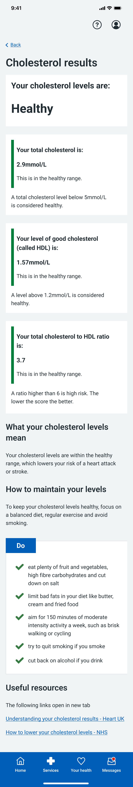

The cholesterol results page helps users understand their cholesterol levels and take action to improve their health.

Cholesterol is a complex topic. Your total cholesterol level is made up of good and bad cholesterol, and the ratio of total cholesterol to good cholesterol in your blood is an important indicator of cardiovascular risk.

This complexity is clinically necessary but can be difficult for users to understand. While we can simplify the design and language, we still need to explain the detail behind the results. This means the cholesterol results page will always require careful design to balance clarity with clinical accuracy.

We also needed to ensure the page was accessible and avoided overwhelming users with too much information.

## What we did

### Early designs and initial feedback

The first version of the cholesterol results page was based on the NHS Heart Age Tool and NHS guidance on high cholesterol. It included:

- a card showing the user’s total cholesterol score, a colour-coded risk category and a brief explanation
- expandable sections providing more detail about the cholesterol types: HDL (good cholesterol), LDL (bad cholesterol) and the total cholesterol: HDL ratio
- advice on improving cholesterol levels, such as healthy eating and exercise
- a care card for users with high or very high cholesterol, encouraging them to contact their GP and discuss family history

Initial feedback highlighted several issues, including:

- users found the "normal at risk" category confusing, especially with the amber colour coding
- many struggled to interpret the different cholesterol scores and felt overwhelmed by the amount of information
- accessibility issues were raised, particularly with the use of charts and technical terms

### Simplifying and refining the design

In response to feedback, we made several changes over multiple iterations to simplify the design and improve clarity. We:

- replaced the "normal at risk" green colour with amber to make the risk clearer
- replaced expandable sections with cards, making detailed information more visible
- simplified the language in the advice section, removing technical terms like "trans fats" and replacing them with examples
- moved total cholesterol details to sit alongside other cholesterol scores, creating a unified section showing how the scores interact
- removed LDL (bad cholesterol) as it was no longer provided by our third-party provider
- removed bar charts from individual results due to development complexity

These changes helped to reduce the cognitive load and focus on the most critical information.

### Addressing user confusion and behavioural insights

Later iterations focused on addressing ongoing user confusion and incorporating feedback from behavioural science and clinical teams. These changes included:

- the colour-coded inset text was removed to avoid confusion with "normal at risk"
- the high-level card was simplified to show cholesterol levels without descriptions
- individual results were moved higher on the page to follow the overall result
- "high" and "very high" were renamed to "high risk" and "very high risk" for clarity
- "normal" was replaced with "healthy" to reduce unnecessary concern
- a blue care card was introduced for "high risk" to avoid panic, as high risk can result from multiple factors
- guidance was personalised for each result to make it more actionable

## What we learned

The research reinforced the importance of presenting cholesterol results in a way that is:

- clear and easy to understand
- actionable, helping users decide what to do next
- simplified to reduce cognitive overload and focus on the most important information

Users also need:

- context, such as "normal" ranges, presented in a way that is easy to notice and interact with
- guidance that is specific and actionable, helping them take the next steps

## Next steps

These findings will inform the next iteration of the cholesterol results screen. The team will:

- simplify the design to reduce cognitive overload
- make "normal" ranges more visible and easier to understand
- provide clearer, more personalised guidance to help users take action

We will continue to test these changes with users to ensure they address the challenges of presenting such a complex topic in a way that is both clinically accurate and user-friendly.
