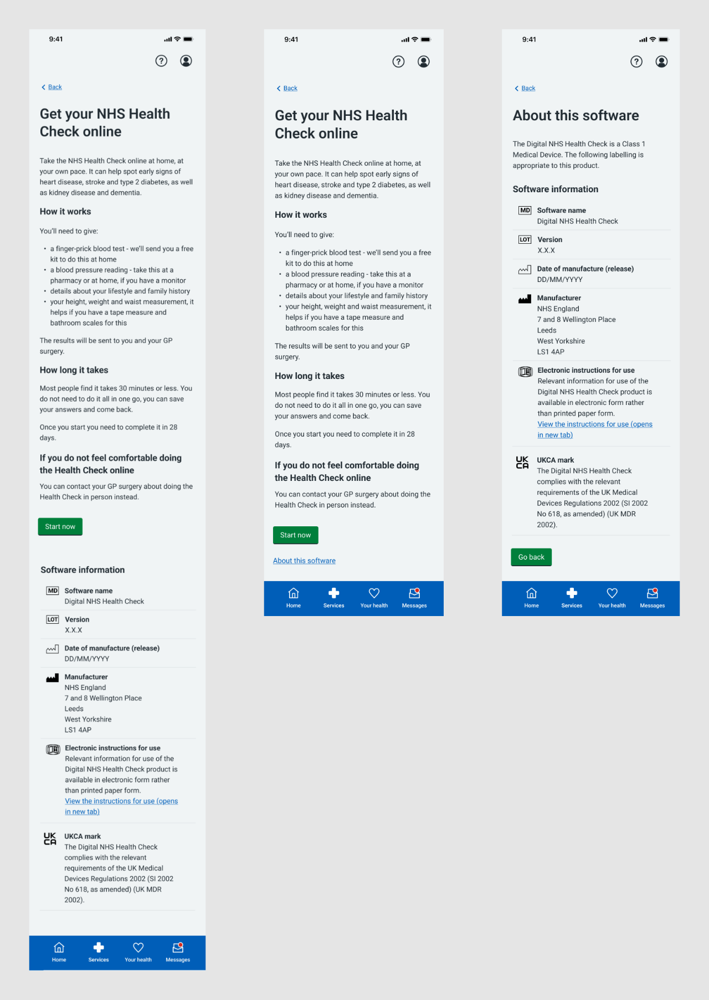

As a Class 1 Medical Device, it is a legal requirement that the NHS Health Check online service clearly displays certain information, such as the version, date of release, manufacturer and UKCA (UK Conformity Assessed) mark. From the earliest release of our service, we have displayed a lengthy software information panel on the start page of the service.

## What is a medical device?

A medical device is anything intended by the manufacturer to be used by human beings for a medical purpose. For example, walking sticks or contact lenses. Software can also be a medical device. Software as a Medical Device (SaMD) is defined as software intended to be used for one or more medical purposes, and which functions without being part of a hardware medical device. 

## Medical device classification

Medical devices in the UK are governed by [The Medical Devices Regulations (2002)](https://www.legislation.gov.uk/uksi/2002/618/regulation/10). These regulations are managed by the Medicines and Healthcare products Regulatory Agency (MHRA), and since these regulations only really cover physical devices, the MHRA has helpfully provided [guidance for the labelling of software (link opens PDF document)](https://assets.publishing.service.gov.uk/media/64a7d22d7a4c230013bba33c/Medical_device_stand-alone_software_including_apps__including_IVDMDs_.pdf). 
 
Specifically with regard to apps it states that, _"A prospective buyer should be able to identify that the app meets the relevant essential requirements prior to purchase. As such, a developer should display the UKCA mark on the primary landing page and as a screen shot in any app store."_
 
It is this guidance that led to the inclusion of a lengthy information panel below the ‘Start now’ button on the initial page of the NHS Health Check online service. 

## The problem 

The panel of software information was longer than the scroll depth of a phone screen, meaning that a user might easily ‘flick’ to scroll down the page and completely miss the start button. Some of our new starters reported this very behaviour when first trying out the service. In addition, we were confident that none of this software information was of any use or interest to the majority of our users. It was these factors that caused us to look again at the rules regarding this information.

## The solution

The key here was to realise that the original solution to providing this mandatory information was not derived directly from fixed rules, but copied from the way existing services were doing the same thing at the time Health Checks was first launched, in the alpha stage of the project. In other words, no one had dug very deeply into the rules and regulations governing this information. What is crucial to note is that the MHRA guidance around software labelling is just that: guidance, not legislation. 
 
Re-reading this guidance it seemed obvious that the intention was that providers should make the software information (the medical device ‘label’) available and discoverable within the tool, but that the mechanism for doing so was not set in stone. For this reason, it seemed reasonable to ask if we could relocate this information elsewhere, and so reduce the cognitive load of that all-important first page of the service. 
 
We submitted our arguments, together with a proposed redesign of the start page to our clinical lead for approval, which was granted. Before and after views of the start page can be seen below. This was only a small change to the service, but good services are created as much by attention to the little details that improve usability as they are by great service design or brilliant tech. Details, in other words, matter. 

