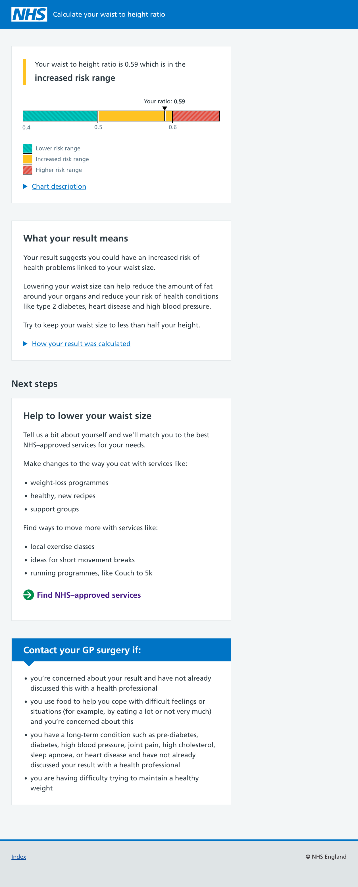
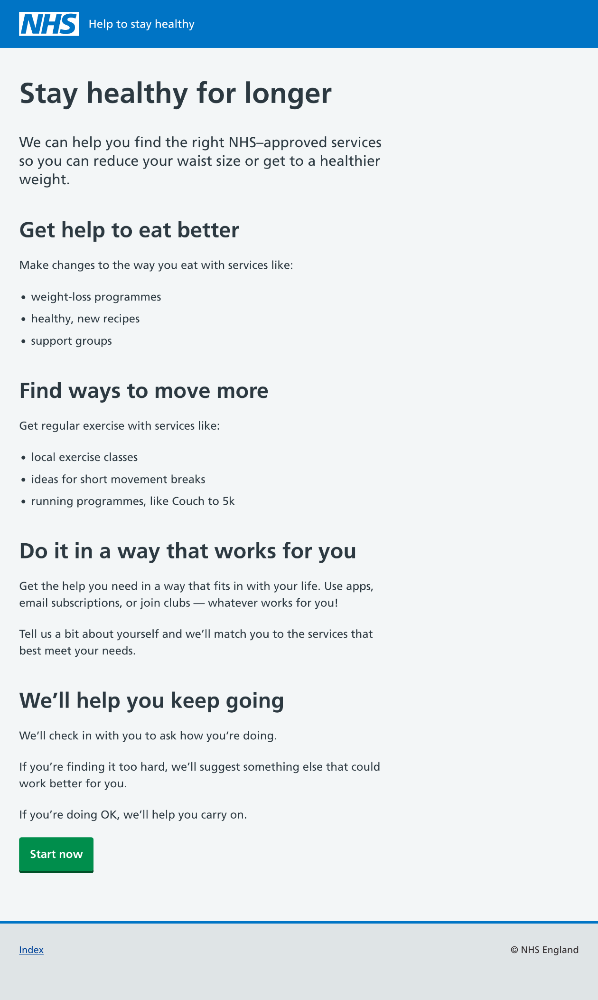
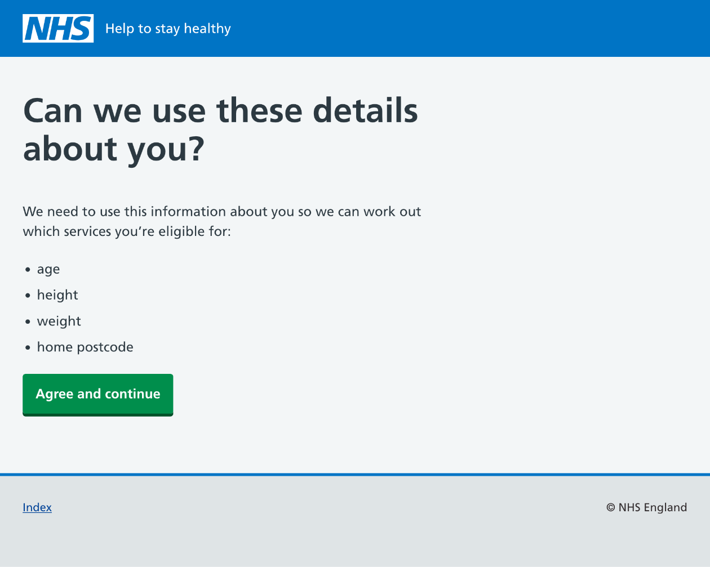
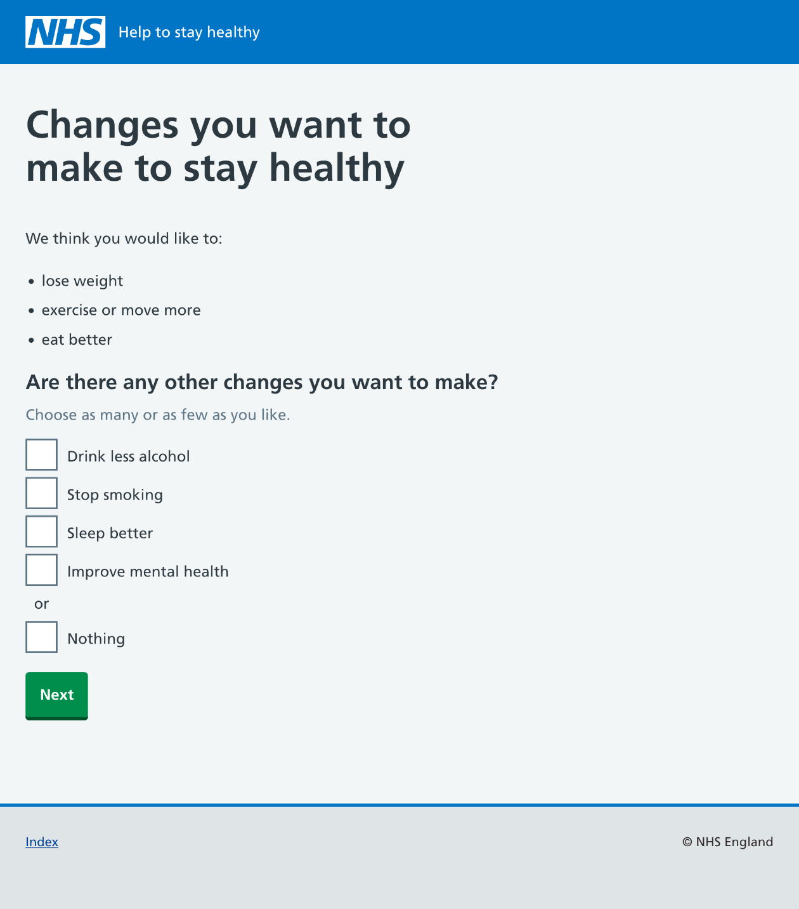
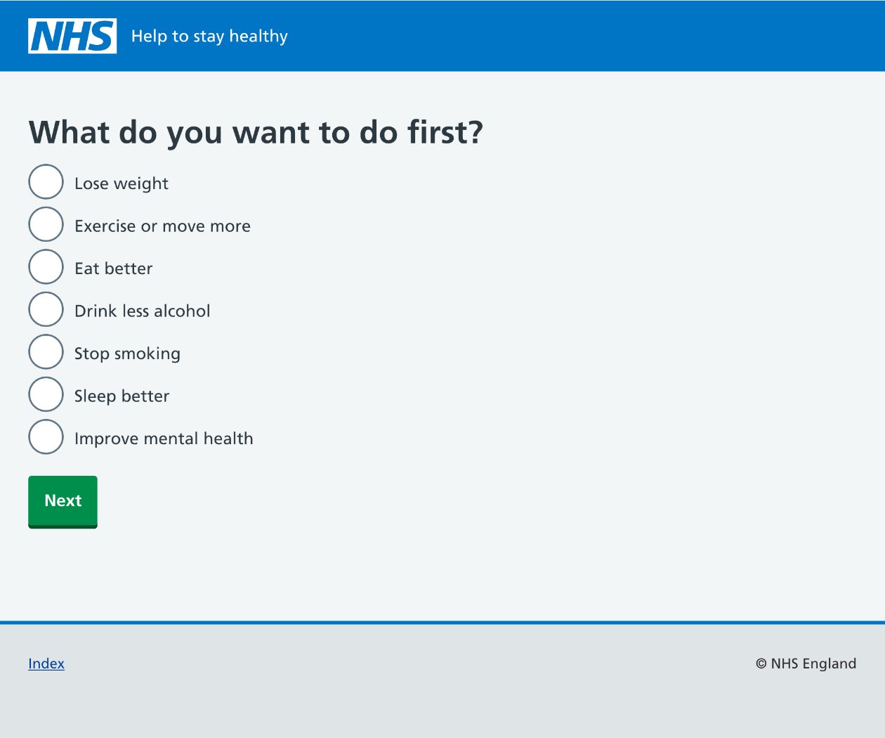
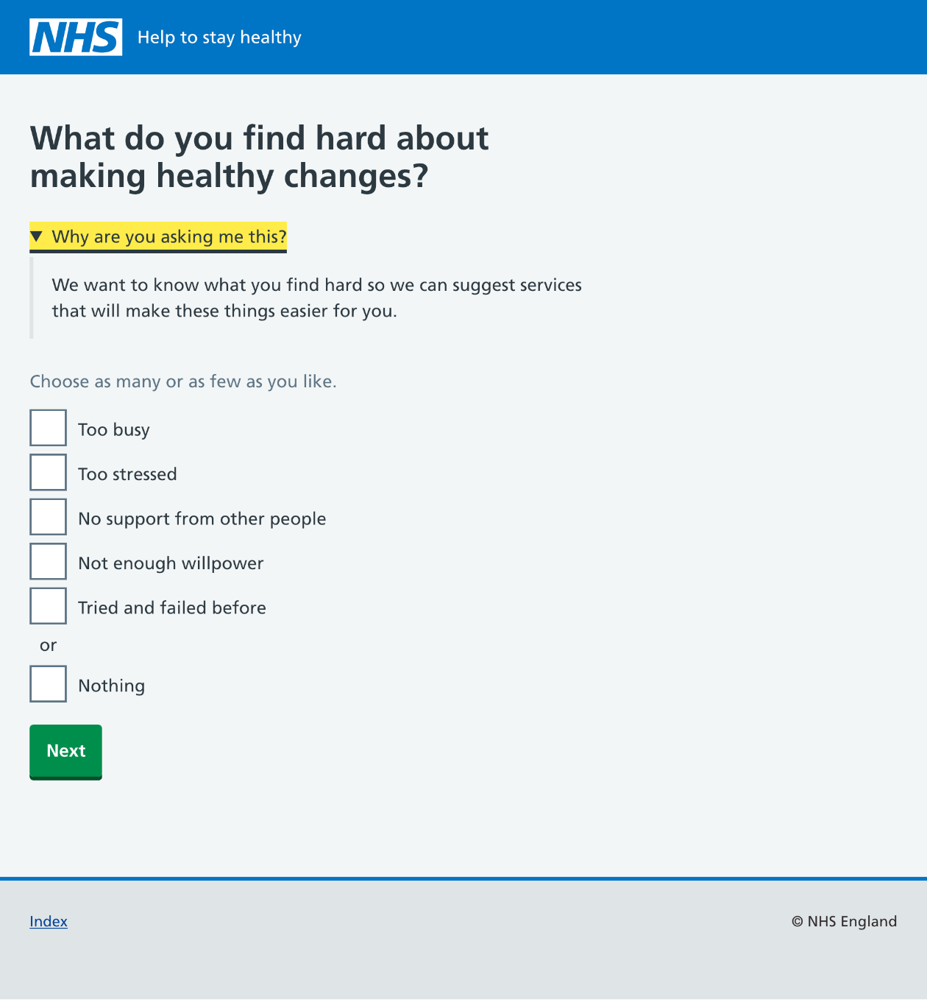
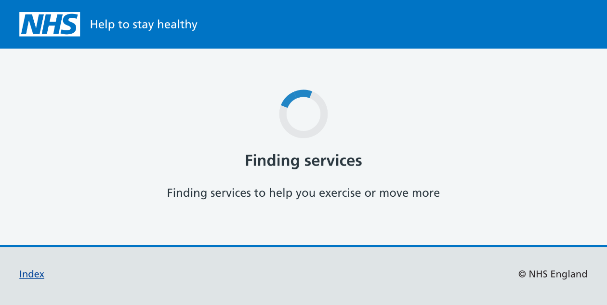

The personalised prevention platform (PPP) team has moved into an alpha phase.

> Alpha is where you try out different solutions to the problems you learnt about during discovery.
>
> Spend alpha building prototypes and testing different ideas. And do not be afraid to challenge the way things are done at the moment: alpha is a chance to explore new approaches.
>
> You do not have to prototype the user’s entire wider journey.
>
> You might not even want to prototype all of the transaction or element you’re working on: often it makes sense just to focus on the areas you think will be most challenging. This lets you do the minimum you need to test your riskiest assumptions.
>
> -- From the [GOV.UK Service Manual](https://www.gov.uk/service-manual/agile-delivery/how-the-alpha-phase-works)

Amongst other things we’re building html prototypes to explore and test our hypotheses, and have just completed our first round, concerned with ‘onboarding’.

## What we did

Our main areas of interest in this round were:

- do users understand what the service is and how it could help them?
- how do users react to being offered the option of guidance versus going directly to services?
- how willing are users to share their data to be matched to services, and what assumptions about data do they make?
- how do users feel about the platform recommending areas to focus on versus their personal priorities?
- do users retain focus on their health goal during an onboarding journey?

To help us explore these topics, we built a mock journey that represented just the initial stages a potential journey:

- entry points
- starting to interact with a PPP
- confirming and giving information

We also made the following assumptions:

- our scenario starts from an NHS.UK calculator
- users are already somehow digitally registered ‘with the NHS’


{{ nhsukImage({
  classes: "app-media--full-width",
  src: "prototype-flow.png",
  alt: "Diagram depicting the prototype user journey using sequential screen grabs from left to right.",
  caption: "The prototype journey from left to right, from calculator result to a ‘finding services’ loading screen."
}) }}

We ran 6 sessions with people who live in deprived areas of England (within the top 20 areas on the Index of Multiple Deprivation), and have more than one of the following health risk factors:

- overweight
- smoker
- heavier drinker
- inactive

## Exploring the prototype with users

### Entry point into the platform

As an example entry point we’ve used results from the [calculate your waist to height ratio](https://www.nhs.uk/health-assessment-tools/calculate-your-waist-to-height-ratio) tool, and added a call to action. This represents one of many potential routes into the platform.

#### In research:

We know using a health assessment or calculator result does have the potential to inspire action.

However if risk is the trigger to take action, that risk needs to be well understood.

---

### Start page

The user then hits a fairly traditional start page. It’s mildly personalised in that it offers examples that are related to the waist to height ratio results.

#### In research:

The start page was well understood. Our claims of a service fitting in with people’s lives and subsequently checking in were positively received.

This is a good start in describing the PPP service. Creating smooth links between multiple potential entry points and the service may be more challenging.

---

### Do you want know more?

This part of the prototype is aimed at gaining insights about the relative value of guidance as opposed to finding services.

We do this by asking a simple question: do you want know more about the benefits of reducing your waist size and getting to a healthier weight?

We’re offering to ‘send you some guidance’, and giving the user the option of saying yes or no.

#### In research:

Participants split 50/50 on those opting for guidance versus those going straight to services.

Those going straight to services were either time poor or sceptical about the quality of any guidance.

Those opting for guidance still expected to get help finding services.

We think it’s possible to offer guidance materials as just one part of an onboarding process. We could do more to explain what that guidance might consist of to combat cynicism.

---

### Can we use these details about you?

Next we explore what users think about consent and data sharing across the system. Our page presents a forced consent to use a basic set of details in the platform.

#### In research:

All participants were happy to share the example details (with the caveat that this is in a research setting).

Half expected the NHS to already have these details, all were happy to provide any missing information.

---

### Changes you want to make to stay healthy

One way to explore personal priorities versus what we (the system) are saying is to allow choice. We display recommended changes based on the user’s journey (in this case height-to-waist-ratio related), but offer additional options.

#### In research:

Almost all participants selected one or more additional option.

Most were happy that the service was making initial recommendations, but felt it was good they still had the choice of other things.

---

### What do you want to do first?

How do people feel about selecting one single priority to tackle first?

From the perspective of onboarding, it’s often best to design for as little friction as possible, reducing complexity. A platform could retain all selected goals in the background, but take the user through the initial journey with a single goal.

#### In research:

Often participants prioritised their own additional changes first.

Overall these interactions seem to achieve a good balance between the platform making suggestions, while leaving room for personalisation.

---

### What do you find hard about making healthy changes?

During our discovery we noted that asking people what might get in the way brought them much more on board.

People often know what they should be doing, and reasonably enough are put off by being given the same advice repeatedly. A platform that takes into account people’s barriers when recommending services could stand more chance of success.

In this interaction we wanted to test how people react to having only a fixed number of barriers to choose from, and what they thought about being asked about barriers at all.

#### In research:

Participants weren’t sure why they were being asked what they found difficult when trying to make changes. Few thought it would be for their benefit (i.e. to recommend the right services), with some thinking they were being asked purely for statistics. Nobody questioned the items in the list.

We need to work harder to convey why we are asking about barriers.

---

### Preferences

By using ‘facts’ about someone (for example their age, height and weight, and home postcode), we can match a set of services that a person will be eligible for.

Gathering both barriers and preferences could allow us to reorder or reduce that set further to make it more suitable.

Our prototype asks a few questions, to understand how detailing preferences affects a user’s understanding or expectations:

- Where would you like any services we recommend to happen?
- Would you prefer to do things yourself or be coached by someone?
- Do you prefer to do things on your own or with other people?
- Would you prefer to use a service in person (face-to-face) or remotely (using a website or app)?
- Are you OK to wait if a service does not start straight away?

#### In research:

All participants were able to make a clearly reasoned choice for each preference option.

---

### Find services based on what you’ve told us

Similar to the start page, we end on a fairly standard pattern playing back what the user has told us.

#### In research:

In one instance playing everything back to the user seemed to strongly reduce their motivation, so we need to look at how we play back this information in the right way, if at all.

In one instance playing everything back to the user seemed to strongly reduce their motivation. This contributes to a working hypothesis that getting people quickly into results where they can see recommended services helps them to understand the value of the product and mitigates potential overwhelm.

---

### Finding services

We end on a loading spinner. This bookends the prospective onboarding process.

---

## Conclusions

Some parts of these prototypes could make it into a real service, and some elements have been designed expressly to provoke conversation in research sessions.

Overall we can create a comprehensible and usable onboarding journey, and less friction means less drain on a user’s motivation.

We need to work harder to:

- ensure smooth jumps from entry points into the service
- establish the proposition quickly and effectively
- explain our interest in what people find difficult when attempting healthy changes

We need to create a fast and simple set of interactions to provide guidance to users without interrupting the flow.

Probably the biggest challenge thrown up by the research sessions is the need to onboard people without them losing focus on what brought them to the service in the first place. The journey needs to work hard to remain concise and maintain a strong relationship to the _subject_ that brought the user to it.

---

At this point we may well leave onboarding where it is in favour of a different part of the potential service journey. We’ve tested ideas, gotten insights, and made our notes for taking things further or doing things differently.
