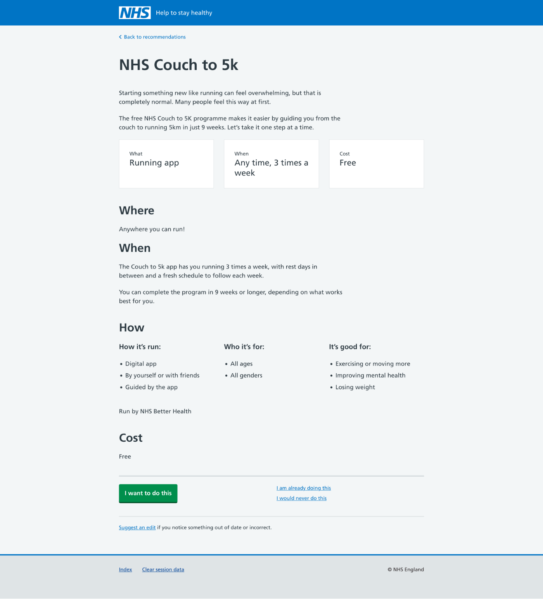

A central piece of our proposition (and that of PPS strategy in general) is the idea of a cycle. Our team is exploring how me might work as a “connecting capability”:

* introducing users to relevant next steps based on what we can know about them (finding support)
* encouraging them to make a start (take action)
* then checking in to see how things are going (maintain a healthier lifestyle)


{{ nhsukImage({
  classes: "app-media--full-width",
  src: "stages-highlighted.png",
  alt: "Diagram of a prevention cycle showing stages of information provided, risks explained, support to improve, taking action, maintaining. Find support, taking action, and maintain are highlighted",
  caption: "The segments of the cycle we’ve been exploring"
}) }}

We’ve explored a user’s very first contact with our service &ndash; [introducing and onboarding,](/personalised-prevention-platform/2025/04/onboarding-users/) followed by [presenting relevant options.](/personalised-prevention-platform/2025/10/presenting-opportunities-to-take-action/)

This post examines how we figure out which (if any) opportunities a user intends to take up, now that we’ve presented them. How can we know if someone has:

* downloaded and started to use an app, for example Active 10?
* attended a community event, for example a Parkrun?
* used a public facility, for example an outdoor gym?

We need to be able to do this so we can:

* check in with someone in a personalised way &ndash; we can approach the user with a “subject”
* understand what is working for someone and what isn’t
* examine feedback to improve our recommendations for all users
* understand which options are popular
* potentially provide feedback to services
* get a better picture of outcomes

In the abstract this might seem straightforward. We show the user options, they pick, then we check in later to see how it’s going. Easy right?

Not so fast!

Let’s take Parkrun as an example. A user could:

1. notice Parkrun in our listings
2. read more in our details and become interested
3. click through to the Parkrun site to find out more
4. get engaged and register
5. attend their first event

At point 3, we have no idea of what happens next. The click through does not actually represent “starting” or “choosing”. At this moment we can only infer it represents a desire to find out more about something before making a decision.

Things are not joined up, particularly where options we might present could be varied. There is no consistent underlying capability that allows us to completely rely on “knowing via tech” what a user has decided (or not) to do.

## Can we gauge intent?

As we’ve been prototyping, we’ve been considering ways we could get an indication from the user what they intend to do.

### Interface experiment: asking for a commitment

We created an interface where a user would pick an option: “I want to do this”.

Logically, for this approach to work, we needed remove all other ways to continue. For example links and contact details were not displayed.

In our research sessions, we noted a lot of inconsistency in understanding this interaction. When prompted to explain, answers varied from things like “it would launch the app, right?” to “it would display more details so I could register”.

Aside from causing confusion, an approach like this isn’t realistic because:

* we’re asking for an **immediate** commitment from the user
* that commitment is required before the user has access to all the information they may need
* demanding commitment this quickly creates unreliability at a key point, risking false positives
* to create an interface that requires a declaration means you must remove all other ways to continue, creating friction in exactly the wrong place
* there is literally no user need here, we’re making the user do the work to join things up for us

The drawbacks of this approach are self-evident, but we felt we needed to demonstrate very clearly the fundamental difficulty (and problematic nature) of relying on the user and interface to do the work of joining up for us.

### Process: background reporting

A second potential approach does the work behind the scenes: we receive information back from services themselves about usage.

A reporting approach benefits from being reliable and removes unnecessary work from the user to join things up. It’s definitely something to explore, particularly with options that offer online referral or registration.

However, we also must consider:

* informal or small scale community based options, for example a litter picking club
* services that don’t _want_ to report on an individual level, for example any service offering anonymity of any kind
* facilities which have zero registration or reporting, for example a public gym in a park

All these examples are completely viable &ndash; the lack of “being joined up” is not a reason to exclude them.

In short, this approach is strong, but we need to be able to handle variety.

### Approach: gathering clues

We can also work to assemble clues and indications as to someone’s intent.

Perhaps we can gain clues in the background by using analytics to:

* track and save result sets as the user explores options
* track visits into detail pages
* measure dwell time, scroll depth and so on in such pages
* track outbound clicks

We can also experiment more with providing opportunities for the user to communicate interest:

* favouriting or liking
* asking the user what they think of an option in-page
* include tools to send or share option details

Using multiple techniques puts us in the realm of probabilities and likelihoods. This is more realistic and reflective of what we know about people’s lived experiences. It also prevents us from building a dependency on false points of truth.

## Intent is the third big challenge

So far we have assembled three big challenges:

1. curating a good selection of local and national options
2. understanding how to recommend those options based on user input (and what we might already know)
3. gleaning what a user decides to do based on those options

## What we’re doing next

We’re thinking about the first conversation we’ll have with a user after they’ve been presented with options. At the point of our first check in, someone has potentially set up some goals, barriers, and preferences. Hopefully they’ve been presented with one or more relevant options that are interesting and engaging.

The first check is the primary point where having knowledge of a user’s intent becomes crucial. Otherwise what will we talk about?
