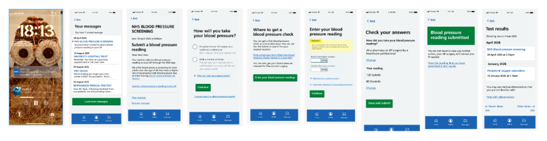
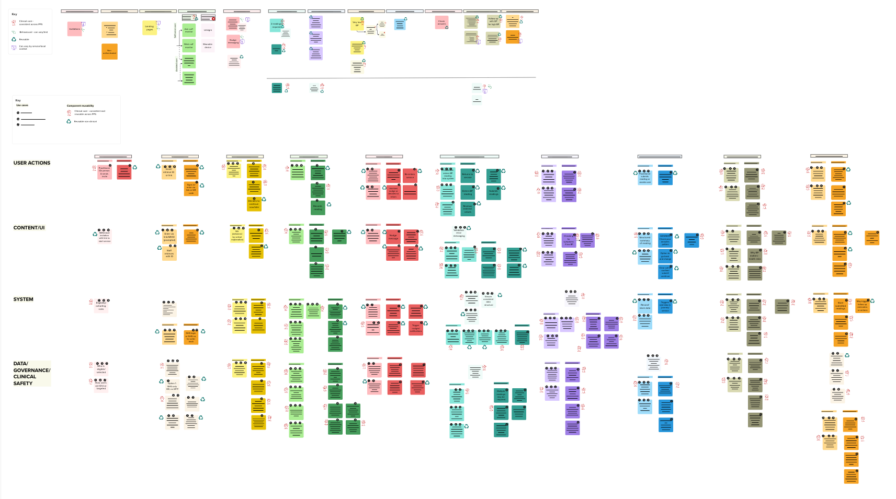

Our Personalised Prevention Services (PPS) strategy places reusability at its heart. 

We recognised that we therefore need to be clear about what building reusable components might require, based on what we have built so far. This helps us avoid duplicating work, and provide more consistent experiences across services.

We ran a short spike to understand the opportunities and challenges involved in reusing what we have already built in PPS.

## Blood pressure capture

We chose to explore the blood pressure capture capability from the [NHS Health Check online](/nhs-health-check-online/) service. Our engagement with Integrated Care Boards (ICBs) had identified interest in a standalone blood pressure capture capability, and our Health Assessments service will also require a blood pressure capture element. This made it a useful starting point for understanding how existing work could be reused in other contexts, and there's already demand for it.

## Our approach

A small team ran a 3-week spike, including a technical architect, a content designer, and a business analyst.

We investigated the existing health care professional led blood pressure journey, including its user interface and experience, content, use cases and software implementation. We then evaluated how these could be reused in a minimal viable blood pressure capture capability.

The capability we considered would:

- capture a one-off blood pressure reading
- validate and structure the data, making it interoperable and available for sharing if needed
- write to the relevant service or system for the journey in which it is used
- share the data with strategic stores, such as the Patient Data Manager (PDM), and where appropriate write it back to a GP record

We specifically de-scoped a stand-alone blood pressure service, including multiple or recurring readings for long-term condition management, risk stratification and follow-on actions. The intent was to understand the reusability of a simplified capture journey, rather than the wider requirements of a comprehensive service, such as downstream risk calculations and clinical decisions about onward referral. Keeping the scope to a single reading allowed us to focus the spike on the reusable capability itself, while leaving risk assessment and follow-on care to the service using it.

We analysed the user journey, content and software implementation to understand what could be reused in other contexts, what might need refactoring or adapting, and where a different approach would be more appropriate.

## What we learnt 

- We already have a substantial body of work behind the blood pressure capture journey, including research, design iterations, content decisions and clinical assurance. This gave us a clearer view of what good looks like and helped us identify what could be reused in other contexts, reducing duplicated effort for future services.
- From an engineering perspective, we found that the NHS Health Check online solution was built as a complete stand-alone journey, with components tightly integrated end to end.
- We found that parts of the existing codebase, content and user journey could be reused to help accelerate delivery in other contexts.

## What we are doing differently next

- Reuse the frontend patterns and flows from login or identity proving through to confirmation and submission, alongside relevant content patterns and guidance, for blood pressure capture. We will validate these against the needs of other services, the NHS Design System and NHS content style guidance
- Use the simpler architecture developed by the Help to Stay Healthy service team for Health Assessments. This will allow the team to build its own backend while making it easier to reuse components and service modules in future.
- Consider reusing specific sections of the NHS Health Check online architecture where this could accelerate delivery
