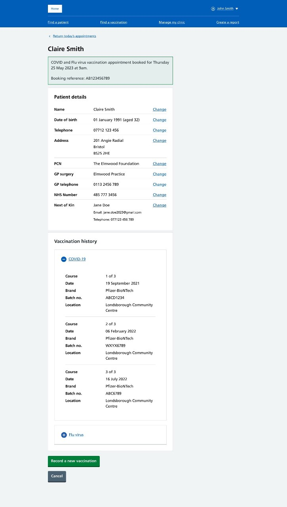
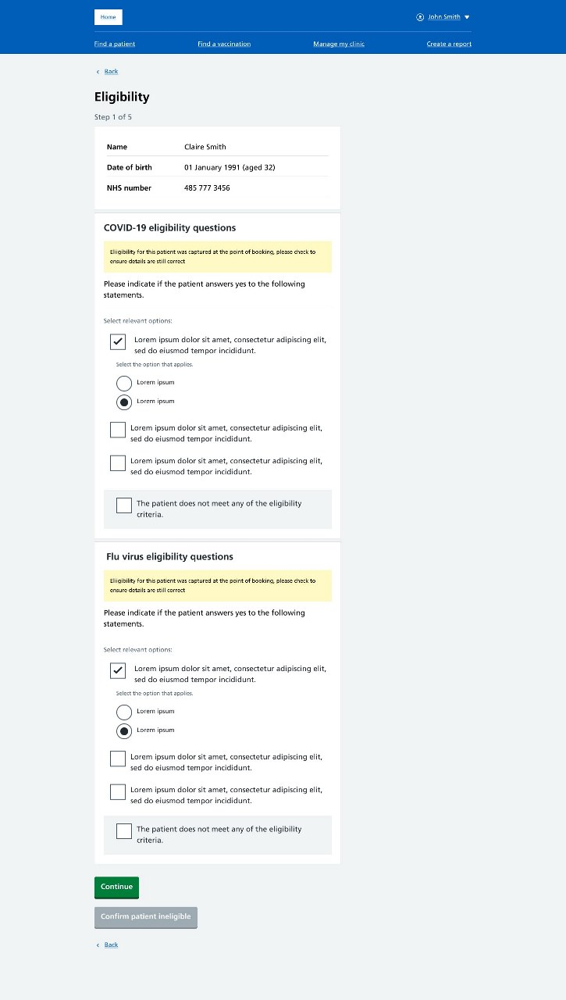

## Searching for patients and finding information about them and their booking

After testing our prototypes in [sprint two: finding a patient and recording a vaccination](/record-a-vaccination/2023/04/finding-patients-and-recording-vaccinations), we discovered how users expect to:

- search for patients with or without a booking
- find additional information in an appointment list, the patient’s record, and vaccination history
- evaluate a patient's eligibility and suitability for a vaccine or multiple vaccines

## Iterating our designs

To meet user needs, we refined our designs for further testing.

**Appointment list**: we allowed system users to search, filter and sort a list of appointments to find a patient and view additional information like the patient’s NHS number and vaccination they had booked.

**Patient record**: we included further details about the patient, including their date of birth, address and GP surgery, and their booking details, like the date, time, reference number and vaccination(s).

**Patient vaccination history**: we enabled users to view the patient’s vaccination history for COVID, Flu and other S7a vaccinations, with the option to hide or reveal parts of this information they wanted or didn't want to see.

**Alerts**: we demonstrated how alerts could help users raise timely issues with patients. For example, if a patient arrived on the wrong date for their appointment, was ineligible for a vaccine or had already received one.

### Patient record screen

## Administering two or more vaccines together (co-administration)

Initially, we assumed healthcare settings would offer patients a choice of vaccines at the start of their appointment. We have since learned that the outcome of a patient’s eligibility and health screening determine what vaccines are offered to patients. As a result, we changed the position of where this appears in the journey.

## Recording eligibility and health screening

We featured general vaccine-related questions versus specific vaccine-related questions during the health screening to make recording this information quicker. This approach ensures staff avoid repeatedly asking patients the same question. However, we are also mindful that there could be a clinical need to sequence questions in a particular way.

## Capturing patient consent

We offered users the ability to capture consent for each vaccine. But, for ease, we also enabled them to capture consent for all vaccines — designing for speed.

## Introducing ‘positive’ friction

Good UX design typically avoids ‘friction,’ reducing the mental energy required to engage with a system. However, a small number of users raised concerns about making the recording of the health screening and consent process too easy — preferring to take more time in clinical consultations that involve deeper, more critical conversations. As such, we are considering where and when it’s most useful to introduce positive friction in our design to encourage more mindful interaction.

### Eligibility screen

## What we learnt

Following testing, we found:

- **Primary care networks**: Vaccinators and system administrators use mobile devices during patient community and housebound visits. This contrasts with our discovery findings, which revealed that most users access point-of-care (POC) systems through desktops, laptops, and tablets to a lesser degree.
- Users have different information needs, suggesting we must develop dynamic content to create a more personalised experience.
- Users feel our designs look like other NHS services, contributing to the general perception that the service is trusted and easy to understand and use.

### Import or sync appointments

- Users feel the ability to synch or import appointments from other booking or calendar systems makes it easier to find patients.
- Imported appointments should include the clinic they are allocated to so users can create separate lists. Healthcare settings that run different clinics, like housebound visits

### Flexible PDS search

- Further evidence highlights we need to offer a flexible PDS search.

### Patients without an appointment

- In our initial sprint, we learned users expressed a need to allocate walk-in patients to a free slot within the appointment list. We have since found that other users prefer to record walk-in patients' vaccinations immediately.

### Patient record (including vaccine history)

- To clarify a patient’s immunosuppressed status, users expressed the need to see the patient’s surgery telephone number to follow-up.
- Users are expected to see the patient’s entire vaccine history, with a focus on the booked vaccines and a preference to view where the vaccination was administered. For example, the name and location of the healthcare setting rather than the batch number.

### Eligibility

- Users expressed a need to capture other reasons for eligibility. For example, if a patient is receiving stem cell treatment and requires a double dose of a vaccine or is ineligible, the system should capture and flow this data to the summary care record.
- If a patient agrees to a vaccination in addition to the ones they have booked, the system will need to record that the vaccinator has informed the patient and that the patient consents.

### Pre-screening

- Although most users were comfortable with a single checkbox response during pre-screening, one user felt this should be a yes/no response to each question to make the vaccinator pause and think. Although this is a known pain point in some POC systems, no evidence suggests this approach leads to data errors.
- The system must record who has consented. For example, the patient, a guardian or a clinician acting on behalf of the patient.

### Vaccination protocols

Depending on the vaccination protocol, we need to consider how to:

- Design a workflow and notifications between users/clinicians to raise pre-screening issues to decide whether to vaccinate (or not)
- Simplify system options and user interactions. For example, ensure the system remembers pre-selected staff names and ensures users cannot select expired or used vaccines.
- Support vaccinators to manually add batches into the system (if missing), helping them continue recording a patient's vaccination.
