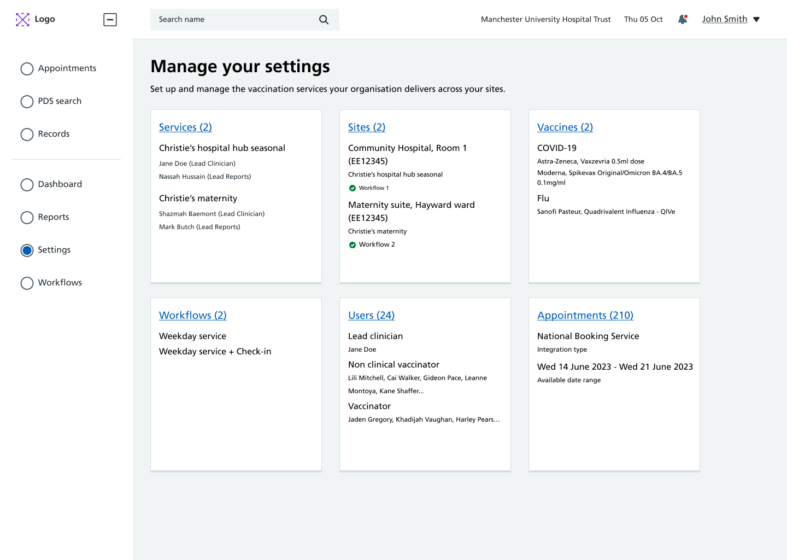
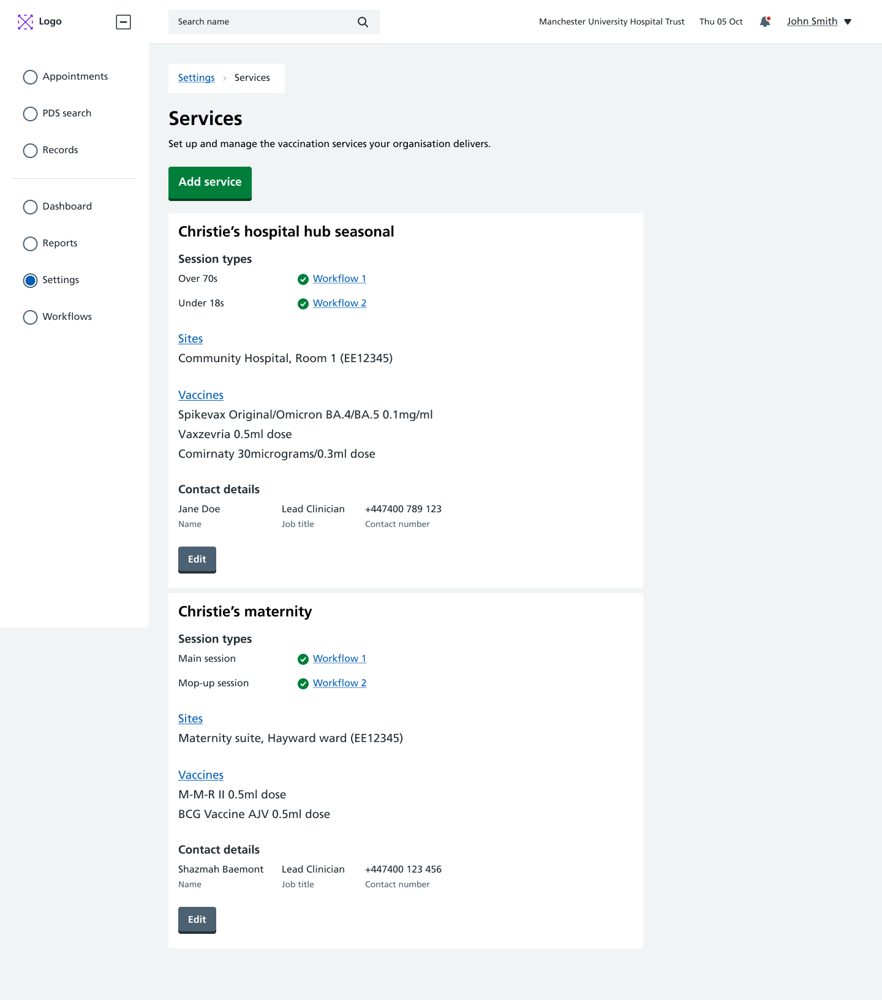

## Bringing together parts of the service

During this sprint, we explored how users set up and manage their settings and brought together our learnings about how users manage:

- appointments
- system users
- vaccines, sites
- workflows

We also introduced universal concepts or terms to ensure all healthcare settings users could identify and use different parts of the the record a vaccination service.

A big part of our testing was to gauge how closely we aligned with users' expectations and if they understood these parts and their relationships.

## Managing services

We designed a home screen that allows users to set up and manage their services.

'Service' aligns to a delivery model or how a customer chooses to deliver their services.

For example, a customer could set up a Winter Vaccination Service that allows patients to get COVID-19 and flu vaccines together.

During testing, we learned users understood this term, and the relationship between the different parts that make up a service.

> “The terminology differs slightly from what teams use now, but it’s not difficult to understand.”

> It’s good that (RAVS) will record all vaccines in one place. It’s easier to manage than using multiple systems for multiple vaccines.

## Adding sites

We designed this screen to allow users to add sessions associated with a site.

A session is made up of a date(s) and a location where a patient is vaccinated. Users can name their sessions, which helps those planning and managing clinics, to label them in a way that reflects their focus.

For example, ‘End of season flu mop-up’ or ‘Staff roving at Claremont Care Home’.

We found many users refer to a session as a clinic, but we moved away from this term since people interpret it differently.

Sessions can be run in different ways. As such, we allowed users to assign a specific workflow to a session.

'Workflow' reflects the vaccine recording user journey based on how a clinic operates.

For example, in a large vaccination centre, staff could check patients into a waiting area before they vaccinate them, unlike a pharmacy where the pharmacist may check in and vaccinate a patient immediately.

Overall, this screen tested well. However, users need clarification on how RAVS will integrate with Q-flow's calendar management system to populate session information. Users also expect to select sub-sites at this stage.

## Setting up your services

We designed a services screen that allowed users to set up and manage their services.

Overall, users recognised services aligned with their delivery models or what vaccine type they provided but didn't expect to add the vaccine product, manufacturer or batch details at this stage.

They also felt there was greater value in aligning an emergency contact to the session rather than the service.

## Usability score and summary

Using a seven-point rating scale, **users scored the managing settings user journey 6 out of 7 (confident)**. Overall, users found the journey to be intuitive and easy to pick up after completing the initial learning curve — confirming that users understood the terms and concepts we presented.
