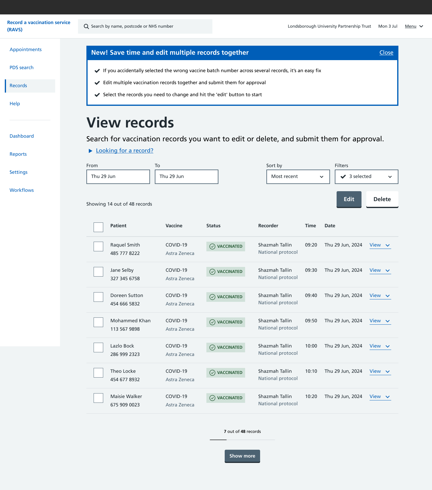
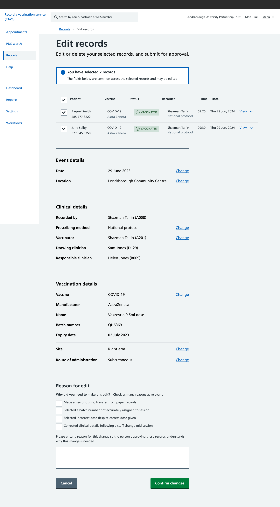
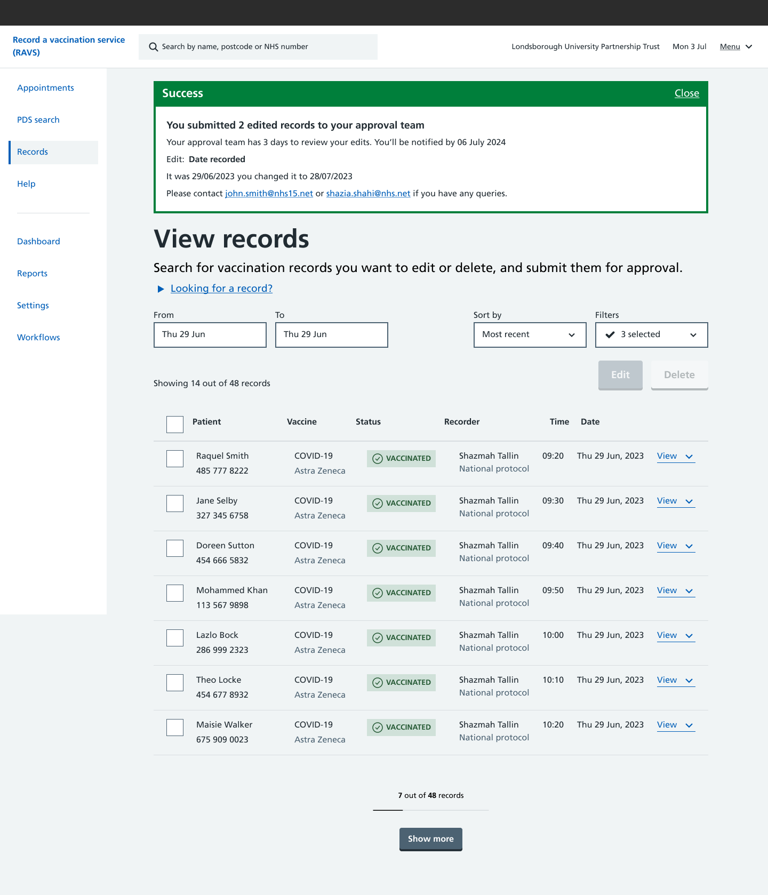

## When and where is support needed?

RAVS is designed to be user-friendly and easy to navigate without requiring frequent support.

Throughout this sprint, we tested the value of support content when its needed to give users confidence in their interactions and encourage them to self-serve when encountering an uncommon issue or concern.

We looked at delivering content in the following ways to help users successfully and independently complete the tasks associated with their goals.

- **Inline help**: is specific, contextual and timely content and coaches users through a process. We featured inline content in the user interface when a user was most likely to interact with a new feature or perform an action regularly. We chose an expander component to contain this content.
- **RAVS (in-built) help**: is typically long-form content that supports users to self-serve. We developed an existing NHS service pattern to create a RAVS help section — accompanied by content to support users in completing tasks in our test scenarios.
- **Notification**: grabs users' attention and provides valuable and timely information. We borrowed an existing GDS notification banner component, which we adapted to help communicate news about new features or to tell the user about the outcome of something they’ve just done.

Through testing, we measured if users could:

- Identify help content
- Understand it
- Follow it to complete their tasks
- Navigate to the help content
- Complete tasks

## Editing a record feature

This feature is new, and we were keen to understand how easily users can complete editing a single record or multiple records. We also wanted to uncover if and when users needed support in the moments they became stuck or had more questions.

## The editing a record journey

### Records homepage: announcing a new feature

Users start at the ‘records’ screen to edit a single or multiple records. We presented a new feature announcement showcasing its benefits and the reasons for using it. We will use this content pattern to form all-new feature announcements.

As a result of its prominence, users noticed multiple-record editing and felt it was a “good time saver”. They also raised concerns about how long the message would appear, suggesting we should consider how long it should persist and offering the user control.

We also included inline content using the expander component to help users navigate the records list and find a specific record or records using the date picker, sort or filter features. According to feedback, this lacked visibility, so we’ll look at repositioning the message.

### Editing multiple records: notification

We displayed a notification at the top of the screen to inform users that they can only edit common fields across the selected records. Users noticed the notification, understood it, and thought it was a secure way to edit multiple records.

We also displayed an **error recovery message** if the user did not enter a mandatory field. Users recognised this as a standard pattern but suggested that required fields should be clearly labelled.

### Back to the records homepage: success message

Once users submit their edited records, we present a success message indicating what fields they have changed, how long the edit will take to approve and when their approval team will notify them.

We also listed details of the user’s approval team if they have any queries or concerns.

Users understood the message and valued knowing how long the approval team would take to approve their amends.

Further feedback highlighted we should explicitly state the contact emails are the approvers’. And consider how to change the status of submitted records to indicate they are pending approval and locked to prevent further edits.

### Help section: navigating the content

If users had any specific questions or concerns about the ability to edit records, we directed them to the help section. Users demonstrated they can easily locate the section using the inline help hyperlinks or from the left-hand navigation.

Users valued the alternative ways to navigate content, like the search, sections and A-Z. They also identified content tags to navigate related content and suggested other keywords we could use, like patient details, appointments, and vaccination records.

Users also suggested being able to print and email the sections to colleagues would be helpful.

## Usability score and summary

> It’s straightforward, and there are plenty of prompts.

Overall, **users scored the editing a record journey 6 out of 7 (confident)**, finding the task straightforward to complete and without needing to access help content.

However, they identified and understood the help content to complete relevant tasks and would navigate to the help section if they needed further assistance.

> There are lots of places to access information.
