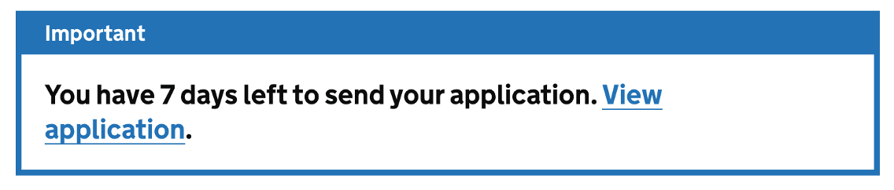
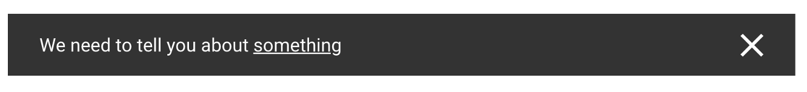
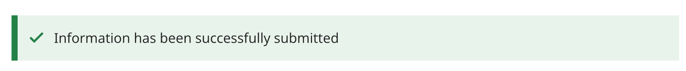
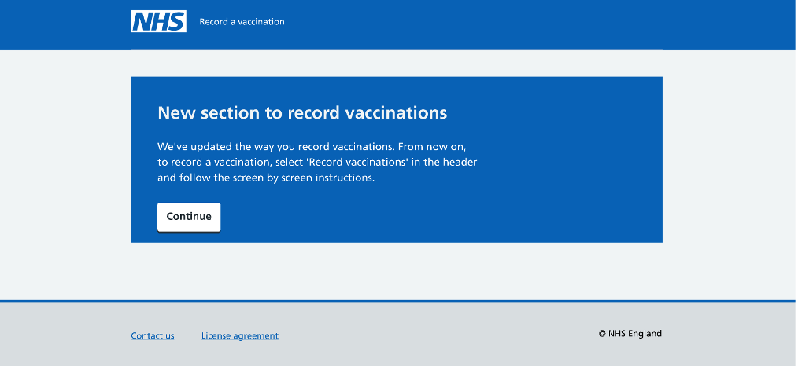
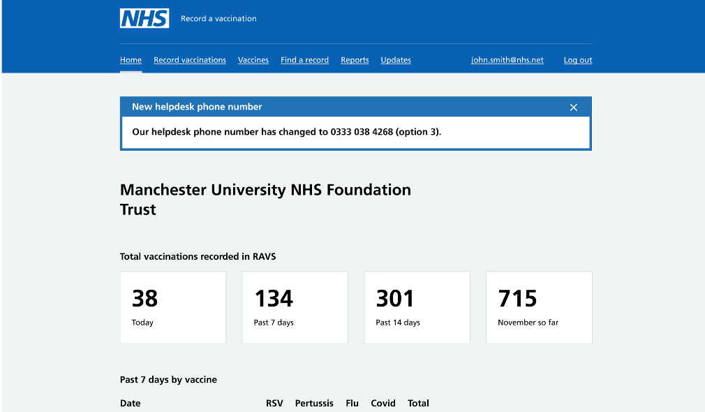
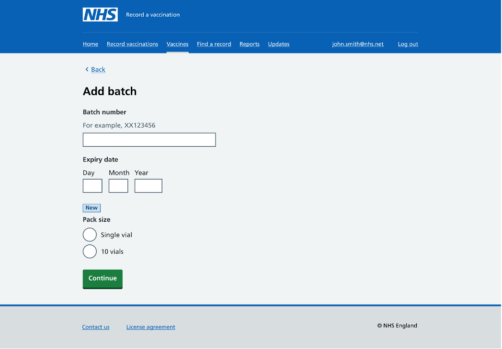
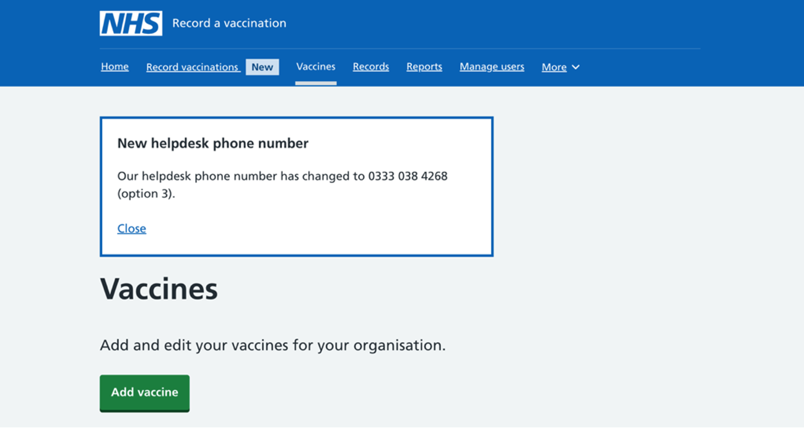
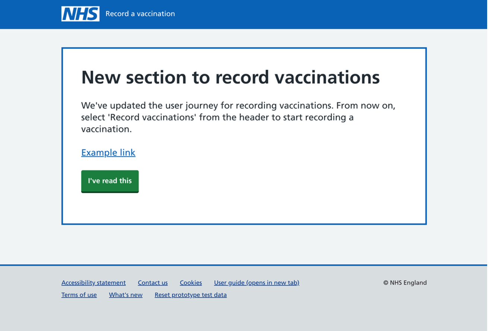

We wanted to explore how we might tell RAVS users about any updates to the service which might impact them. This could include new features such as asking them to complete new fields when adding a vaccine batch, or larger scale changes such as a new streamlined journey for recording vaccinations.

Both new feature examples are on the release roadmap for RAVS, so we were able to use these scenarios in the designs we tested with users.

## Desk research

As there are no current notifications in the NHS Design system, we reached out to the internal design community at NHS England to see if there were any precedents elsewhere. We also did some research into what other government departments might have done to tackle this problem.

We checked this [list of government design systems](https://github.com/ctdesign/gov-design-systems-list), as well as searching online to see what components worked best and in what context:

3 stand out designs for existing notification banners came from the following government departments:

[Notification banner from GOV.UK service manual](https://design-system.service.gov.uk/components/notification-banner/)

[Scottish government design system notification](https://designsystem.gov.scot/components/notification-banner)

[Office for National Satistics success panel](https://service-manual.ons.gov.uk/design-system/components/success-panel)

These design systems are all from UK government agencies and will either take inspiration from or work directly with the GOV.UK design system, as does NHS England.

As much as possible we wanted to stay closely aligned to the GOV.UK designs, but applying any necessary NHS styling in terms of typeface and colours.

However one apparent problem for our users with the Notification Banner used on GOV.UK is the inability to close the banner once the user has read the notification. It is intended for public facing services and this may not be as appropriate in RAVS where users would see the same message throughout their working day if they cannot close the message. That said, we wanted to test if this was true with RAVS users through user testing.

## Our designs

As a design team we discussed the various needs for notifications within the service that might warrant messaging to users ‘in service’ as opposed to via email.

We decided that 3 different levels of updates would be appropriate to cover different levels of eventualities depending on the severity and impact of the change to RAVS.

It was also discussed that updates may need to be released alongside other communications such as an email to users.

**Interruption** - We opted for an interruption card as used in MOJ for high level changes where the impact to users would be severe. Users would be shown the message after logging in, but before the home page and would need to click the call to action to indicate they have read the message.

**Notification** - For medium level severity changes we opted for a notification banner to be placed within the right context and on the right page. For example, if the message impacted user management, then the intent was that it would only be shown in this section.

**‘New’ tag** - We opted for a tag to indicate a low level change which would not significantly impact the user but may help to highlight where a feature or field had been newly added.

## Pilot test

Before conducting any user testing sessions, we ran a small pilot test with 1 user to help give us confidence in the design artefacts and the way in which we wanted to show them to users as part of the testing. Our pilot user indicated that they would want a way to close the messages, particularly for the interruption and the notification banner. The subtle ‘New’ tag was well received.

This feedback validated an important initial assumption which was that users would need a way to close the medium level notification, rather than it persisting as is the intention of the GOV.UK notification banner.

We amended the design by adding a close icon to the notification before further testing.

## Design iteration

We tested the designs with 7 users remotely. We also used the time to test a new feedback notification with users and the usability of the newly designed search in RAVS, which included continuing without an NHS number.

Highlights from the research regarding the update notifications included:

- the interruption design needed to be clearer to avoid being missed after the user logs in
- a way to close the notification was needed to not frustrate users
- the context of when and where the messages would be shown would need to be considered each time we decide to use them in RAVS to have the most effective impact

The feedback validated some of our initial assumptions for the medium level notification around closing the message and indicated we may want to iterate the interruption card to create more positive friction in the journey, allowing our users to read important messages.

With this feedback and in the interest of consistency in RAVS we re-styled the notification message to look similar to the design for the feedback message: blue border with white background. The close icon was also replaced with a link below the message to be consistent, whilst the header and body also reflected how the feedback message is presented. This meant that our messages would be consistent in design and that the design was clear and the message clearly conveyed.

Notification re-design:

The high level interruption card was also re-styled to be clearer and consistent with other messages.

## Future

We will need to continue to assess the effectiveness of these components through user testing and also keep speaking and learning from other services within the NHS which may share a similar problem, particularly staff facing products or services.
