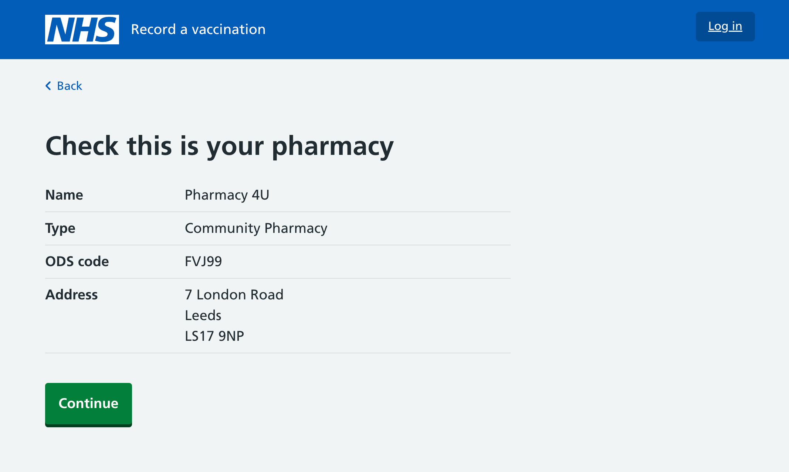

We’ve created a new way for pharmacies to sign up and start using the Record a vaccination service (RAVS).

Our new flow is designed to be as quick and easy as possible.

This feature went live on 7 August 2025.

## Background

Up until now NHS organisations have been invited to use RAVS by regional NHS teams, and to support this we [designed and built an onboarding interface](/record-a-vaccination/2024/08/onboarding-organisations-without-spreadsheets/) for those regional teams.

Whilst this process is still being used for some NHS organisations, pharmacies are now able to independently choose and sign up to a platform for recording vaccinations. To support this, we have [designed a product page](/record-a-vaccination/2025/08/promoting-the-service-with-a-product-page/) to promote the benefits of our service. This features a prominent ‘Sign up for free’ button that links to a new sign up flow.

## The design

We designed the sign up flow to collect the minimum amount of information needed.

The first screen asks for the name of the pharmacy. This uses an autocomplete, which searches the complete list of pharmacies using an API from the NHS’s [Organisation Data Service (ODS)](https://www.odsdatasearchandexport.nhs.uk). You can search the list by the name or ODS code of the pharmacy.

Because many pharmacies share the exact same name, particularly those in a chain (for example, Boots), the autocomplete search results shows users the first line of the address and the postcode, to help them select the right one.

To try and avoid the wrong pharmacy being selected, the next screen shows the chosen pharmacy's details, and asks users to ‘check this is your pharmacy’.

The next screen asks for the user’s name and email address.

Our first design allowed any NHS email domain in the [Care Identity email domain allow list](https://digital.nhs.uk/services/care-identity-service/applications-and-services/apply-for-care-id/care-identity-email-domain-allow-list) to be used.

However this is hard to explain and user research showed it confused users, so we have decided to stick to nhs.net emails only for the initial lead admin for each site. This may also provide some additional assurance and verification.

The last screen asks users to check their answers, and allows them to go back and change them if they have made a mistake.

After confirming their details, the user is shown a page asking them to check their email, and telling them we will send them a welcome email with details about how to sign in. Depending on whether they already have an Okta account, they may also get a verification email from Okta.

## Research

We tested the sign up flow with 5 pharmacists, covering a wide geographical spread and and including users from single-site pharmacies as well as those working for a chain with more than 100 pharmacies.

We found that the sign up process was easy to complete, and users liked being able to get access straight away, without having to wait or to phone or email someone.

There was some confusion about which email addresses could be used, with the terms ‘NHS approved email’ and ‘approved email domains’ being unclear. We have resolved this by restricting the email to nhs.net email addresses only, and updating the content.

Those who worked for large pharmacy chains expected to be able to easily sign up multiple sites at the same time.

## Future considerations

We decided not to design and build a way to sign up multiple pharmacies at once for the time being, but this may be something we return to in future as we learn more about the needs of large pharmacy chains.

At the moment we are unable to verify that the NHS email address belongs to someone who works at that pharmacy, as we have no reliable and accessible source of this data. This could be something we investigate in future to help avoid errors and provide additional assurance.

In future we could also explore ways to make it easier for pharmacies to sign up to other related services needed to deliver vaccinations, such as [Manage your appointments (MYA)](/manage-your-appointments/), [Manage your service (MYS)](https://www.nhsbsa.nhs.uk/pharmacies-gp-practices-and-appliance-contractors/dispensing-contractors-information/manage-your-service-mys) and [Immform](https://www.service-catalogue.nhs.uk/services/Immform), at the same time.

We may also be able to use this feature for other types of NHS provider in future, such as GPs or hospital trust services.
