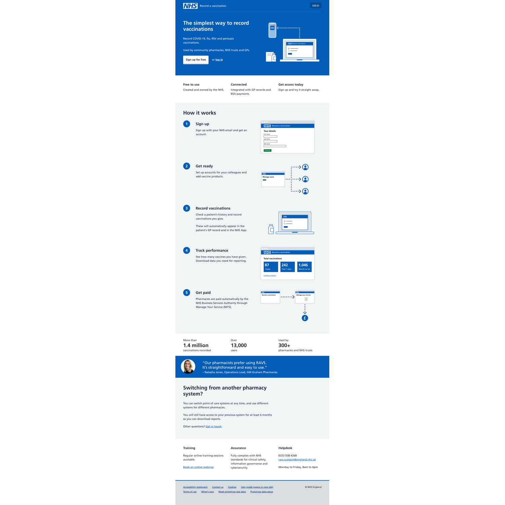
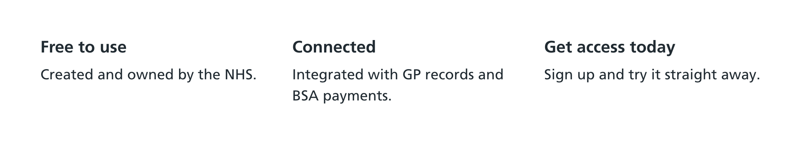
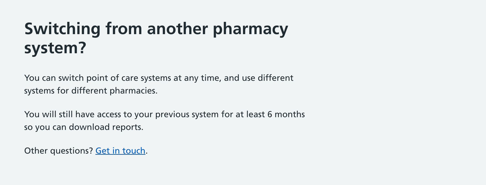
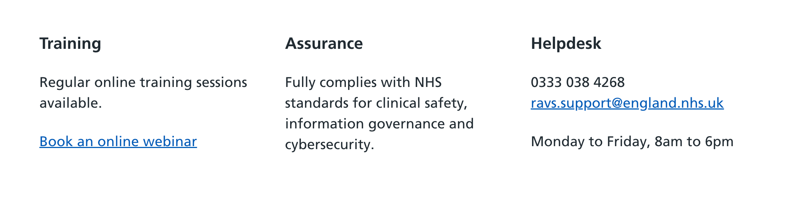

We created [a product page](https://www.ravs.england.nhs.uk/) to promote the service to potential new users.

The page went live on 7 August 2025.

## Background

Whilst we initially piloted the service with a small number of pharmacies in the East of England, those pharmacies were selected via a procurement process and onboarded by the NHS England regional leads using our [regional interface](/record-a-vaccination/2024/08/onboarding-organisations-without-spreadsheets/).

From Autumn/Winter 2025, all pharmacies will be able to use the service for recording flu and covid vaccinations, and so we needed a different approach.

As pharmacies will have a choice of services to pick from, our first step was to design a product page which summarised the main features of the service and would give pharmacies the confidence to select it.

We did some research with pharmacies to understand what they would look for when selecting a service.

Some of the common themes were:

- cost
- ease and speed of use
- integration with other systems
- how they would get paid for providing the service
- trust and assurance in the system

We also learned that they would be influenced by word of mouth, including recommendations from other pharmacies and from pharmacy IT support groups.

## Reviewing our existing product information

We currently have information about the service in several different places, including:

- [a page on the NHS Digital website](https://digital.nhs.uk/services/vaccinations-point-of-care/record-a-vaccination-service)
- [a page on the Future NHS website](https://future.nhs.uk/vaccsandscreening/view?objectId=56346864)
- [our own guidance website](https://guide.ravs.england.nhs.uk)
- emails and documents sent to pharmacies by NHS England

However, none of these pages get many views. This evidence was backed up by research with pharmacies, which found that many of them had not heard about the service or were unaware that they could use it.

When searching for the service name online, there is currently a confusing mix of results from different sources with the same title, including the pages listed above and our own login page. This is potentially confusing for users who want to learn about the service, and also makes it harder for our existing users who may just want to sign in as quickly as possible.

## Designing a product page

We decided to create a ‘product page’ to try and bring together all the relevant information about the service currently dispersed across several websites.

Rather than being hosted separately, the product page will also be our ‘signed out’ page from which users can sign in to the service.

We hope that by having a single product page, and removing content about the service hosted elsewhere, we can improve the search engine performance (SEO) of the single page, and allow both new and existing users to find us more easily.

We based the format of our product page on that from [NHS Notify](https://notify.nhs.uk) (which in turn was inspired by [GOV.UK Notify](https://www.notifications.service.gov.uk/)), and spoke to their team to learn from them.

Unlike our existing content pages about the service, the product page would use the same look and feel as the service itself, following the NHS design system.

### Header and tagline

The page starts with a tagline: “The simplest way to record vaccinations”.

It then includes the 2 bits of information that our user research indicated were the most relevant:

- who it is for (organisation types)
- what they can do with it (which vaccines we currently support)

### 3 main benefits

We then included the benefits we felt were most compelling. These were iterated after the research to focus on cost, connectivity and being able to try it out straight away.

### 5 simple steps

We then added a How it works section. This is presented as a numbered list of steps, as we know this format works well for making the process feel manageable.

The 5th step only applies to pharmacies, as they are the only ones being paid per jab directly by the NHS Business Services Authority, but the other steps apply to all settings.

### Stats and testimonial

Our research indicated that word of mouth is quite important to pharmacies when it comes to selecting software.

To try and build confidence in our product, we included a section which contains some statistics about how many vaccinations we’ve recorded, and how many users and organisations we have using the service.

We also included a quote from a user who has used RAVS in their pharmacies since the days of the pilot and has a positive experience of it.

This section is a form of social proof.

### Reassurance about switching

One concern we heard from pharmacies in the research was about the pain of switching systems. These concerns include whether data would need to be migrated, the need to re-train and onboard staff, and just the general fear of the unknown.

To help allay these fears, we added a section specifically about switching systems. This was inspired in part by utility company websites, where the majority of their new customers are likely switching from another supplier, and the need for reassurance is high.

We included content to emphasise that pharmacies could switch systems at any time, any that they could use different systems in different premises. This could allow them to try out a new system and roll it out gradually.

Pharmacies are also able to continue to access their previous system for at least 6 months in case they need to access reports or to make corrections to previously recorded vaccinations.

### Training, assurance and support

The final section of the page includes some brief content about training and assurance. These were mentioned by some users in research as things they might look for.

We also include the details of our helpdesk, both so that they can be contacted for any queries, and as reassurance that we provide users with support.

## Future considerations

As we learn more about the questions from pharmacies thinking about using the service, we will continue to iterate the content on the product page.

We also want to find out if this page meets the needs of our existing users.

We considered having a dedicated section or page for pharmacies, and this may be something we come back to in future. This may become necessary if we also need to target other types of organsiations such as GP surgeries, and find that they have different needs when evaluating whether to use the service.
