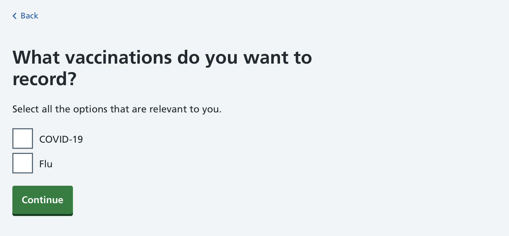
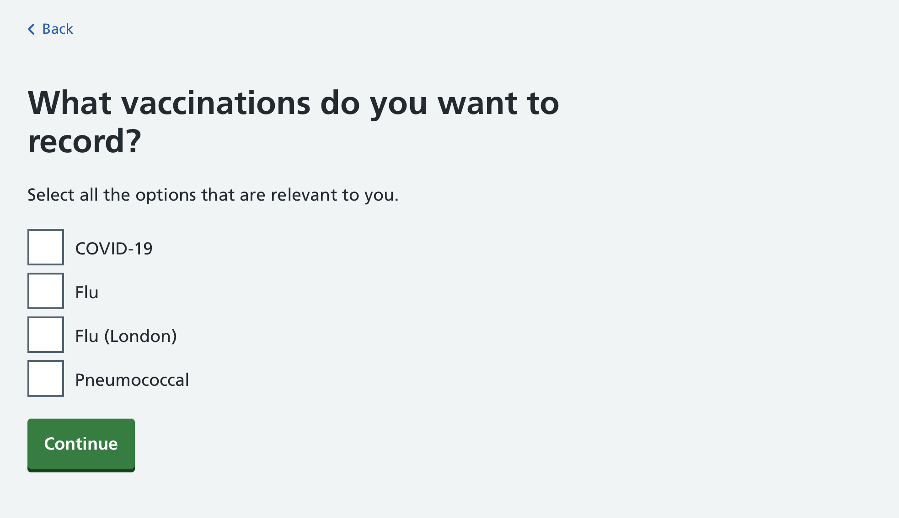
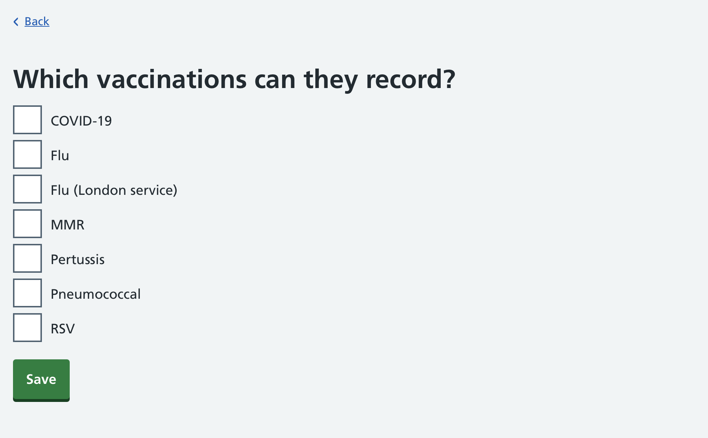
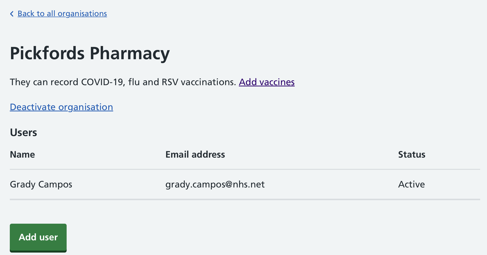
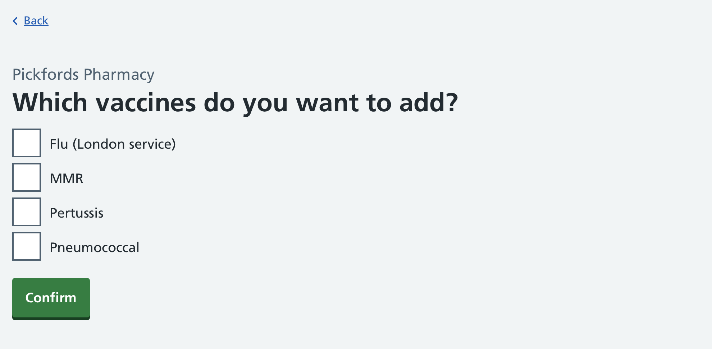
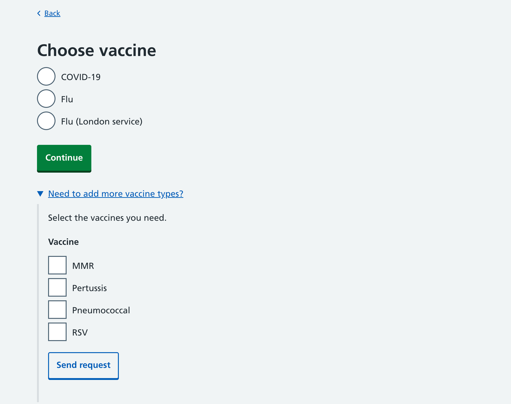
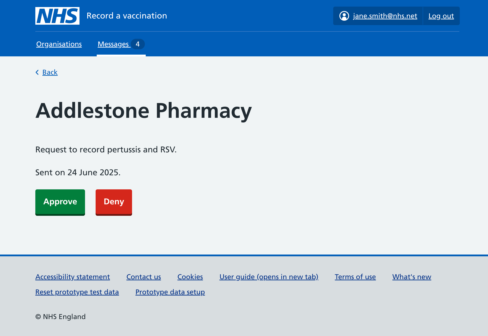

Previously, all organisations using RAVS could technically record any of the 4 vaccine types that we support: COVID-19, flu, RSV and pertussis.

However in reality, they are only able to give and record different vaccines depending on how they’ve been commissioned and assured.. For example, only pharmacies that are part of a pilot are currently able to offer the RSV vaccine.

When we were only supporting 4 vaccine types and a limited number of organisations, this was not an issue as organisations could just ignore the vaccines they weren't using.

With the expansion of RAVS to support more vaccine types, we decided to add a permissions system so that different organisations only have access to record specific vaccines.

## Pharmacies self-onboarding

For [pharmacies signing up to use the service](/record-a-vaccination/2025/08/enabling-pharmacies-to-sign-up/) we added an additional screen to ask which vaccines they would be giving:

If the pharmacy is in London, some additional options are shown:

Currently, all pharmacies are able to offer the flu vaccine as part of their standard service, whilst only pharmacies who have been assured can offer the COVID-19 vaccine. In London, some pharmacies have been separately commissioned to offer the pneumococcal and MMR vaccines and an extended eligibility for the flu vaccine.

## Organisations added by regions

If an organisation is invited by a region using the [regional interface](/record-a-vaccination/2024/08/onboarding-organisations-without-spreadsheets/), the regional user is now asked which vaccines the organisation should be given access to:

This list contains all of the vaccine types that RAVS currently supports.

## Giving organisations access to additional vaccines

When a regional user views details of an organisations in their region that is using RAVS, the screen now shows which vaccines that organisation is currently able to record, and includes a link to add additional vaccines:

When adding additional vaccines, the regional user is shown a list of the vaccines the organisation cannot yet record, and they can select which ones to add:

## What an organisation sees

If an organisation does not have access to a vaccine, they will not be able to add batches for that vaccine, or select that vaccine when recording a vaccination.

If they need to request access to record a new vaccine type, they will have to contact their region.

## Removing access to vaccines

We have currently chosen not to allow regional users to remove an organisation’s ability to record a vaccine type.

This is because:

* if this was done accidentally, it may prevent someone being given a vaccine or the information being shared, causing a clinical risk
* even if an organisation is no longer commissioned to give a certain vaccine type, they may still need to retrospectively record those vaccinations
* if the organisation closes or is no longer offering any vaccinations, they can be deactivated instead

We will keep this under review.

## Requesting and approving

We also designed a way for users to directly request access to additional vaccine types within the service, instead of needing to contact their region by email:

These requests would then appear in a 'Messages' section in the regional interface (as well as an email notification):

![Screenshot of a page with the heading ‘Messages’ beneath which are 4 rows of a table, each of which has a link containing the name of an organisation and the text ‘Request to record [vaccine type]’. In a second column either ‘Today’ or ‘[number] days ago’](messages.png)

The regional user could then approve or deny the request:

However we decided to de-scope this feature, and will instead wait and see what the additional admin burden of managing requests for access to record vaccines looks like.
