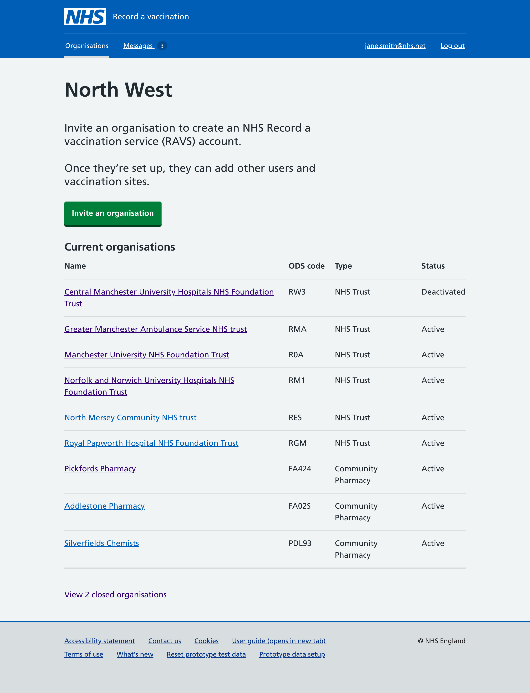
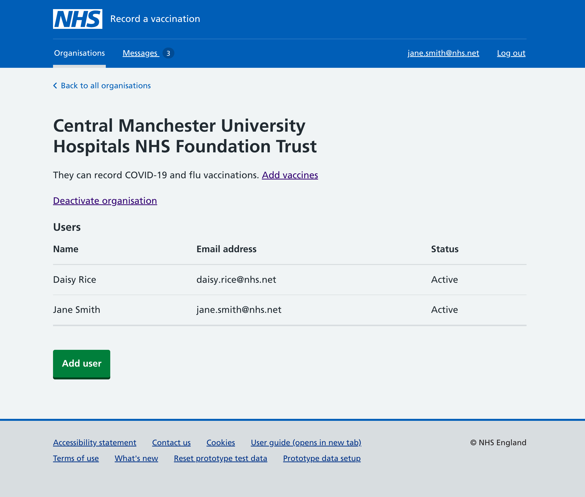
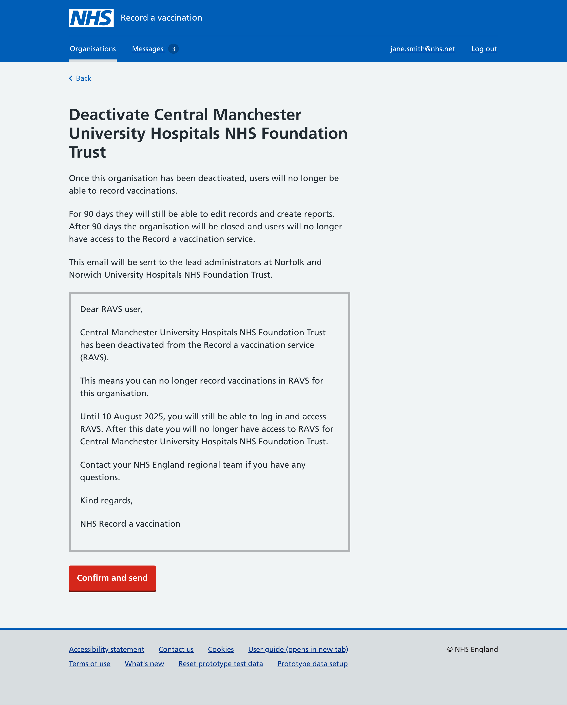
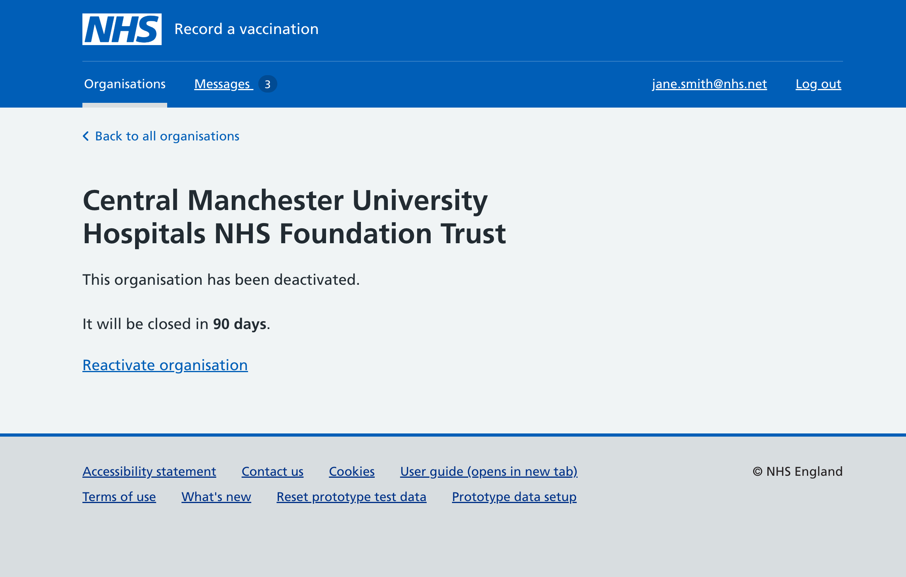
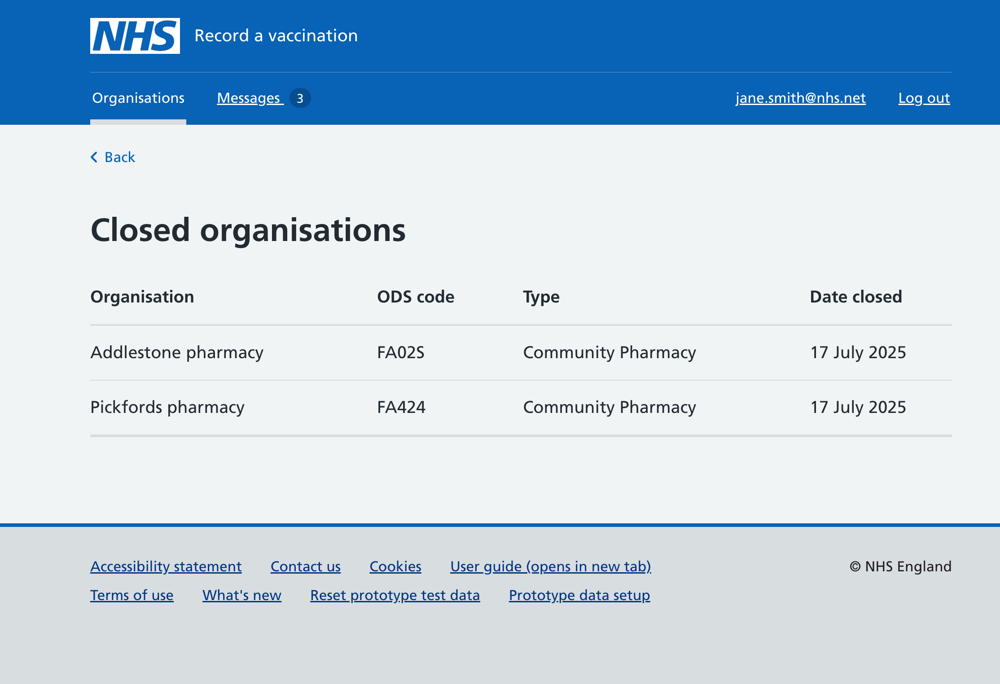

RAVS has a [regional interface](/record-a-vaccination/2024/08/onboarding-organisations-without-spreadsheets/) which has been successful in allowing the 7 NHS regions to control who they want to onboard to RAVS and when. It gives them control for their own area and removes a level of admin otherwise taken up by the RAVS team, a win-win.

## Challenge
However, the time has come to allow regions to also offboard organisations that are no longer taking part in the region’s vaccination campaigns for whatever reason, for example because they are no longer vaccinating, have closed or changed ownership.

It makes sense to therefore allow the regions to say “goodbye” and offboard any organisation they no longer deem part of their region for vaccination campaigns.

The challenge is allowing the organisations enough time to finish everything they are doing. This could be recording vaccinations retrospectivly, editing records if needed and any final checks, as they won’t be able to do any of these when the account is finally closed.

## Solution

To allow a smooth transition to closure, the RAVS regional interface lets regions deactivate organisations first, which then gives them 90 days to change their mind before the organisation is closed.

The 90 days of course also allows about 3 months for the organisation to get things in order as needed.

The 90-day deactivation and closure process is explained in the regional interface and includes a preview of the email that will be sent to lead administrators at the deactivated organisation.

We've added a link at the bottom of the regional interface home page to a section showing closed organisations. This keeps the user interface tidy as it separates the closed organisations from the main elements and actions on this page.

## Next steps
We have shown this new feature to users and will be keeping in touch to monitor not just this feature but their overall use of the regional interface. The more they can do, the less RAVS needs to, which is good news for both parties.
