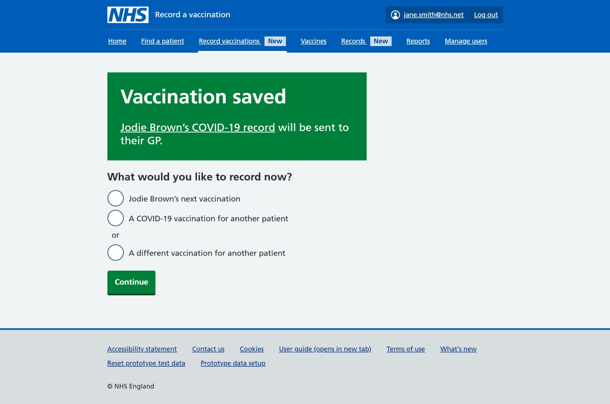
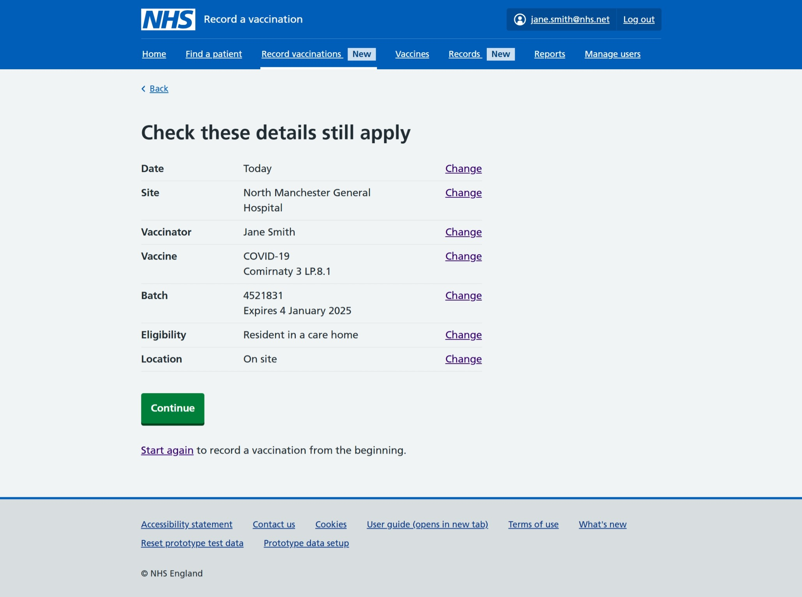

As part of the work we've done to streamline the recording journey, we've added 2 new options for users once they've saved their first vaccination of the session. They can choose to record:

- the same patient's next vaccination
- the same vaccination for another patient

## Background

The option to easily record another vaccination for the same patient, often referred to by users as co-admin (administering 2 or more vaccines at the same time) has been a common request in user feedback.

We also know that in some settings, users might be recording the same vaccination for  successive patients, for example if they are running a vaccination clinic just for flu vaccinations.

These new recording options are part of the wider work we've been doing to simplify the recording journey for our users. See our previous post on [asking fewer, better questions](https://design-history.prevention-services.nhs.uk/record-a-vaccination/2025/03/asking-fewer-better-questions/).

All of these changes which we've been referring to within our team as 'streamlining' are due to go live in October.

## Designs

When a user selects 'Record vaccinations', they go through the default recording journey. Depending on the vaccination type, there are slight variations but as a minimum, the user is asked:

- date of vaccination
- site or team (only asked if an organisation offers vaccinations at several sites)
- name of vaccinator
- details of vaccine (type, product, batch)
- why the patient is having the vaccination (eligibility)
- patient's NHS number or patient demographic details
- consent details
- injection site (the only exception is nasal vaccines where this question is skipped)
- check and confirm answers (final screen before the record is saved)

After that first vaccination has been saved, we've introduced these new options. The user can choose to record either:

- the same patient's next vaccination
- the same vaccination for another patient
- a different vaccination for another patient

### Record the same patient's next vaccination

If a user selects this option, they skip these questions:

- date of vaccination
- site or location
- name of vaccinator
- patient's NHS number 

We only ask these questions:

- details of vaccine (type, product and batch)
- why the patient is having the vaccination (eligibility)
- consent details
- injection site
- check and confirm 

### Record the same vaccination for another patient

If a user selects this option, they are taken to a summary page asking them to check if this data from the previous vaccination still applies: 

- date
- site or location
- vaccinator
- vaccine type, product and batch
- why the vaccine is being given (eligibility)

They have the option of changing any of these previous selections. 

If the saved settings are correct for the next patient, they can continue straight to the screen where they are asked for the patient NHS number or details.

Once they've seen the patient's vaccination history, they are only asked:

- consent details
- injection site
- check and confirm

### Record a different vaccination for another patient

This option is very similar to the default recording option but skips the first 3 questions:

- date of vaccination
- site or location
- name of vaccinator 

## Research 

We carried out research and usability testing with a range of participants working in different settings. Participants were a mix of hands-on vaccinators, and people who organised clinics but did not give vaccinations. Some were new to RAVS and some had used the service for a while.

### The way the options were presented

We found that participants understood the options to record another vaccination for the same patient or the same vaccination for another patient. 

It was pointed out that we were missing an option to record a different vaccination for another patient so this is something we added later.

### Recording the same patient's next vaccination 

Participants understood and could complete the journey. 

Most thought this option would make it quicker to record multiple vaccinations for the same patient.

### Recording the same vaccination for another patient

Participants understood and could complete the journey. But some had concerns that they or their teams might lose track of the selections that were being applied to the next patient. 

We also heard from participants who worked at community pharmacies that they were less likely to find this option useful. 

## What we changed after research

On the screen where we show the options for what you can do next after a vaccination has been saved, we:

- added the name of the vaccination to the 'Vaccination saved' message to highlight which vaccination has just been saved
- switched the order of the choices, making the option to record the 'same patient's next vaccination' the top option
- added an option to record a different vaccination for another patient 

To address users' concerns about potentially losing track of the selections that were being applied to the next patient in the 'give the same vaccination to another patient' journey, we are exploring using [headings with captions]( https://service-manual.nhs.uk/design-system/styles/typography) for the 2 new branch journeys. 

Our hypothesis being that the 'caption' displayed above the heading will help users understand which journey they are in.

## Future considerations

Once the new streamlined recording journey is live, we will monitor:

- how often these new journeys are used
- how long it takes users to record a vaccination using the different options, and if the 'extra' journeys save time

And we'll need to carry out further user research to understand if these new journeys have made it easier for users to record multiple successive vaccinations. 

