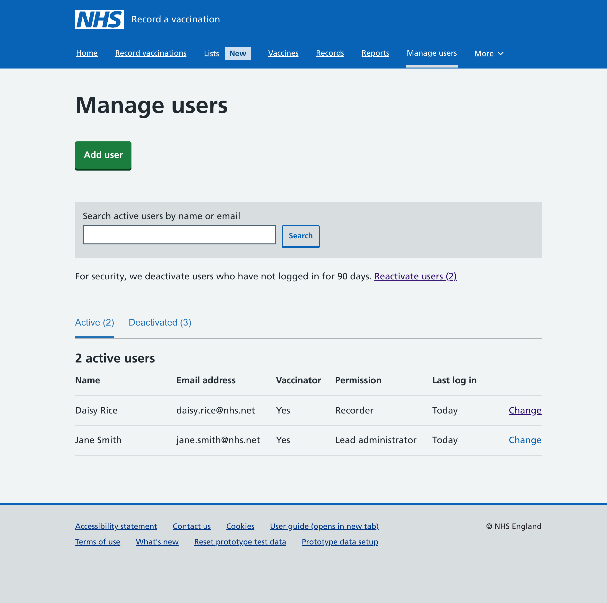
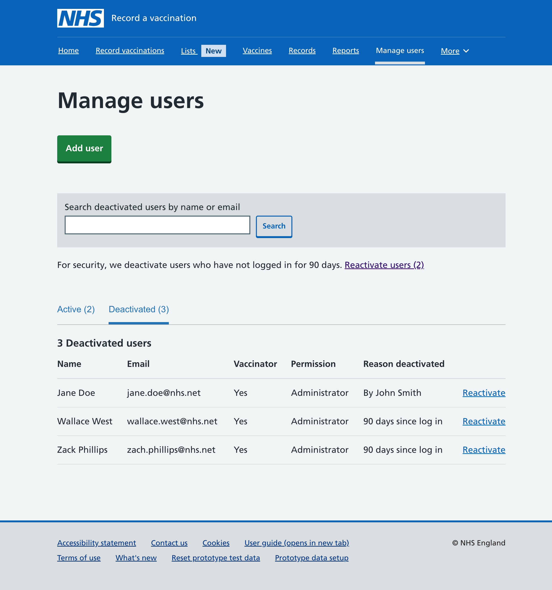
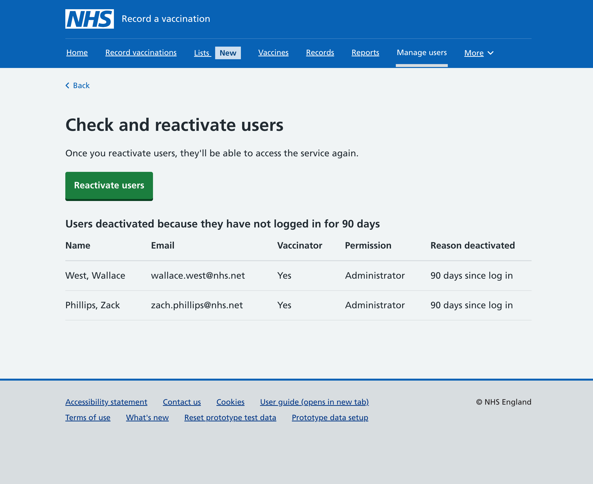

In RAVS we let lead administrators at organisations control their users' access to the service and their permissions. They do this via the **Manage users** section.

## Challenge

Although we allow lead administrators to deactivate users in RAVS, this is not the only way users can be deactivated. 

To prevent users who no longer need access to RAVS from using the service, for example because they have left the organisation that was using RAVS, NHS security mandates that we automatically deactivate users after 90 days of inactivity.

The problem is that inactivity is common in RAVS, given that vaccines are often given seasonally. Between the end of March and the start of October we could reasonably have 6 months of inactivity, when vaccinators, who should still be allowed to use RAVS, could be  automatically deactivated. Moreover, this could happen at a large scale.

## Solution

To solve the problem, we needed a way to allow lead administrators to reactivate any deactivated user in their organisation, and preferably a way to reactivate several users at a time.

First, we needed to show if a user's status was active or deactivated. We created 2 tabs in the user table to draw this distinction and we added the number of users next to each status label. 

We added the date of **Last log in** for each active user, spanning from "Today" up to "89 days ago" to inform lead administators who was nearing deactivation.

The deactivated tab includes a column for **Reason deactivated**, which shows either the name of the person who deactivated the user, or says "90 days since log in" if a user was deactivateed because of the automatic 90-day security feature. Next to each deactivated user, there is a link to "Reactivate" the user. 

When it comes to reactivating in bulk, we’ve created a shortcut as our MVP design. Above the tabs we've added a line of text that says: "For security, we deactivate users who have not logged in for 90 days." Next to this there is a link to "Reactivate users" with the number of deactivated users in brackets. 

This link goes to a separate page, **Check and reactivate users**. This only shows users deactivated because they have not logged in for 90 days and allows the lead adminstrator to reactivate them in bulk, greatly reducing the admin burden at the start of each vaccination season.

## Next steps

We did consider the use of sortable tables, and of checkboxes to select individual or multiple users. But as these features are not yet available in the NHS design system yet, and they are something we are considering for other areas of RAVS, which would require more time to get right, we decided to start with an MVP solution. As always we will monitor its use and make any changes needed to improve the experience further for users.

